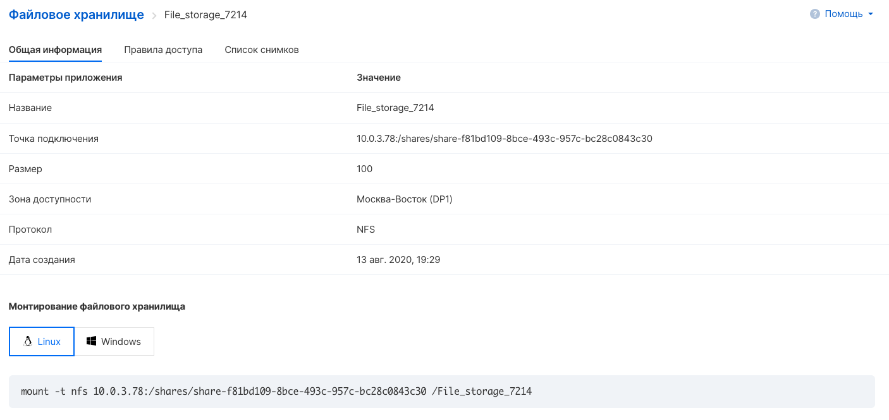
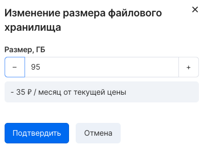
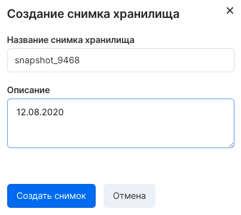
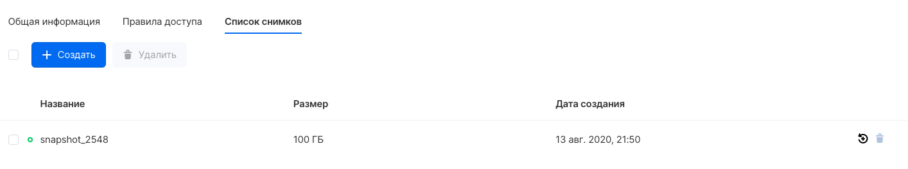
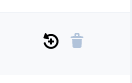

Management of existing file storages is performed from the personal account of the VK CS panel on the "File storage" tab of the "Cloud computing" section and from the Openstack CLI.

## Viewing information

To get detailed information about a file server instance, select "Information" from the context menu. The open properties window displays the parameters and instructions for the connection:

## Change of size

Both increasing and decreasing the size of the file storage are possible. To do this, in the context menu of the instance, select "Resize" and specify the new size of the file storage, and then confirm the changes with the "Confirm" button:

## Taking a snapshot

To create a snapshot (snapshot) of the file storage, select the "Create snapshot" option in the context menu. In the window for creating a snapshot, enter a name and a comment, and then click "Create snapshot":

## Viewing Pictures

To view the storage snapshots, select the "Snapshots list" option in the context menu. A window for viewing images will open:

## Recovery from snapshot

To restore from a snapshot, in the snapshot view window, select the "Restore file storage" item in the line of the required snapshot:



Then you need to confirm the recovery. The process of creating a new repository from the snapshot will begin.

## OpenStack CLI Management

File storage is managed using the manila client:

Getting a list of file storages in a project:

```
 manila list
```

Viewing information about a file storage:

```
 manila show <repository ID>
```

Change of size:

```
 manila extend <repository ID> <new size>
```

Reducing size:

```
 manila shrink <storage id> <new size>
```

Taking a snapshot:

```
 manila snapshot-create --name <snapshot name> <repository ID>
```

Viewing pictures:

```
 manila snapshot list --share-id <storage id>
```

Recovery from snapshot:

```
 manila create --snapshot-id <snapshot ID> <protocol> <size>
```
