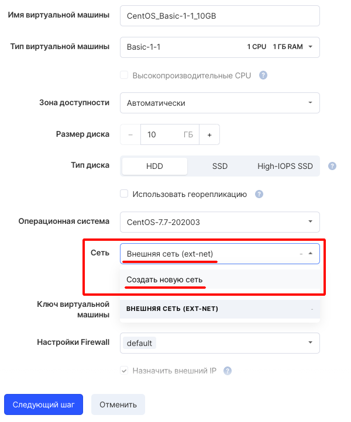
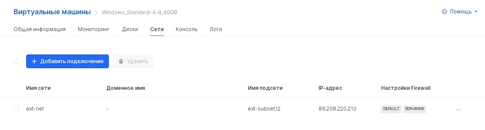
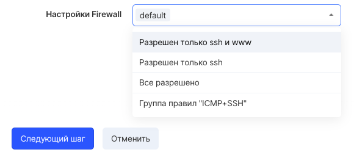

Several ports of different networks can be connected to virtual machines. Port - the virtual network interface card of the instance for which security groups, connected network and DNS name are configured.

## Connecting the network when creating a VM

By default, a virtual machine is connected to the external network (Ext-net) when it is created. This means that the virtual machine receives an IP address from a certain range (see below):




You can also create a new network on the fly when creating a virtual machine. In this case, the network parameters can be selected independently.

## Adding a connection after creating a VM

To manage VM network connections [in your VK CS account, you](https://mcs.mail.ru/app/services/infra/servers/) should:

1.  Go to the Virtual Machines page of the Cloud Computing section.
2.  Open the instance card, go to the "Networks" tab. This page displays all network connections.
3.  To add a network interface, you need to select "Add connection" and configure the parameters in accordance with the table:

    <table style="width: 99%; margin-right: calc(1%);"><tbody><tr><td style="width: 21.1729%; background-color: rgb(239, 239, 239);">Name</td><td style="width: 78.6436%; background-color: rgb(239, 239, 239);">Setting the port name</td></tr><tr><td style="width: 21.1729%;">Network to connect</td><td style="width: 78.6436%;">Selecting the subnet to which the port will be connected</td></tr><tr><td style="width: 21.1729%;">DNS name</td><td style="width: 78.6436%;">Available for private networks. Entering a DNS name that can be used to access the instance using private DNS</td></tr><tr><td style="width: 21.1729%;">Set IP address</td><td style="width: 78.6436%;">Selecting an item allows you to enter a specific IP in the "IP Address" field. The address must belong to the selected subnet</td></tr><tr><td class="currently-active" style="width: 21.1729%;">Firewall settings</td><td style="width: 78.6436%;">Selecting security groups that establish traffic flow rules</td></tr></tbody></table>

4.  After saving the parameters, the network interface will be added to the VM.

## Security groups

When creating a virtual machine, the default security group is substituted (Firewall rule, traffic flow rule) " **default** ":



The Firewall " **default** " rule works as follows:

**Inbound traffic** : By default, only inbound traffic from instances in the default security group is allowed. In this case, traffic from the Internet is not allowed.

**Outgoing traffic** : By default, outgoing traffic is allowed within the internal network and to the Internet.

## OpenStack CLI

To connect a network to a VM using the OpenStack client, you need to:

1\. Get a list of networks:

```
 openstack network list --all
```

2\. Get a list of security groups:

```
 openstack security group list
```

3\. Get a list of ports on the network:

```
 openstack port list --long --network <network ID>
```

4\. Create port:

```
 openstack port create --network <network ID> <port name>
```

As a result, a port with an IP address and a default security group will be created in the specified network.

It is also possible to create a port with the specified IP address, description, DNS name, security group and [DHCP option](https://github.com/Juniper/contrail-controller/wiki/Extra-DHCP-Options) :

```
 openstack port create --network <network ID> --fixed-ip subnet = <subnet ID>, ip-address = <IP address> --description <description> --dns-name <DNS name> --extra- dhcp-option name = time-servers, value = <IP address> --security-group <security group ID> <port name>
```

As a result of the command execution, the description and ID of the port will be obtained.

Next, you need to attach the port to the instance:

```
 openstack server add port <instance ID> <port ID>
```

You can view all ports of the virtual machine with the command:

```
 openstack port list --server <instance ID>
```
