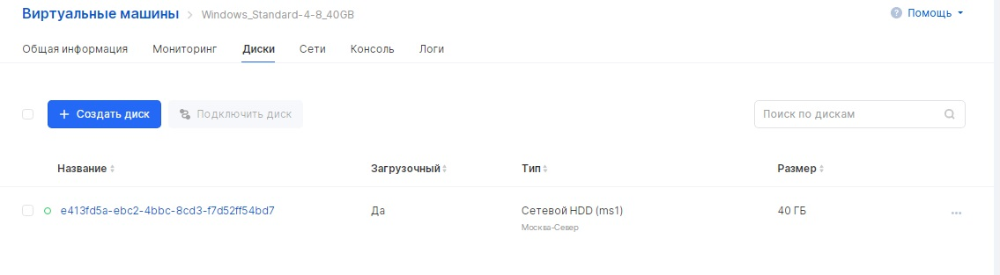
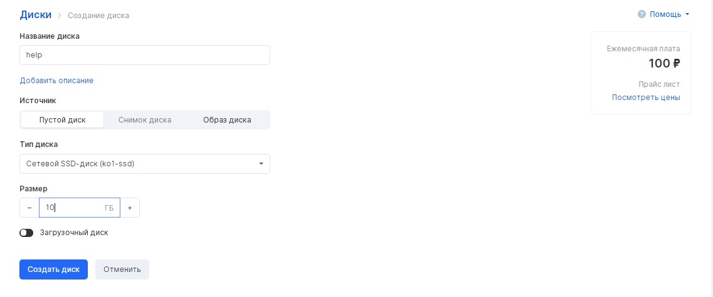
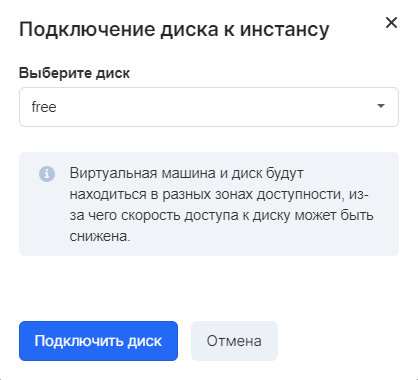

VK CS instances support a variety of disk operations.

## VK CS control panel

To perform operations with virtual machine disks [in your VK CS personal account, you](https://mcs.mail.ru/app/services/infra/servers/) should:

1.  Go to the Virtual Machines page of the Cloud Computing section.
2.  Open the instance page, go to the "Disks" tab.

Available operations in the section top menu:

- Disc creation
- Attaching an existing disk to an instance

Available disk context menu operations:

- Resizing the disk
- Viewing a list of disc snapshots
- Change disk type (requires unplugging the disk)
- Replacing the root disk
- Unmounting a disk
- Create a disk snapshot (snapshot)

**Attention**

After expanding the disk in the instance operating system, you must also expand it.

**For Linux OS family**

Get a list of sections

```
 fdisk -l
```

Expand the required partition (in the example / dev / vda1)

```
 growpart / dev / vda 1
resize2fs / dev / vda1
```

**For Windows OS family**

Open the Disk Management snap-in ( diskmgmt.msc ), select "Expand Partition" in the context menu of the desired partition.

## OpenStack CLI

Instance disks are managed using the following commands:

Get a list of disks:

```
 openstack volume list
```

Get a list of virtual machines:

```
 openstack server list
```

Attach or detach drive:

```
 openstack server add (remove) volume <instance ID> <disk ID>
```

**Note**

Changing the size of a disk using the CLI is possible only after disconnecting it from the instance.
