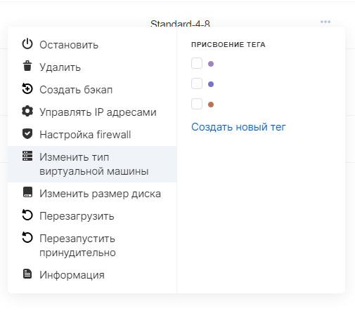
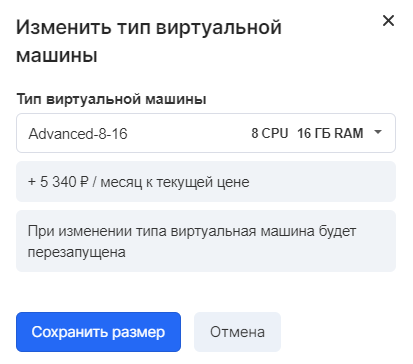
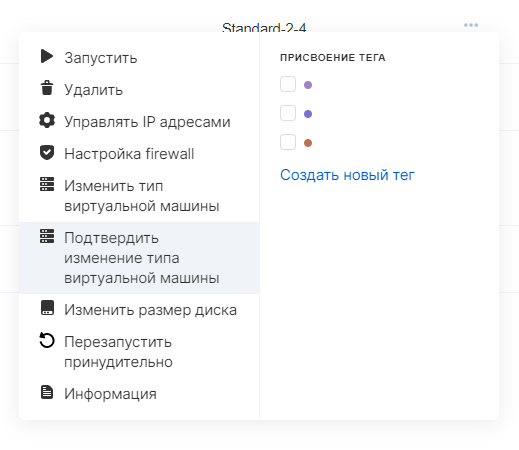

The type of virtual machine (number / type of CPU and the amount of RAM) can be changed within the configurations (flavors) available to the project.

**Note**

You can change the type of an existing instance, either down or up, at any time, and you only need to reboot the instance.

Configurations with high-performance processors can be added to the project upon request to technical support.

Any change to the VM configuration affects its cost.

## In VK CS panel

To change the type of instance in your [VK CS account, you](https://mcs.mail.ru/app/services/infra/servers/) should:

1.  Go to the Virtual Machines page of the Cloud Computing section.
2.  Open the context menu of the instance, select the "Change virtual machine type" item.
3.  In the menu that appears, select the required type and click "Save Size". The VM will be rebooted:
4.  In some cases, after changing the type, it is necessary to confirm the operation, this can be done in the context menu of the instance:

## Via Openstack CLI

To change the type in the OpenStack CLI, run the command:

```
 openstack server resize --flavor <config ID> <server ID>
```

You can get a list of available configurations with the command:

```
 openstack flavor list --all
```

The server ID is on the instance card in your personal account or in the list of virtual machines:

```
 openstack server list
```
