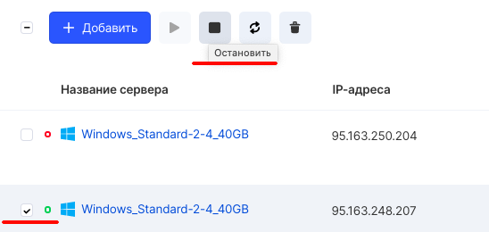
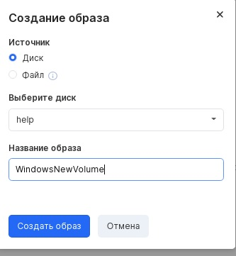
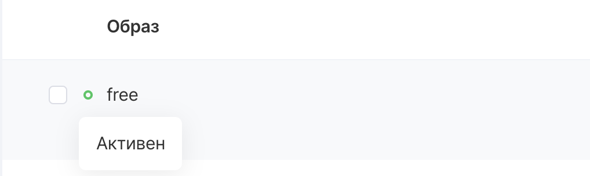
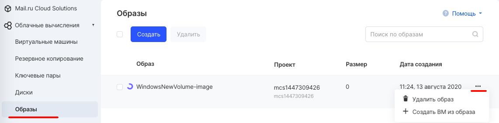

An image is a file that contains a virtual disk with an operating system or other data already installed on it. Images are used to create virtual instances in the cloud.

## VK CS control panel

To create an image from an existing instance [in your VK CS account, you](https://mcs.mail.ru/app/services/infra/servers/) should:

1.  Stop the required VM instance - from which we will create an image.
2.  Go to [the "Images" section](https://mcs.mail.ru/app/services/infra/images/) of the "Cloud Computing" service.
3.  Press the "Create" button, in the image creation menu, select the disk of the required virtual machine and enter the name of the image (by which it can then be uniquely identified). If you select the item "Allow access to all projects" the image will be available in all projects where the user is a member.
4.  Click "Create Image". The process of creating an image will begin, and the status can be obtained by hovering the mouse over the colored indicator.
5.  The created image will be available in the "Images" section after a while, and in the context menu of the image it will be possible to create a new virtual machine from this image:

## OpenStack CLI

To create an image in the OpenStack client, you need:

Get a list of drives by running the command:

```
 openstack volume list
```

Or get a list of the drives attached to the server:

```
 openstack server show -c volumes_attached <instance ID>
```

Create an image by running:

```
 openstack image create --volume <disk ID> <image name>
```

As a result of the command execution, a window with the data of the created image will be displayed.
