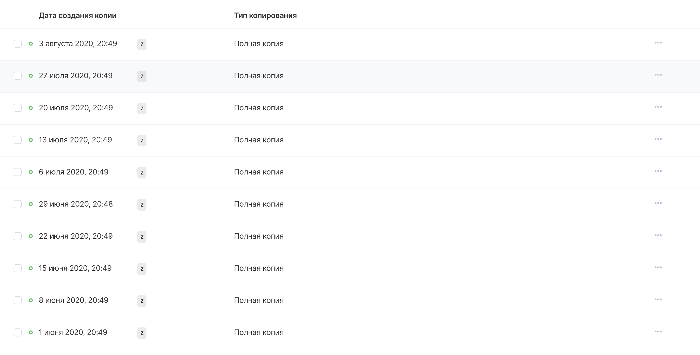

Restoring an instance from a backup helps you create a copy of a virtual machine at a specific point in time when the backup point was created.

**Note**

Incremental backups are consolidated into a full backup according to the schedule configured in the Backup plan.

When recovering, you should only focus on a full instance backup.

## VK CS control panel

To restore a backup [in your VK CS account, you](https://mcs.mail.ru/app/services/infra/servers/) should:

1.  Go to the "Backup" section of the "Cloud Computing" service.
2.  Go to the required backup plan in the "Automatic" or "Manual" section, the interface for viewing backups will appear:
3.  In the context menu of the recovery point, select "Create instance copy":
4.  Configure the parameters of the instance being restored from the backup:
5.  Select "Create a copy of an instance from a backup", after which the creation of a new virtual machine will begin.

## OpenStack CLI

You can create an instance from a backup using the karbor package of the Openstack CLI toolkit. To do this, you need to run the following commands:

Get a list of providers:

```
 karbor provider-list
```

Get a list of backup plans:

```
 karbor plan-list
```

Get a list of restore points:

```
 karbor checkpoint-list <provider ID> --plan_id <plan ID>
```

Perform recovery using item IDs from the previous steps:

```
 karbor restore-create <provider ID> <restore point ID>
```
