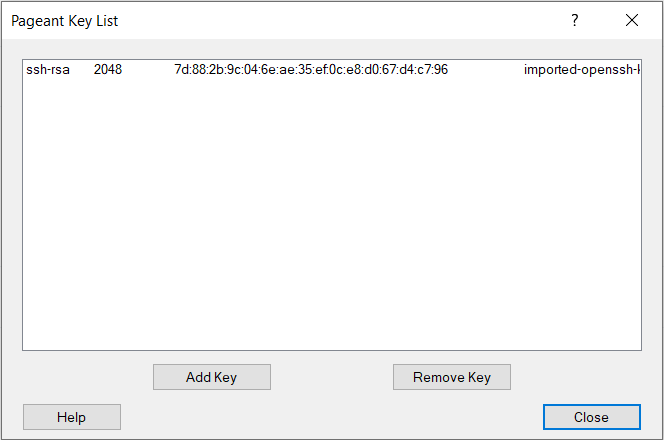
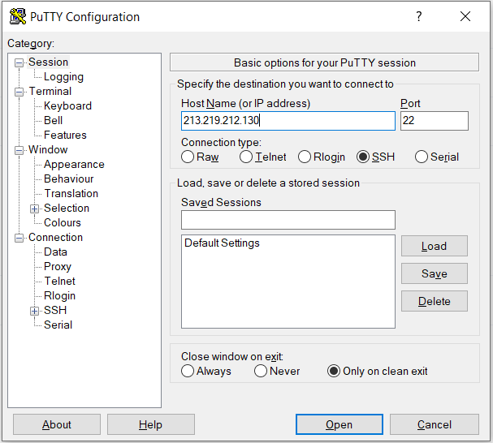
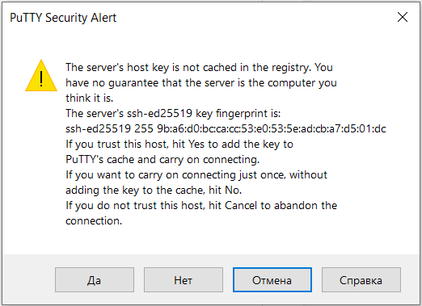
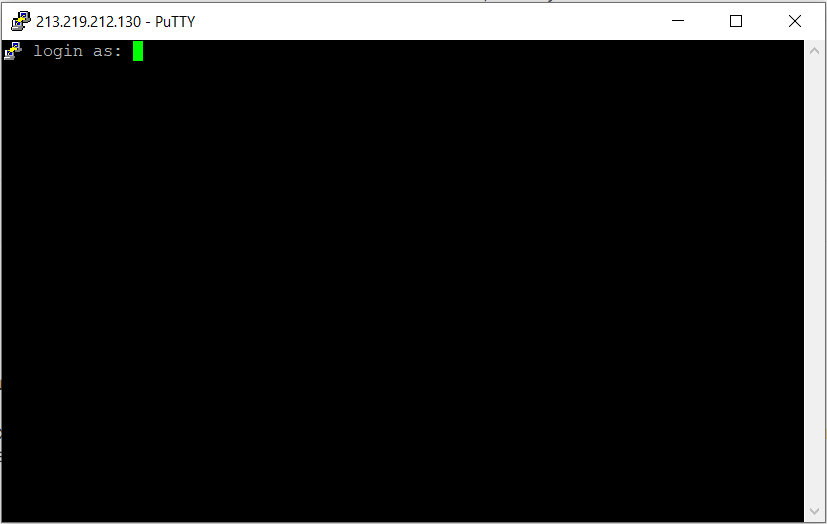

Linux-based virtual machines are created with openssh client enabled, which allows remote access to the instance via SSH protocol.

The recommended way to connect to a virtual machine via SSH is using a key pair: the public key is in the virtual machine, while the private key is stored by the user.

To connect, the following conditions must be met:

- 15 minutes have passed since the VM was created and all scripts have finished their work
- The virtual machine is on
- A security group has been assigned to the virtual machine with a rule that allows remote access via SSH and TCP port 22
- The instance must have an external IP address available for connection

**Caution**

Linux-based virtual machines created from FreeBSD, Bitrix or other images that have additional software products or are oriented towards their use are not configured to work with the ext-net network.

In this case, remote connection using SSH will not be possible.

Remote access for such instances is possible by creating it in a private network with the DHCP option enabled, as well as an assigned Floating IP address.

## Getting a login

Each operating system has a login account. The standard account is not used for security purposes, but you can always activate it and assign a password. However, it is not recommended to use built-in accounts to avoid the possibility of unauthorized third parties gaining access to your instance.

<table border="0" cellpadding="0" cellspacing="0" style="margin-right: calc(2%); width: 98%;" width="265"><tbody><tr><td style="background-color: rgb(239, 239, 239);">operating system</td><td style="background-color: rgb(239, 239, 239);">Login</td></tr><tr><td height="19" width="48.679245283018865%">Bitrix *</td><td width="51.320754716981135%">root* </td></tr><tr><td height="19">CentOS</td><td>centos</td></tr><tr><td height="19">Debian</td><td>debian</td></tr><tr><td height="19">Fedora</td><td>fedora</td></tr><tr><td height="19">FreeBSD</td><td>freebsd</td></tr><tr><td height="19">Ubuntu</td><td>ubuntu</td></tr></tbody></table>

\*Bitrix: Immediately after logging in, the system will ask you to set a new password. To do this, the system will ask for the current password (bitrix) and will ask for a new password for the root user twice.

Bitrix-CentOS \* image currently does not support Ext-Net.

## Getting the key

At the stage of creating an instance, a key was selected or a new key pair was created. When a new key was generated, it was downloaded to the local computer. This key is required to connect, regardless of the local operating system used.

Connection to an instance is configured depending on the local operating system used.

## Windows

**Windows 10**

The ssh client is already installed in Windows 10 by default.

It is enough to execute the command

```
 ssh -i <path to key> login @ IP_address
```

Where:

- Key path - full path to the key file previously created or loaded when creating an instance
- Login - the login of the operating system of the instance
- IP address - external IP address of the virtual machine, which can be seen in the instance information on the "Virtual Machines" tab of the "Cloud Computing" service

If the command is successful, you can see a request to confirm the connection to a previously unknown host:

```
 The authenticity of host '213.219.212.130 (213.219.212.130)' can't be established.
ECDSA key fingerprint is SHA256: aYZIWs9N6KRtfFOuic6eoWcluhSp6 + jha / DSBgd9McI.
Are you sure you want to continue connecting (yes / no)?
```

After entering "yes" and confirming the entry, the connection will be established.

**Windows 7/8**

The best way to connect to Linux is by using the [PuTTY](https://www.putty.org/) application.

Before connecting, you need to convert the existing or received key to \* .ppk format for use in PuTTY.

This requires:

1.  Find and open PuTTYgen installed with the PuTTY app
2.  In the "Conversions" menu, select "Import Key" and point to the existing key file \* .pem
3.  Click on the "Save private key" button, select the directory and specify the desired file name

Next, you need to import the key into the Pageant application, also installed with PuTTY:

1.  Find and run Pageant
2.  Open the running program Pageant in the system tray near the clock with a double click
3.  Press "Add Key" and select the previously saved \* .ppk key
4.  The window with the key can be closed with the "Close" button
5.  The application must be running and can be minimized (in the tray)

Now you can proceed to the very connection to the instance.

To connect you need:

1.  Launch PuTTY application
2.  In the Host Name field, enter the IP address of the instance
3.  Make sure port 22 is specified for this connection
4.  Click "Open"



If this is the first connection in the instance, then you must confirm the connection in the window that appears:



If everything is configured correctly, a login prompt window will appear:

 You must enter a login, after which you will be logged in using the key previously imported into Pageant.

**Note**

The login depends on the operating system image and can be found in the general information about the instance.

## Linux / MacOS X

Before connecting to an instance, you must provide access to a previously saved or generated key:

```
 chmod 400 <path to key>
```

Connection to an instance is carried out using the command

```
 ssh -i <path to key> login @ IP_address
```

If the command is successful, you can see a request to confirm the connection to a previously unknown host:

```
 The authenticity of host '213.219.212.130 (213.219.212.130)' can't be established.
ECDSA key fingerprint is SHA256: aYZIWs9N6KRtfFOuic6eoWcluhSp6 + jha / DSBgd9McI.
Are you sure you want to continue connecting (yes / no)?
```

After entering "yes" and confirming the entry, the connection will be established.

**Attention**

After creating a virtual machine running Linux, we recommend setting a separate password for the superuser (root):

1.  Connect to an instance
2.  Enter the command:
    ```
     sudo passwd root
    ```
3.  Enter a new password and confirm it again

To get root user rights, run the command:

```
 sudo bash
```
