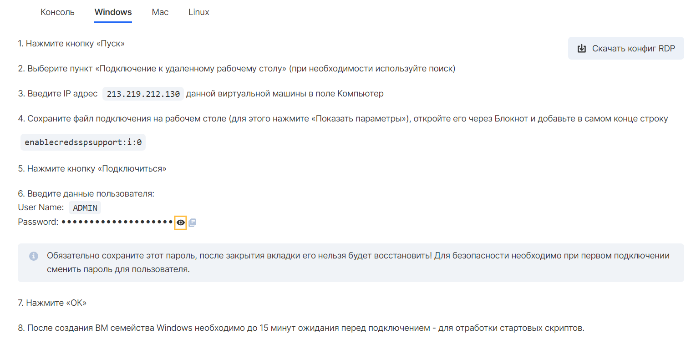
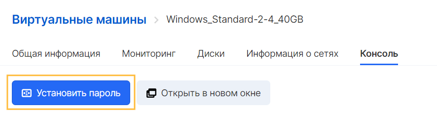
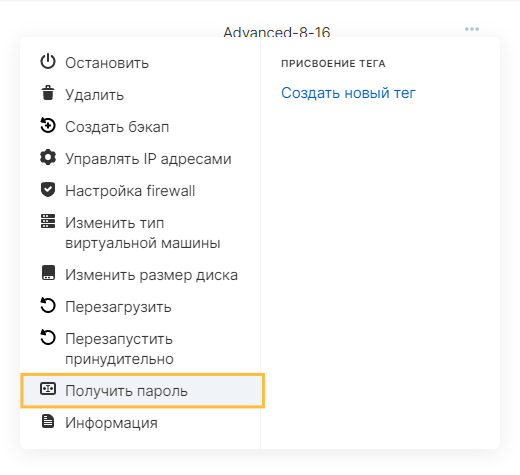
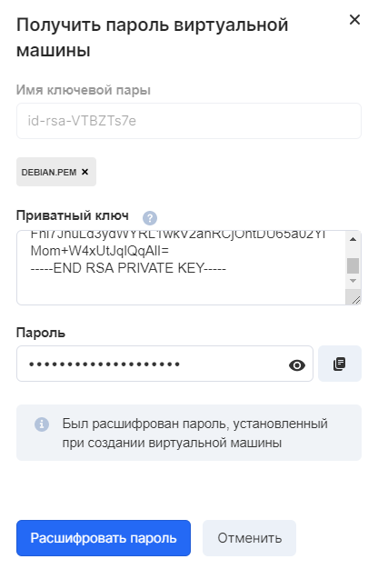

After creating a virtual machine based on Microsoft Windows, you can connect to the instance remotely using RDP (Remote Desktop Protocol).

For this, the following conditions must be met:

- 15 minutes have passed since creation and all scripts have finished their work
- The virtual machine is on
- A security group has been assigned to the virtual machine with a rule that allows remote access on TCP port 3389
- The instance must have an external IP address available for connection

The way to connect to a VM depends on the local operating system being used.

**Attention**

The first time you connect to an instance created on the ext-net network, you will need to change the password by entering the original password and confirming the new password.

## Retrieving a password

Before connecting to the instance, you need to obtain the password for the virtual machine user.

Depending on the network that was specified when creating the server, the methods differ:

**For VMs on ext-net**

You can get the password for the local user account at the final step of creating the virtual machine.



If the password was not saved at the final stage of VM creation, then it should be reset.

If, when creating a virtual machine, the ext-net network was connected to the instance, then in this case it is enough to go to the information about the virtual machine in the list of instances of the "Cloud Computing" service.

On the "Console" tab, click on the "Set password" button.



**Attention**

The password must contain upper and lower case letters of the Latin alphabet, numbers, symbols ! "# $% & () \* +, -.:; <=>? @ [] ^ \_\` {} ~

The password must contain at least one letter or number, in addition to special characters.

**For VMs on a private network**

To get the VM password:

1.  Go to the Cloud Computing Virtual Machines page.
2.  Open the context menu of the instance and click on the "Get password" button:
3.  In the window for obtaining a password, you need to attach the key file selected when creating the instance and click on the "Decrypt password" button. The result will be the password for the ADMIN user:
4.  You can copy the received password and close the window

## Windows

To connect via RDP, you can use manual configuration or a configuration file.

**Manual connection** consists of several steps:

1.  Press the "Start" button
2.  Find and open "Remote Desktop Connection"
3.  Enter the IP address of the virtual machine in the "Computer" field
4.  When connecting, specify the login and password of the account.

**Connecting using an RDP configuration file** .

You can download the RDP config file on the instance information page on the "Windows" tab.

You can connect to the virtual machine using the downloaded file.

## Linux

You can connect to a Windows instance via RDP from Linux.

To do this, you can use the Remmina utility:

1.  Download and install the Remmina client for connecting via RDP protocol
    ```
     sudo apt-add-repository ppa: remmina-ppa-team / remmina-next
    sudo apt-get update
    sudo apt-get install remmina remmina-plugin-rdp libfreerdp-plugins-standard
    ```
2.  Launch Remmina client
3.  To create a new connection, use the menu item "Connection" / "New" / "CTRL + N" or the button on the Remmina toolbar
4.  Enter the name of the connection, the group (if desired), select the "RDP" protocol
5.  Enter the IP address of the virtual machine in the "Server" field
6.  Enter user data:
    - User Name: ADMIN
    - Password: your password
7.  Click the Save button
8.  Connect to remote machine in the list of connections

## MacOS X

It is possible to connect to an instance from an operating system of the Apple Mac OS X family.

To make the connection:

1.  Download and install Microsoft Remote Desktop for RDP connection
2.  Add a new connection via the "+" function
3.  Enter the IP address of the virtual machine in the name field
4.  Add a new user by selecting "Add User Account" in the "User Account" field
5.  Enter user data:
    - User Name: Admin
    - Password: your password
6.  Press the "Add" button twice
7.  Connect to the virtual machine by double clicking in the RDP client interface
