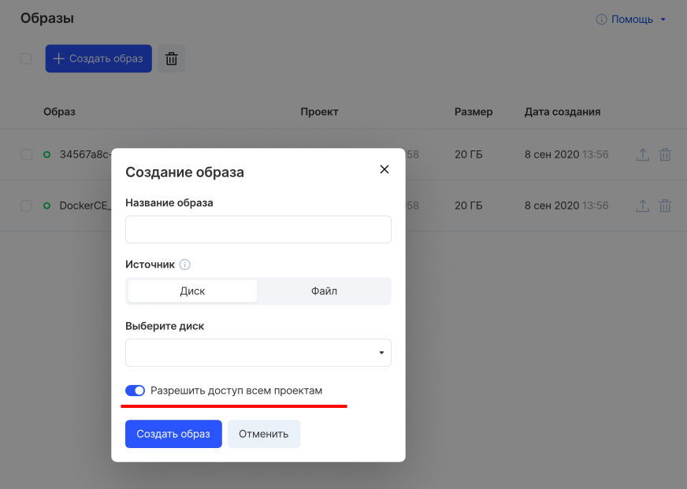
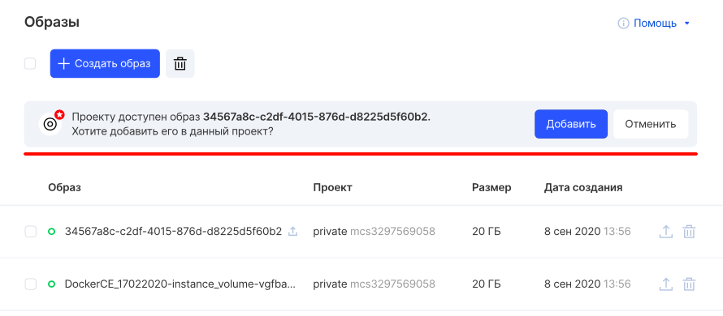

Sharing an image across multiple projects allows you to speed up deployment of instances.

## VK CS panel

When creating an image, select the "Allow access to all projects" item:



In this case, the image will not appear automatically in other projects - but a proposal will appear to add it to the project.



## OpenStack CLI

To set up image sharing in the OpenStack client:

Get a list of images:

```
 openstack image list
```

Set up sharing for an image:

```
 openstack image set --shared <image ID>
```

Add a partner project for an image:

```
 openstack image add project <image ID> <partner project ID>
```

Next, the partner needs to confirm the addition of the image to the project:

```
 openstack image set --accept <image ID>
```

To view projects that have access to the image, run:

```
 openstack image member list <image ID>
```

To remove an image from a project, the owner should do:

```
 openstack image remove project <image ID> <project ID>
```

--
