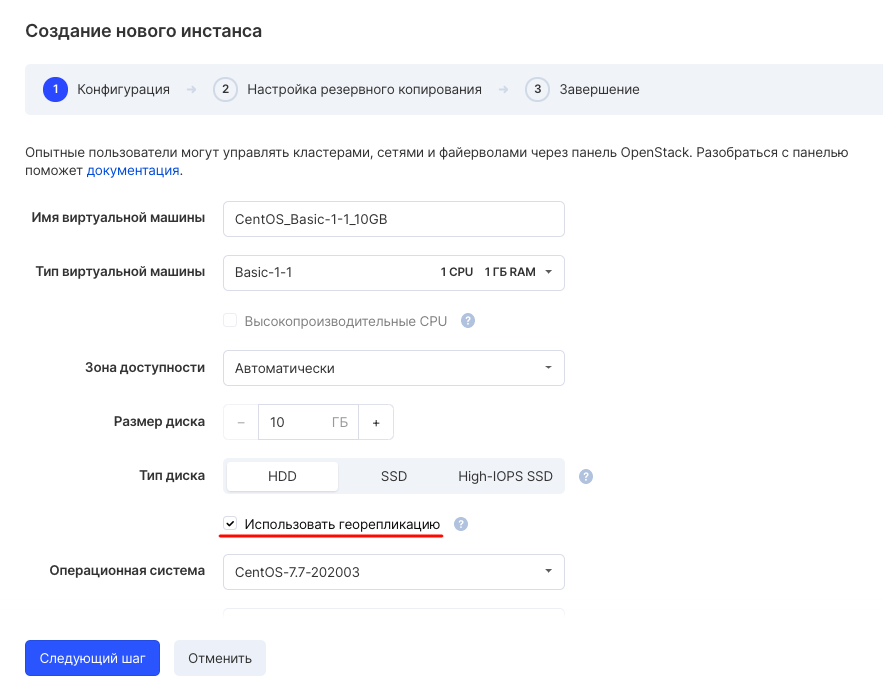

Geo-replication guarantees three copies of your data across two data centers. In any accident, your data is reliably protected.

You can enable disk geo-replication at the stage of creating a virtual machine (except for SSD):

