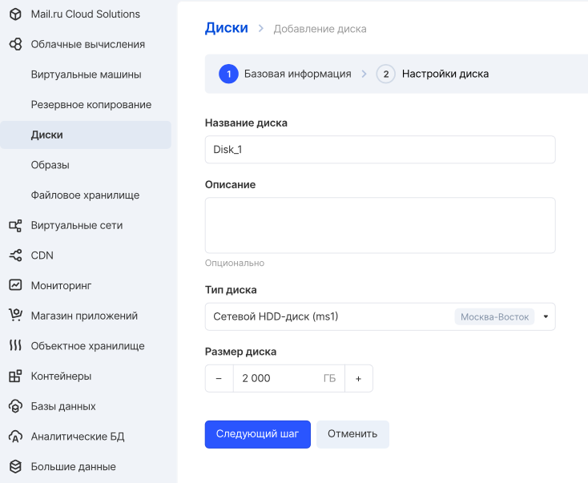
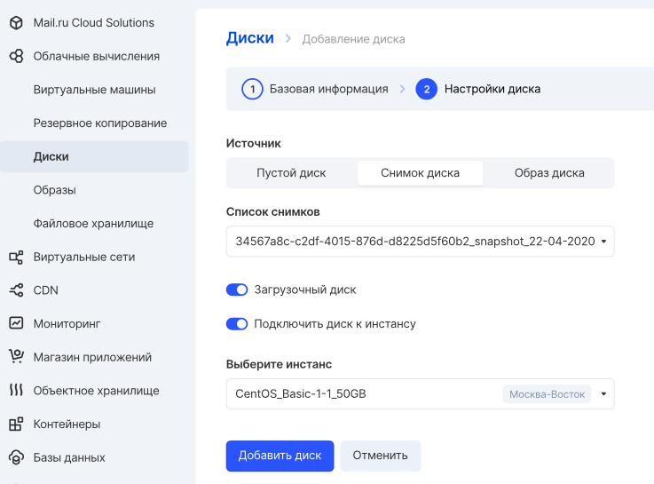
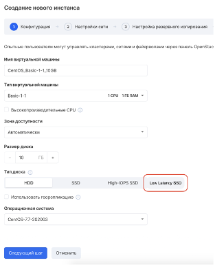

## VK CS control panel

To create a disc [in your VK CS account, you](https://mcs.mail.ru/app/services/infra/servers/) should:

1.  Go to the "Disks" section of the "Cloud Computing" service.
2.  In the top menu select "Create Disc".
3.  Configure the parameters of the created disk:

    <table style="width: 100%;"><tbody><tr><td style="width: 31.2385%; background-color: rgb(239, 239, 239);">Disc name</td><td style="width: 68.6698%; background-color: rgb(239, 239, 239);">The displayed name of the created disc</td></tr><tr><td style="width: 31.2385%;">Description</td><td style="width: 68.6698%;">Disc description</td></tr><tr><td style="width: 31.2385%;">Disc type</td><td style="width: 68.6698%;">Selecting the type and zone of availability</td></tr><tr><td style="width: 31.2385%;">A source</td><td style="width: 68.6698%;">Blank disk, disk snapshot, or image</td></tr><tr><td style="width: 31.2385%;">The size</td><td style="width: 68.6698%;">Specifies the size of the disk in GB</td></tr><tr><td style="width: 31.2385%;">Boot disk</td><td style="width: 68.6698%;">When you mark an item, it will be possible to create a VM from disk</td></tr><tr><td style="width: 31.2385%;">Connect disk to instance</td><td style="width: 68.6698%;">When checking the item, the disk will be connected to the VM after creation</td></tr><tr><td style="width: 31.2385%;">Select instance</td><td style="width: 68.6698%;">Selecting the virtual machine to which the disk will be connected</td></tr></tbody></table>

4.  After setting the parameters, click "Create disk".

**Note**

You can create low-latency disks if you have access to high-performance virtual machine templates. You can get access to high-freq configurations [using technical support](https://mcs.mail.ru/docs/contacts) .

To create it, you need to select a high-freq template, after which the low-latency disk appears in the VM creation wizard:



Data stored on this type of disk is not backed up at the disk subsystem level. It is highly recommended to set up regular backups in case you need to recover your data after a disaster.

To remove a disc, select the "Remove disc" item in the "Disks" section of the "Cloud Computing" service in the context menu of the disc. This will also remove snapshots of the disk.

## OpenStack CLI

To create a disc in the OpenStack client:

Get available disc types:

```
 openstack volume type list
```

Create a disk of the selected type and specified size:

```
 openstack volume create --type <disk type ID> --size <size> <disk name>
```

It is also possible to use the following parameters:

- \--image <image ID> - specifying the image from which the disk will be created
- \--snapshot <snapshot ID> - specifying the snapshot from which the disk will be created
- \--source <disk ID> - specifying the disk on the basis of which the disk will be created (disk cloning)
- \--description <description> - arbitrary disc description
- \--availability-zone <zone> - specifying the disk availability zone
- \--property <key = value> - specifying arbitrary disk properties
- \--bootable - creates a bootable disk

To remove a disk in the OpenStack client:

Get a list of disks in a project:

```
 openstack volume list --long
```

Get disk information:

```
 openstack volume show <disk ID>
```

Remove disk:

```
 openstack volume delete <disk ID>
```
