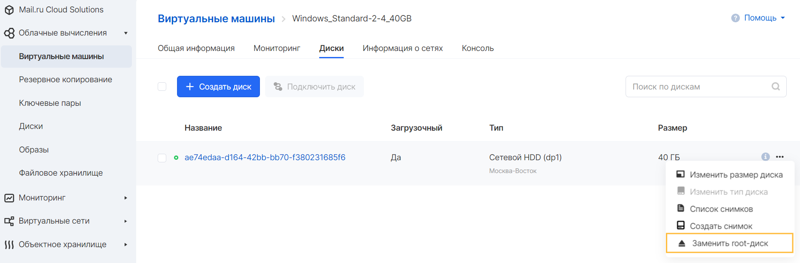
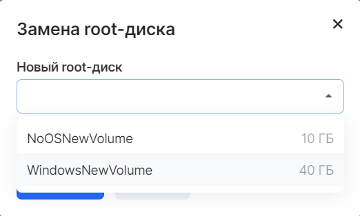

The root (or root) disk of an instance is the primary or first disk with which the virtual machine is started.

In cases when it is required to detach the root disk from the instance, to change its type, OS, or recreate without changing the instance configuration, the following conditions must be met:

1.  The instance must be stopped
2.  All processes associated with configuring the instance must be completed
3.  The project must have a disk to replace the existing root disk
4.  The new disk should not be attached to any instance
5.  The new disk must be bootable

**Attention**

Removing the root disk without replacing it with another is impossible.

The process for replacing the root disk for Windows and Linux virtual machines is identical. To do this, select the required instance in the list of Virtual Machines in the Cloud Computing service and go to the Disks tab.

The replacement is performed in the properties of the disk connected to the VM:

If all the conditions in the list are met, a new disk will be available:

After replacing the root disk, the instance can be started.

**Caution**

For the instance to work correctly, at least 1 attached disk must contain the operating system and be bootable.
