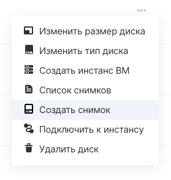
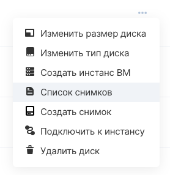

A snapshot (snapshot) of a disk is the state of the file system at a particular point in time.

Taking a disk snapshot stops the guest OS recording for a short time, saves the state of the system files, and writes all subsequent changes to a separate file. Thus, it is possible to roll back changes to the file system to a certain point or use snapshots as a tool for quickly cloning disks.

**Attention**

Low-latency disk snapshots are removed during virtual machine migration (this can happen when load balancing hypervisors). It is recommended to create a manual backup to save the state of the disk at a certain point.

## VK CS control panel

To create a snapshot of a disk [in your VK CS account, you](https://mcs.mail.ru/app/services/infra/servers/) should:

1.  Go to the Disks page of the Cloud Computing service.
2.  In the context menu of the disk, select "Create Snapshot":
3.  In the menu for creating a snapshot, specify the name of the snapshot and click "Create snapshot".

To view the snapshots of a disk, select the "Snapshot list" on the "Disks" page in the context menu of the disk:

To delete disk snapshots, select the required snapshots on the snapshot view page and click "Delete snapshot"

## OpenStack CLI

You can also perform operations with disk snapshots in the OpenStack client

Get a list of snapshots of the specified disk:

```
 openstack volume snapshot list --volume <disk ID>
```

Get a list of project disk snapshots:

```
 openstack volume snapshot list --project <project ID>
```

Create a snapshot of the disk, if the disk is connected to the instance, add the --force flag:

```
 openstack volume snapshot create --force --volume <disk ID>
```

Delete disk snapshot:

```
 openstack volume snapshot delete <snapshot ID>
```

Change snapshot properties:

```
 openstack volume snapshot set <property> <snapshot ID>
```

Available properties:

- \--name - name
- \--description - description
- \--property - data in key = value format
- \--no-property - remove all additional values
