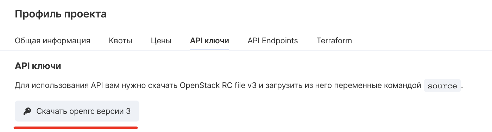

## Installing terraform

Download terraform from the link [https://www.terraform.io/downloads.html](https://www.terraform.io/downloads.html) and follow the instructions [https://learn.hashicorp.com/terraform/getting-started/install.html](https://learn.hashicorp.com/terraform/getting-started/install.html) to install it.

## Provider setting

To start using the terraform VK Cloud provider, follow these steps:

- Download the provider's VK Cloud binary from the link [Mac](https://hub.mcs.mail.ru/repository/terraform/darwin/v0.1.0/mcs-provider) [version, Linux](https://hub.mcs.mail.ru/repository/terraform/linux/v0.1.0/mcs-provider) [version, Windows version](https://hub.mcs.mail.ru/repository/terraform/windows/v0.1.0/mcs-provider.zip) .
- Create a directory where the config files will be stored, for example "mcs_provider".
- Place the provider VK Cloud binary in the following path "~ / .terraform.d / plugins /".
- Change to the "vkcs_provider" directory and create a "main.tf" file in it. To use variables when creating resources, also create a "vars.tf" file.
- To initialize the openstack provider, use the "openrc" file - you can download it from the link [https://mcs.mail.ru/app/project/keys/](https://mcs.mail.ru/app/project/keys/) .

 Then run:

```
 source% your_openrc_name% .sh
```

**Attention**

For correct operation of both providers, make sure that the "OS_USER_DOMAIN_ID" variable is not set in the environment variables. You can also remove it by running the command "unset OS_USER_DOMAIN_ID".

Also, the openstack provider can be configured in the "main.tf" file (for detailed information, use the documentation at the link [https://www.terraform.io/docs/providers/openstack/index.html](https://www.terraform.io/docs/providers/openstack/index.html) "):

```
 \`\` \`sh
provider "openstack" {
user_name = "admin"
tenant_name = "admin"
password = "pwd"
auth_url = "http: // myauthurl: 5000 / v2.0"
region = "RegionOne"
}
\`\`,
```

\- To initialize the VK Cloud provider, set the following variables in the environment variables by running the commands:

```
 \`\` \`sh
export USER_NAME = "your_username" #same as OS_USERNAME
export PASSWORD = "your_password" #same as OS_PASSWORD
export PROJECT_ID = "your_project_id" #same as OS_PROJECT_ID
\`\`,
```

also the configuration of providers can be described in the "main.tf" file, for example:

```
 \`\` \`sh
provider "mcs" {
username = "your_username"
password = "your_password"
project_id = "your_project_id"
}
\`\`,
```

## Resource creation

Follow these steps to create and manage resources:

Describe in the file "main.tf" the resources to create, for example, to create a cluster with a group of nodes, insert the following:

```
 \`\` \`sh
data "mcs_kubernetes_clustertemplate" "ct1" {
version = 16
}
data "openstack_compute_flavor_v2" "k8s" {
name = "Standard-2-4-40"
}
 
resource "mcs_kubernetes_cluster" "mycluster" {
cluster_template_id = data.mcs_kubernetes_clustertemplate.ct1.id
subnet_id = "your_subnet_id"
network_id = "your_network_id"
master_flavor = data.openstack_compute_flavor_v2.k8s.id
keypair = "your_keypair_name"
}
resource "mcs_kubernetes_node_group" "myng" {
cluster_id = mcs_kubernetes_cluster.mycluster.id
node_count = 1
}
\`\`,
```

**Attention**

For the convenience of filling in some "id" you can use \`data sources\`, they start with the label" data "and read already existing resources.

To create or use a keypair:

```
 \`\` \`sh
# Read an existing keypair, use \`data.openstack_compute_keypair_v2.kp\` to access the attributes
data "openstack_compute_keypair_v2" "kp" {
name = "my-keypair"
}


# Generate key pair
resource "openstack_compute_keypair_v2" "test-keypair" {
name = "my-keypair"
}
 
# Create with an existing key pair
resource "openstack_compute_keypair_v2" "test-keypair" {
name = "my-keypair"
public_key = "ssh-rsa your_public_key"
}
\`\`,
```

Use the following constructs to create new network entities or read existing ones:

```
 \`\` \`sh
# Read existing resources
data "openstack_networking_network_v2" "k8s_network" {
name = "your_network_name"
}
 
data "openstack_networking_subnet_v2" "k8s_subnet" {
name = "your_subnet_name"
}


# Create new resources
resource "openstack_networking_network_v2" "k8s" {
name = "k8s-net"
admin_state_up = true
}
 
resource "openstack_networking_subnet_v2" "k8s-subnetwork" {
name = "k8s-subnet"
network_id = openstack_networking_network_v2.k8s.id
cidr = "192.168.0.0/24"
ip_version = 4
dns_nameservers = ["8.8.8.8", "8.8.4.4"]
}
 
data "openstack_networking_network_v2" "extnet" {
name = "ext-net"
}
 
resource "openstack_networking_router_v2" "k8s" {
name = "k8s-router"
admin_state_up = true
external_network_id = data.openstack_networking_network_v2.extnet.id
}
 
resource "openstack_networking_router_interface_v2" "k8s" {
router_id = openstack_networking_router_v2.k8s.id
subnet_id = openstack_networking_subnet_v2.k8s-subnetwork.id
}
\`\`,
```

## Application configuration

Run the command "terraform init".

In order to see what resources will be created - execute "terraform plan".

To apply the selected configuration execute "terraform apply" and enter "yes"

## Deleting Resources

\- Execute the command "terraform destroy" and enter "yes".

## Switching to VK Cloud provider

To switch from an openstack provider to mcs, follow the following algorithm:

Consider the following openstack cluster:

```
 \`\` \`sh
resource "openstack_containerinfra_cluster_v1" "cluster_1" {
name = "clusterone"
cluster_template_id = "cluster_template_id"
master_count = 1
keypair = "keypair_name"
master_flavor = "master_flavor_id"
labels = {
fixed_network = "fixed_network_id"
fixed_subnet = "fixed_subnet_id"
}
}
\`\`,
```

Let's create a configuration for the VK Cloud provider and fill in only the required fields:

```
 \`\` \`sh
resource "mcs_kubernetes_cluster" "cluster_2" {
name = "clusterone"
cluster_template_id = "cluster_template_id"
keypair = "keypair_name"
network_id = "fixed_network_id"
subnet_id = "fixed_subnet_id"
}
resource "mcs_kubernetes_node_group" "ng_2" {
cluster_id = mcs_kubernetes_cluster.cluster_2.id
node_count = 1
}
\`\`,
```

If you didn’t have any VK Cloud provider resources in your state before, then run "terraform init -plugin-dir GOPATH / bin".

Run the commands:

```
 \`\` \`sh
terraform import mcs_kubernetes_cluster.cluster_2 cluster_uuid
terraform import mcs_kubernetes_node_group.ng_2 ng_uuid
\`\`,
```

To stop using the openstack provider to manage the cluster, open the terraform.tfstate file (jy must be in the same directory) and delete all information about the cluster created through the openstack provider from it. The state backup is located in the terraform.tfstate.backup file.

This will create a new resource in the terraform that will manage the existing cluster.

Now the cluster is managed through the VK Cloud provider.
