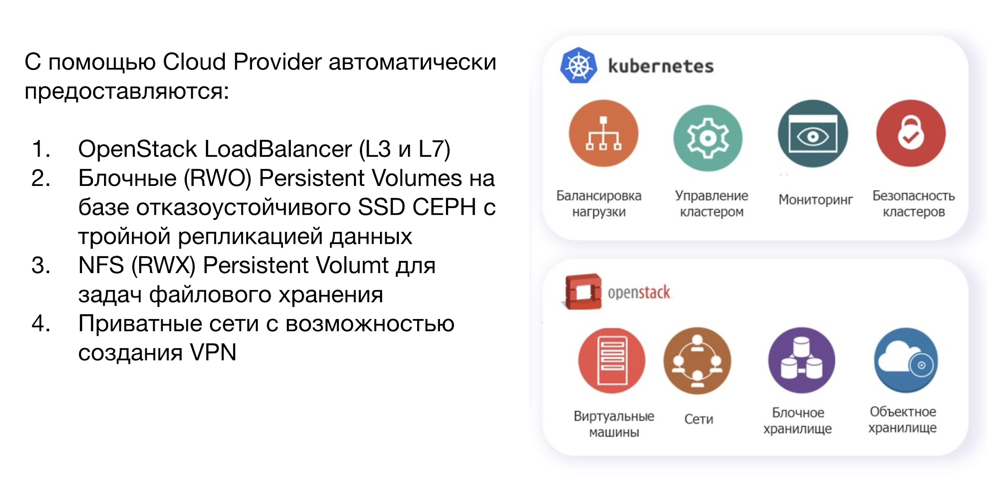

The integration of Kubernetes with the cloud is not one-way. Kubernetes isn't just deployed to virtual machines, it fully integrates with OpenStack IaaS.

On the basis of the Cloud Provider OpenStack, a Cloud Provider for VK CS was created, which, within the framework of the OpenStack project (tenant), connects to the VK CS API and creates, configures, removes disks, balancers, external IP addresses, connects them to Kubernetes nodes, configures security groups.

