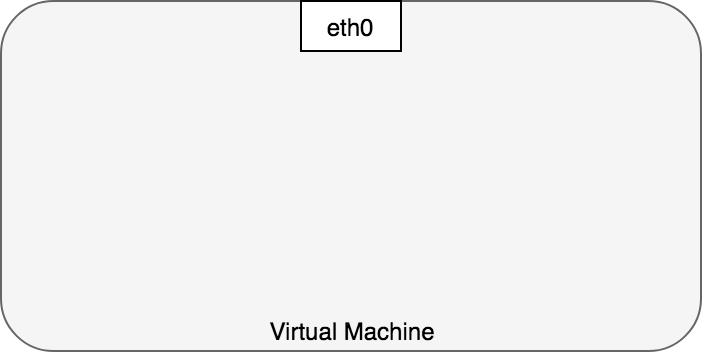
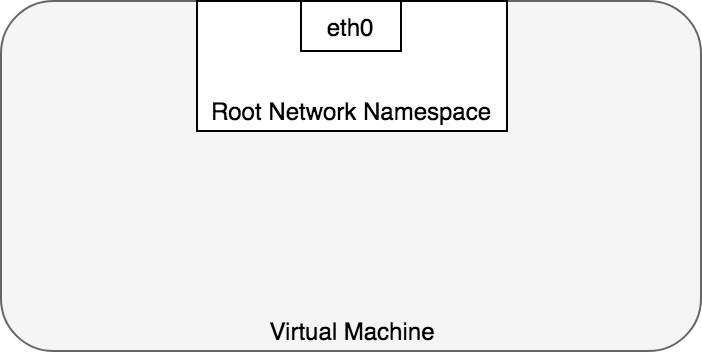

## Kubernetes networking model

Kubernetes has the following requirements for any network implementation:

- all modules can communicate with all other modules without using network address translation (NAT).
- all nodes can communicate with all modules without NAT
- The IP address that the Pod sees in itself is the same IP that others see it as

Given these limitations, the following network communication issues remain to be addressed:

1.  Container-container network
2.  Pod-to-Pod Network

Let's take a look at these problems in turn and how to solve them.

## Container-container network

Typically, networking in a virtual machine is viewed as communicating directly with an Ethernet device, as shown in the figure.



In Linux, each running process interacts with a network namespace, which provides a logical network stack with its own routes, firewall rules, and network devices. The network namespace provides a new network stack for all processes in the namespace.

Network namespaces can be created using the ip command. For example, the following command will create a new network namespace named ns1.

```
 ip netns add ns1
```

When you create a namespace, a mount point / var / run / netns is created for it, allowing the namespace to persist even if there is no process attached to it.

You can list the available namespaces by listing all mount points under / var / run / netns using the ip command.

```
 ls / var / run / netns
ns1
ip netns
ns1
```

By default, Linux assigns each process to the root network namespace to provide access to the outside world:



In terms of Docker constructs, a Pod is modeled as a group of Docker containers that share a network namespace. All containers inside a module have the same IP address and portspace assigned through the network namespace assigned to the module and can find each other through localhost since they are in the same namespace. You can create a network namespace for each module in the virtual machine. This is implemented using Docker as the "pod container" that keeps the network namespace open, while the "application containers" (whatever the user has specified) are attached to this namespace using the Docker –net = container: function.


Applications within a module also have access to shared volumes, which are defined as part of the module and are available for mounting on the file system of each application.

## Pod-to-Pod Network

In Kubernetes, each pod has a real IP address, and each pod communicates with other pods using that IP. You need to understand how Kubernetes provides Pod-to-Pod communication using real IP addresses, whether the Pod is deployed on one physical node or on another node in the cluster. Consider the modules that are on the same computer to avoid the complexities associated with navigating the internal network for communication between nodes.

From the Pod's point of view, it exists in its own Ethernet namespace, which needs to communicate with other network namespaces on the same node. Fortunately, namespaces can be linked using a Linux Ethernet virtual device or a veth pair of two virtual interfaces that can be distributed across multiple namespaces. To bind the Pod namespaces, we can assign one side of the veth pair to the root network namespace and the other side to the network Pod namespace. Each veth pair acts like a patch cable, connecting the two sides and allowing traffic to flow between them. This setting can be replicated for any number of modules on the machine.

~~

In this step, the pods are configured so that each has the same network namespace, so that they think they have their own Ethernet device and IP address, and are connected to the root namespace for Node. Now you need to ensure that the pods communicate with each other through the root namespace, and for this, a network bridge will be used.

A Linux Ethernet bridge is a virtual layer 2 networking device used to connect two or more network segments together, working transparently to connect two networks together. A bridge works by maintaining a forwarding table between sources and recipients, checking the destination of data packets that pass through it, and deciding whether to forward packets to other network segments connected to the bridge. The bridging code decides whether to send or discard data by looking at the MAC address unique to each Ethernet device on the network.

Bridges implement ARP to discover the link-layer MAC address associated with a given IP address. When a data frame is received by a bridge, the bridge transmits the frame to all connected devices (except the original sender), and the device that responds to the frame is stored in the lookup table. Future traffic with the same IP address uses the lookup table to determine the correct MAC address to forward the packet.


