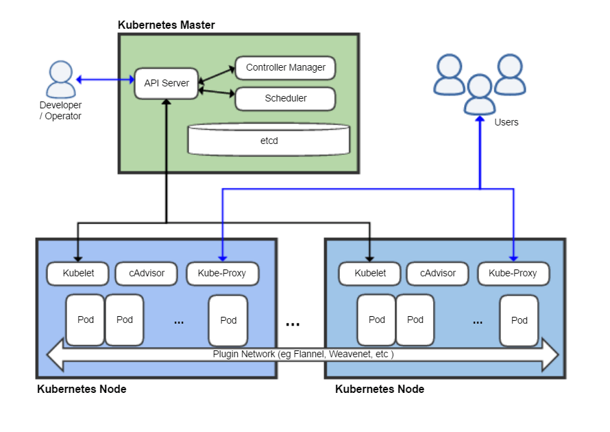

## Description

A **node** is a separate physical or virtual machine on which application containers are deployed and run. Each node in the cluster contains services for running applications in containers (such as Docker), as well as components for centralized management of the node.

**Pod** (pod, from English - "cocoon", also a module) is a basic unit for managing and launching applications, one or more containers that are guaranteed to run on one node, sharing resources, interprocess communication, and providing a unique IP within the cluster. the address. The latter allows pod applications to use fixed and predefined port numbers without the risk of conflict. Pods can be directly managed using the Kubernetes API, or control can be transferred to a controller.

All management objects (nodes, pods, containers) in Kubernetes are labeled with **labels** , label selectors are requests that allow you to get a reference to objects that match any of the labels; labels and selectors are Kubernetes' main mechanism for choosing which object to use for the requested operation.

A **service** in Kubernetes is a collection of logically related sets of pods and access policies to them. For example, a service may correspond to one of the layers of software designed in accordance with the principles of a layered software architecture. The set of pods corresponding to the service is obtained by executing the corresponding label selector.

Kubernetes provides service discovery and on-demand routing functions, in particular, the system can reassign the IP address and domain name of the service required to access the service to the various subpods that are part of it. This provides load balancing between pods, whose labels correspond to the Round robin DNS service, as well as correct operation if one of the cluster nodes fails and the pods located on it are automatically moved to another. By default, the service is available inside the managed Kubernetes cluster, for example, the backend pods are grouped to provide load balancing and are provided to the frontend as such, but it can also be configured to provide external access to the pods that are part of it, as a single frontend.

