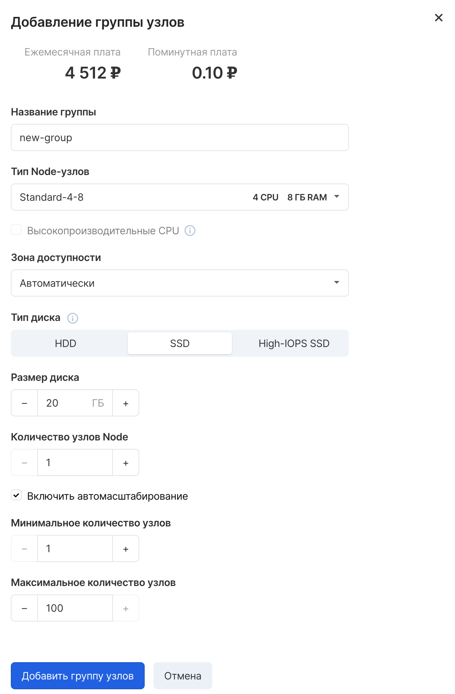
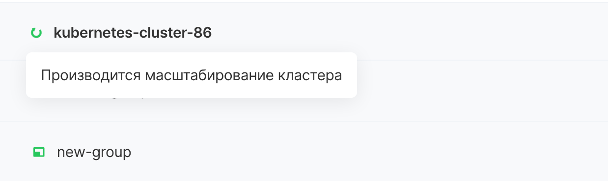

A node group is a set of nodes with a common flavor. It is possible to create several node groups with different flavors and speaking names to solve different problems. For example, you can create a node group with a great flavor for resource-intensive containers.

In VK CS panel
------------

For a node group in your VK CS account you should:

1.  Go to the Kubernetes Clusters page in the Containers section.
2.  Open the context menu of the cluster, select the "Add node group" item
    
    
3.  In the menu that appears, you need to set the parameters:
    
    
    
    <table style="width: 100%;"><tbody><tr><td style="width: 28.5333%;">Group name</td><td style="width: 71.3334%;">set the name of the node-group</td></tr><tr><td style="width: 28.5333%;">Node type</td><td style="width: 71.3334%;">select the required type (node size, number of CPU / RAM)</td></tr><tr><td style="width: 28.5333%;">High performance CPU</td><td style="width: 71.3334%;">if nodes with high-performance CPUs are required, you need to check the corresponding box (the corresponding flavors must be added to the project, contact support to add them)</td></tr><tr><td style="width: 28.5333%;">Accessibility zone</td><td style="width: 71.3334%;">specify availability zone</td></tr><tr><td style="width: 28.5333%;">Disc type</td><td style="width: 71.3334%;">choose a disk type with suitable performance, but we do not recommend writing / reading from node disks inside pods, for such purposes it is better to use PVC</td></tr><tr><td style="width: 28.5333%;">Disk size</td><td style="width: 71.3334%;">set disk size</td></tr><tr><td style="width: 28.5333%;">Number of Node</td><td style="width: 71.3334%;">number of worker nodes</td></tr><tr><td style="width: 28.5333%;">Enable autoscaling</td><td style="width: 71.3334%;">adds a special autoscaler sub to the cluster, which monitors the state of the pods in the cluster, and if due to lack of resources the pods have the Pending status, autoscaler creates new nodes</td></tr><tr><td style="width: 28.5333%;">Minimum number of nodes</td><td style="width: 71.3334%;">the number below which the number of nodes will not fall (cannot be more than the Number of Node nodes from the previous paragraph)</td></tr><tr><td style="width: 28.5333%;">Maximum number of nodes</td><td style="width: 71.3334%;">number above which the number of nodes will not rise</td></tr></tbody></table>
    
4.  Click the Add a group of nodes button, after which the cluster will start scaling
    
5.  After a while (up to one hour, depending on the number of added nodes), the cluster will finish scaling and the node-group will be added to the cluster