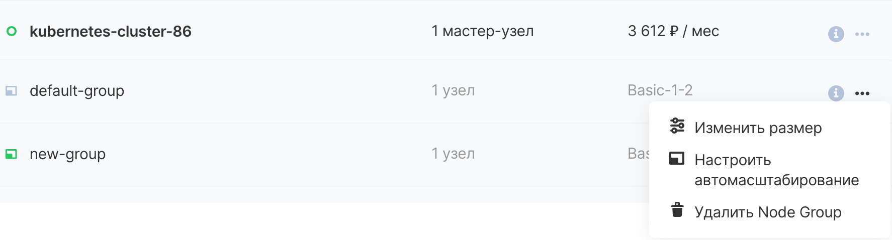

To edit, you need to open the context menu of the node group.

The Resize button allows you to set the current number of nodes in a node-group. After clicking the Save changes button, cluster scaling to the specified number will start.

Configure autoscaling allows you to enable or disable this function for a node-group, as well as set the minimum and maximum number of nodes in it.

The Delete node-group button will start deleting all nodes from this group, it is impossible to cancel this operation.
