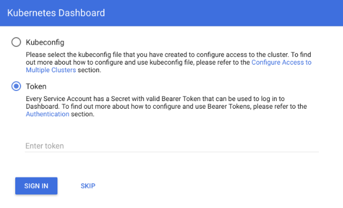

## Description

Kubernetes Dashboard is a universal web interface for Kubernetes clusters. It allows users to manage and troubleshoot applications running on the cluster, and to manage the cluster itself.

## Connection

First, you need to get Secret to access the cluster. This can be done in two ways: through the VK Cloud GUI and using kubectl.

1.  Using the VK Cloud interface, go to the cluster, from the menu, select "Get Secret to enter Kubernetes dashboard".
2.  Alternatively with kubectl. You need to run the command and copy its output:

```
kubectl get secret $(kubectl get sa dashboard-sa -o jsonpath='{.secrets[0].name}') -o jsonpath='{.data.token}' | base64 --decode
```

2.  Start kubectl proxy:

```
kubectl proxy
```

3.  Open a browser and follow the link:

[http://localhost:8001/api/v1/namespaces/kube-system/services/https:kubernetes-dashboard:/proxy/](http://localhost:8001/api/v1/namespaces/kube-system/services/https:kubernetes-dashboard:/proxy/)

4.  In the window that opens, select the "Token" option.
5.  Insert the token received from the previous command and click "Sign In".

    

6.  The Kubernetes Dashboard window will open with superadmin rights.
