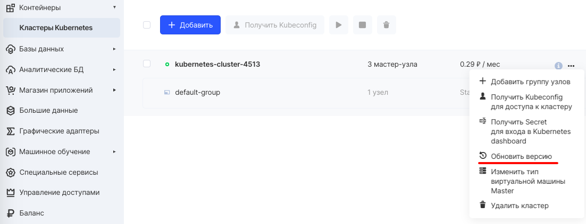
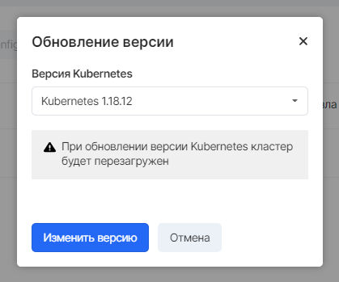

## Before updating

It is recommended to save important data and applications, make a backup, and also perform an update operation on the cluster copies to prevent possible problems and data loss.

**Important**

You can only upgrade a cluster to a newer version. Reverse operation or downgrade is not possible.

Upgrading a cluster from version v1.15 to version v1.16 and higher is possible only through the operation of creating a new cluster. To perform this operation, it is recommended to [use the Velero](https://mcs.mail.ru/help/k8s-backups/k8s-import) cluster backup software and then restore to a newer version.

## Update in VK Cloud Panel

Cluster version updates are made in the "Containers" section of the VK Cloud Panel. To do this, select the appropriate "Update version" option in the context menu of the required cluster:

In the pop-up window, you need to select the desired new version and confirm the change of version with the "Change version" button.

During the upgrade operation, the cluster nodes will be rebooted 1 in 1 (rolling upgrade). The master nodes will be updated first, then the node nodes.

If you upgrade a cluster with 1 master-node or 1 node-node, your application may be interrupted because all of its replicas will be on the node being updated.

In the case of upgrading a cluster with 3 master-nodes and 2 or more node-nodes, the upgrade will be performed without affecting the performance of the end applications.
