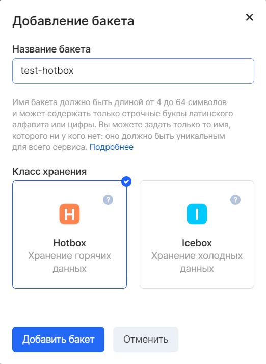
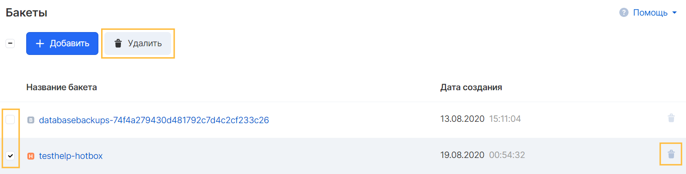

Buckets are containers for objects. A project can have one or more buckets. Access to each bucket can be controlled: specify which users can create and delete objects in the bucket, and display a list of objects.

## Bucket name

The bucket name is used to access data and will be seen by other users when granting access.

Bucket names must be unique for all projects of the Object Storage service, ie. you cannot create two buckets with the same names even in different projects.

The bucket name must meet the following conditions:

- Contain between 4 and 63 characters
- Do not contain uppercase characters (uppercase)
- Start with a lowercase character (lowercase) or numbers

Not recommended in name:

- The format is similar to the IP address (i.e. 192.168.5.4)
- Using the underscore (\_) character, because it is not DNS-compatible and such a bucket cannot be bound to a DNS name
- Start with characters xn--

It is recommended to avoid using personal information such as project number or user account in the bucket name.

## Features of use

- Bucket cannot be renamed
- Buckets cannot be nested
- You can delete a bucket only if there are no objects in it
- It is impossible to delete a bucket with the "Backup" type on your own, this type of storage is managed by the instance backup service
- After deleting a bucket, it may take some time before creating a new bucket with the same name becomes possible.

## Bucket creation

To create a bucket in the VK CS panel:

1.  Go to the "Buckets" tab of the Object Storage service in the VK CS panel.
2.  Press the "Add" button:
3.  Select the type of bucket to create and enter a DNS-compatible name:

## Removing a bucket

Deleting a bucket after cleaning it is possible in the general list of buckets of the Object Storage service. To delete one bucket, you can use the delete button against the bucket, and to delete several elements, you can select using the checkbox to the left of the buckets:

**Attention**

The bucket with the Backup storage class cannot be deleted. You can delete the objects it contains through the backup service. Deletion of backups can be delayed, therefore, if there are backup objects in it, you should wait until the delete backup operation is completed.

After deleting backups, the Backup bucket may be empty. It is required by Object Storage for further work with backup plans in the project.
