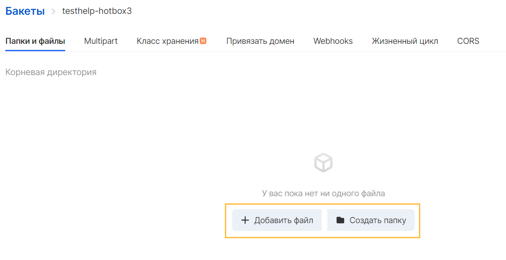
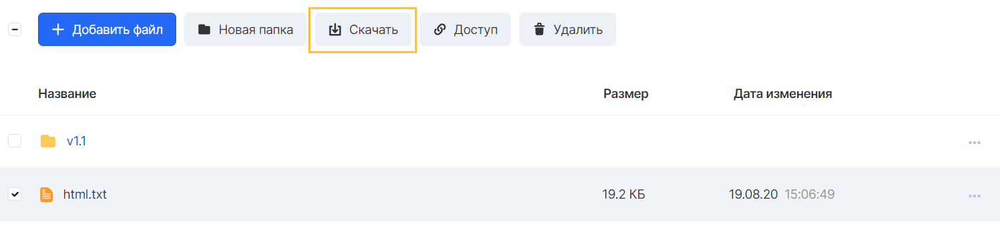
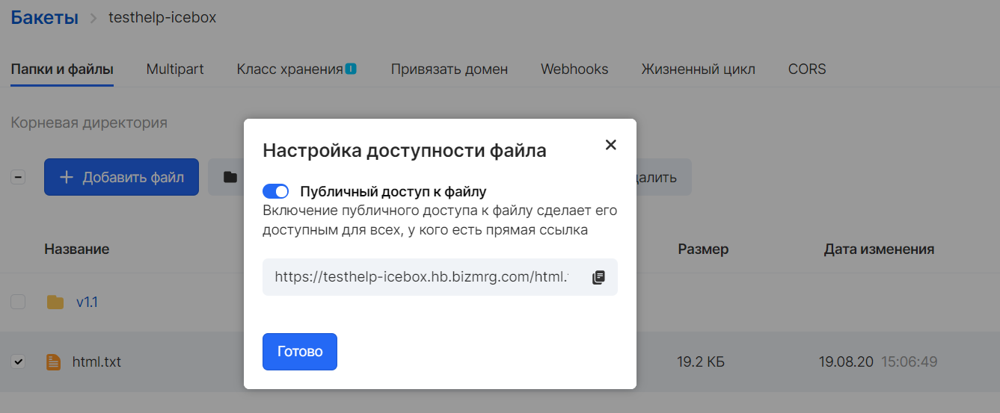
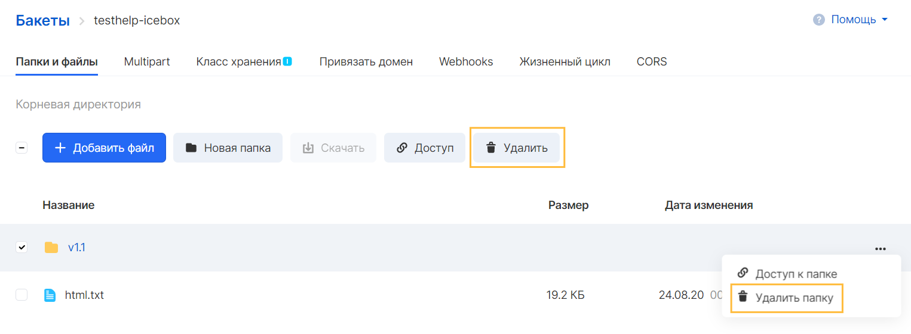
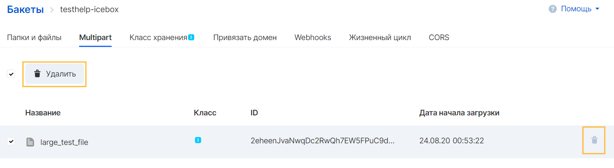

VK Cloud Object Storage is a simple key and value store designed to store any number of objects. These objects are stored in one or more buckets, and each object can be up to 320 TB in size.

## general information

The object consists of the following:

**Key** - the name that is assigned to the object. The object key is used to retrieve the object.

**Value** is the content of the stored object. The object value can be any sequence of bytes. Objects can range in size from zero to 320 TB.

**Metadata** is a set of name-value pairs that can be used to store information about an object. It is possible to assign metadata, called custom metadata, to your objects in Object Storage. VK Cloud also assigns system metadata to these objects, which is used to manage the objects. The object's custom metadata can be up to 2KB in size.

**Information for access control** **(Access Control Information)** - you can control access to objects stored in the Object repository. VK Cloud supports resource-based access control such as access control list (ACL) and bucket policies, as well as user-based access control.

## Functionality

Loadable objects have additional functionality such as:

Storage class - VK Cloud provides the ability to use several storage classes to best suit the needs: Hotbox for active work with objects and Cold storage (Icebox) for long-term storage with rare requests to them.

Lifecycle - a mechanism that determines automatic actions to delete individual objects of a bucket or a group of objects within a specified period of time

## Loading an object

The created bucket can be loaded with files that are saved as an S3 object. Objects are composed of file data and metadata describing the object. The bucket can contain an unlimited number of objects.

You can upload any type of file - images, backups, data, movies, etc. - to the S3 bucket. The maximum size of a regular file that can be uploaded to a bucket is 32 GB. For files that exceed this size, you must use the multipart upload and store method. For a comfortable download of a file larger than 1 GB, it is recommended to use the AWS S3 CLI or AWS S3 REST API.

To load objects, go to the created bucket in the "Buckets" section of the "Object Storage" service:

The VK Cloud panel allows you to work with buckets as with a hierarchical file system: create folders and load objects into them. The key of the object will be the entire path to the object from the root of the bucket.

When loading a folder, S3 loads all files and subfolders from the specified folder into the bucket. It then assigns a key object name, which is a combination of the downloaded file name and the folder name.

If an object with a key name that already exists in the bucket is loaded, S3 replaces the existing object.

## Displaying objects

You can view the objects in the bucket using graphical tools such as the VK Cloud Panel or graphical file manager, and the AWS S3 CLI console.

In the VK Cloud panel, the list of objects is available when you select a bucket in the Buckets menu of the Object Storage service:

In Object Storage, a folder is a zero-sized object whose key is included in the keys of other objects as a prefix. The VK Cloud panel interface, as well as file managers such as CyberDuck, allow you to work with these objects as folders, simulating a hierarchical structure.

## Downloading an object

Downloading of a single object or a group of objects is available in the VK Cloud panel.

To download objects, select the desired object or mark several objects and click the "Download" button:

To download a single object, you can use the options menu of the selected object.

To download the entire folder (directory) in the bucket, use the S3 CLI, or S3-compatible file managers, for example CyberDuck.

## Providing access to an object

By default, objects uploaded to the bucket have private access settings, which prevents users from accessing them from the Internet.

Enabling public access to the file will make it available to anyone with a direct link.

You can enable public access in the context menu of an object or a set of bucket objects.

The link contains the name of the bucket containing the object, the endpoint of the Object Storage service, and the object key. The object will be available for reading and copying from the Internet, but it will not be possible to delete it.

**Note**

Making a folder public will open access to the objects contained in that folder, but not to the folder itself, since the final URL can only contain the object itself.

## Deleting an Object

Deleting an object, folder or group of objects can be done in the graphical interface of the VK Cloud panel, S3 CLI or any S3-compatible file manager.

To delete one or several objects or folders in the VK Cloud panel, select one or several objects or folders and press the "Delete" button in the object menu or the list menu:

## Removing a multipart object

When using multipart upload for bulk files, you can delete a partially loaded object from the Multipart tab of the selected bucket.

