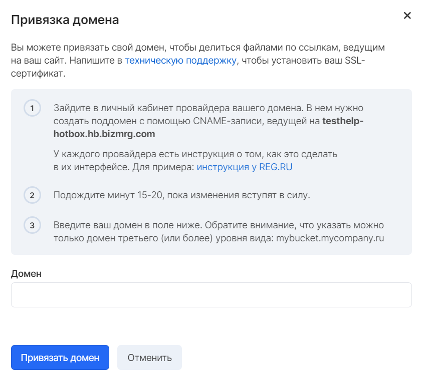

The Object Storage service allows you to use resources for hosting static sites based on HTML, CSS and JavaScript technologies. The store can also be used to forward requests.

**Attention**

The bucket used for hosting cannot be used to host scripts that require running on the web server side.

## Domain binding

To provide access to bucket objects using links leading to a unique site, you can bind your domain on the "Bind Domain" tab.

Pre-required:

1.  Register a domain with any hosting provider
2.  Create a subdomain that will be used for the created bucket
3.  Link subdomain in VK CS panel



After binding, the bucket will be available via a link of the form:

```
 http: // <backet_name>. <website_address>. <domain_zone>
```

**Note**

When you create a bucket with a period (.) Character in the name, it will only be available when using the HTTP protocol. If you need to use the HTTPS protocol, you must install an SSL certificate.

## Installing an SSL Certificate

To install a personal SSL certificate, you should [contact technical support](https://mcs.mail.ru/docs/contacts) , specifying the project, bucket data and providing an SSL certificate for installation.

After installing the certificate, the bucket will be available via a link of the form:

```
 https: // <packet_name>. <website_address>. <domain_zone>
```
