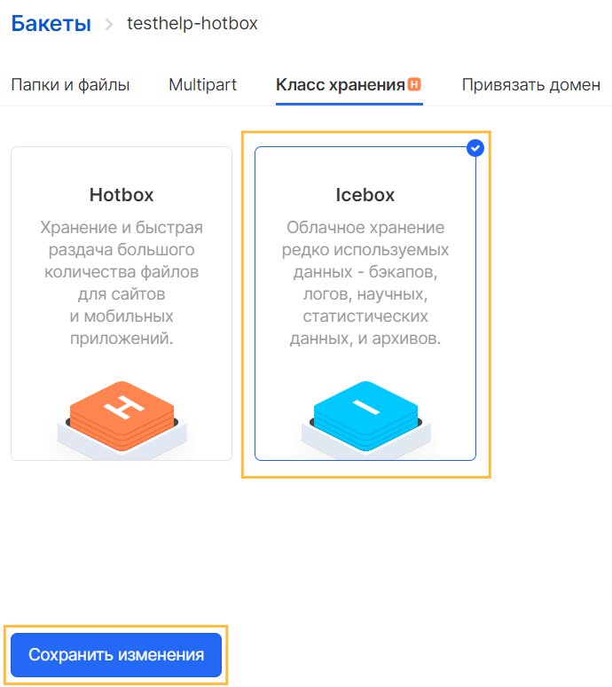

List of classes
---------------

There are several bucket classes that differ in both the purpose and the amount of payment for the objects placed in them:

*   **Hotbox** - storage and fast distribution of a large number of files for media services, online media, sites with multi-user content and mobile applications
*   **Icebox** - cloud storage of rarely used data: backups, logs, media content, scientific, statistical data, as well as working archives
*   **Backup** - placement of backups of instances created both automatically and manually. A bucket of this class cannot be created or deleted on its own, but is managed by a backup service.

Changing the bucket class
-------------------------

After creating a bucket in the panel interface, it is possible to change its class: from Hotbox to Icebox and back. To do this, in the VK CS panel, select the bucket whose class is to be changed, then change the class on the "Storage class" tab and confirm the changes with the "Save changes" button:

