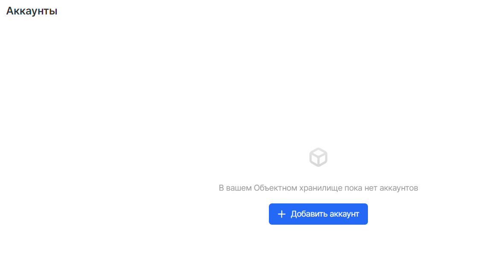

VK CS provides a RESTful XML API for programmatically manipulating stored data using standard HTTP requests. The API is compatible with the Amazon AWS S3 API, allowing you to interact with the service using familiar tools.

**Note**

SOAP over HTTP support has been deprecated but is still available over HTTPS. However, new Amazon S3 features will not be supported for SOAP. REST API or AWS SDK is recommended.

## S3 compatible

The VK CS S3 API is designed to interact with the Amazon AWS S3 API. In most cases, when using the client library, setting the "endpoint" or "base" URL hb.bizmrg.com and creating the VK CS S3 key pair will allow the VK CS Object Storage service.

VK CS S3 provides support for create, read, update, and delete operations for both buckets and objects, as well as the ability to define access control lists (ACLs). Some S3 features are not supported, as shown in the table below:

<table border="0" cellpadding="0" cellspacing="0" style="margin-right: calc(1%); width: 99%;" width="289"><tbody><tr><td height="19" style="width: 32.962%; background-color: rgb(239, 239, 239);" width="38.062283737024224%">Function</td><td style="width: 21.3418%; background-color: rgb(239, 239, 239);" width="29.41176470588235%">Support</td><td style="width: 45.443%; background-color: rgb(239, 239, 239);" width="32.52595155709343%">Note</td></tr><tr><td height="19" style="width: 32.962%;">Bucket Create, Read, Update, Delete</td><td style="width: 21.3418%;">Yes</td><td style="width: 45.443%;"><br></td></tr><tr><td height="19" style="width: 32.962%;">Object Create, Read, Update, Delete</td><td style="width: 21.3418%;">Yes</td><td style="width: 45.443%;"><br></td></tr><tr><td height="19" style="width: 32.962%;">Multipart Uploads</td><td style="width: 21.3418%;">Yes</td><td style="width: 45.443%;"><br></td></tr><tr><td height="19" style="width: 32.962%;">Pre-Signed URLs</td><td style="width: 21.3418%;">Yes</td><td style="width: 45.443%;">Both v2 and v4 signature types are supported</td></tr><tr><td height="19" style="width: 32.962%;">Bucket ACLs</td><td style="width: 21.3418%;">Yes</td><td style="width: 45.443%;"><br></td></tr><tr><td height="19" style="width: 32.962%;">Object ACLs</td><td style="width: 21.3418%;">Yes</td><td style="width: 45.443%;"><br></td></tr><tr><td height="19" style="width: 32.962%;">Identity and Access Management (IAM)</td><td style="width: 21.3418%;">No</td><td style="width: 45.443%;"><br></td></tr><tr><td height="19" style="width: 32.962%;">Security Token Service (STS)</td><td style="width: 21.3418%;">No</td><td style="width: 45.443%;"><br></td></tr><tr><td height="19" style="width: 32.962%;">Multi-factor Authentication</td><td style="width: 21.3418%;">No</td><td style="width: 45.443%;"><br></td></tr><tr><td height="19" style="width: 32.962%;">Public Access Block</td><td style="width: 21.3418%;">No</td><td style="width: 45.443%;"><br></td></tr><tr><td height="19" style="width: 32.962%;">Bucket Policies</td><td style="width: 21.3418%;">No</td><td style="width: 45.443%;"><br></td></tr><tr><td height="19" style="width: 32.962%;">Object Policies</td><td style="width: 21.3418%;">No</td><td style="width: 45.443%;"><br></td></tr><tr><td height="19" style="width: 32.962%;">Bucket Versioning</td><td style="width: 21.3418%;">No</td><td style="width: 45.443%;"><br></td></tr><tr><td height="19" style="width: 32.962%;">Bucket Replication</td><td style="width: 21.3418%;">No</td><td style="width: 45.443%;"><br></td></tr><tr><td height="19" style="width: 32.962%;">Bucket Notifications</td><td style="width: 21.3418%;">No</td><td style="width: 45.443%;"><br></td></tr><tr><td height="19" style="width: 32.962%;">Bucket Tagging</td><td style="width: 21.3418%;">No</td><td style="width: 45.443%;"><br></td></tr><tr><td height="19" style="width: 32.962%;">Object Tagging</td><td style="width: 21.3418%;">Yes</td><td style="width: 45.443%;"><br></td></tr><tr><td height="19" style="width: 32.962%;">Request Payment</td><td style="width: 21.3418%;">No</td><td style="width: 45.443%;"><br></td></tr><tr><td height="19" style="width: 32.962%;">Bucket Lifecycle</td><td style="width: 21.3418%;">Yes</td><td style="width: 45.443%;">Object expiration and removal of incomplete compound downloads are supported. Lifecycle policies based on tagging objects are not supported.</td></tr><tr><td height="19" style="width: 32.962%;">Bucket Inventory</td><td style="width: 21.3418%;">No</td><td style="width: 45.443%;"><br></td></tr><tr><td height="19" style="width: 32.962%;">Bucket Access Logging</td><td style="width: 21.3418%;">No</td><td style="width: 45.443%;"><br></td></tr><tr><td height="19" style="width: 32.962%;">Bucket Metrics</td><td style="width: 21.3418%;">No</td><td style="width: 45.443%;"><br></td></tr><tr><td height="19" style="width: 32.962%;">Bucket Analytics</td><td style="width: 21.3418%;">No</td><td style="width: 45.443%;"><br></td></tr><tr><td height="19" style="width: 32.962%;">Bucket Accelerate</td><td style="width: 21.3418%;">No</td><td style="width: 45.443%;"><br></td></tr><tr><td height="19" style="width: 32.962%;">Bucket Encryption Configuration</td><td style="width: 21.3418%;">No</td><td style="width: 45.443%;"><br></td></tr><tr><td height="19" style="width: 32.962%;">Bucket Websites</td><td style="width: 21.3418%;">No</td><td style="width: 45.443%;"><br></td></tr><tr><td height="19" style="width: 32.962%;">Object Torrent</td><td style="width: 21.3418%;">No</td><td style="width: 45.443%;"><br></td></tr><tr><td height="19" style="width: 32.962%;">Object Lock</td><td style="width: 21.3418%;">No</td><td style="width: 45.443%;"><br></td></tr></tbody></table>

API requests for S3 functions that are not currently supported by VK CS will receive an S3-compliant NotImplemented error response in XML format.

**Python example**

```
import boto3
from botocore.client import Config
# Initialize session to VK CS S3.
session = boto3.session.Session ()
client = session.client ('s3',
region_name = 'ru-msk',
endpoint_url = 'https: //hb.bizmrg.com',
aws_access_key_id = 'urvt4LXPwoSL9s6ieGTLT5',
aws_secret_access_key = '5JogfQUsWzzBE9xG1mbBkMkgW7pxY4TGyHgefSC9n2Xx')
# Create a new bucket.
client.create_bucket (Bucket = 'my-test-bucket1')
# View the list of buckets in the project.
response = client.list_buckets ()
buckets = [bucket ['Name'] for bucket in response ['Buckets']]
print ("Bucket List:% s"% buckets)
```

**Go example**

```
package main
import (
"context"
    "fmt"
"log"
"os"
"github.com/minio/minio-go"
"github.com/minio/minio-go/pkg/credentials"
)
func main () {
accessKey: = os.Getenv ("VK CS_KEY")
secKey: = os.Getenv ("VK CS_SECRET")
endpoint: = "hb.bizmrg.com"
bucketName: = "my-test-bucket1" // Bucket names must be unique for all VK CS projects
ssl: = true
if accessKey == "" || secKey == "" {
log.Fatal ("Must provide VK CS_KEY and VK CS_SECRET environment variables!")
}
// Connect to VK CS S3.
client, err: = minio.New (endpoint, & minio.Options {
Creds: credentials.NewStaticV4 (accessKey, secKey, ""),
Secure: ssl,
})
if err! = nil {
log.Fatal (err)
}
// Create a new bucket.
err = client.MakeBucket (context.TODO (), bucketName, minio.MakeBucketOptions {Region: "ru-msk"})
if err! = nil {
log.Fatal (err)
}
// Show a list of all buckets.
buckets, err: = client.ListBuckets (context.TODO ())
if err! = nil {
log.Fatal (err)
}
fmt.Println ("List of all buckets for this access key:")
for _, bucket: = range buckets {
fmt.Println (bucket.Name)
}
}
```

## Authentication

Requests to the VK CS S3 APIs must include the HTTP-Authorization header. The AWS v4 signature type is supported, as well as the AWS v2 signature type for compatibility with legacy customers. The examples below use v4 signatures. When using the client library, signatures will be generated automatically.

You can create the required access key and secret key in the "Accounts" menu of the "Object Storage" service of the graphical interface of the VK CS panel.

 When creating an account, an Access Key ID and Secret Key values will be generated that are required for use:


The v4 signature consists of several parts. The table below describes each part of the example separately:

<table border="0" cellpadding="0" cellspacing="0" style="margin-right: calc(2%); width: 98%;" width="195"><tbody><tr><td height="19" style="background-color: rgb(239, 239, 239);" width="56.41025641025641%">Parameter</td><td style="background-color: rgb(239, 239, 239);" width="43.58974358974359%">Description</td></tr><tr><td height="19">AWS4-HMAC-SHA256</td><td>AWS Version 4 Signature (AWS4) and Signature Algorithm (HMAC-SHA256)</td></tr><tr><td height="19">Credential</td><td>Contains an access key and request information in the format: $ {ACESS_KEY} / $ {YYYMMDD} / $ {REGION_SLUG} / s3 / aws4_request</td></tr><tr><td height="19">SignedHeaders</td><td>A lowercase list of request header names used in signature computation, for example: host; x-amz-acl; x-amz-content-sha256; x-amz-date</td></tr><tr><td height="19">Signature</td><td>A signed hash consisting of the hash of the request body, the secret key, and information about the request (canonical request). To demonstrate how this is calculated, a "pseudo-code" example is provided.</td></tr></tbody></table>

**Authorization header example**

```
Authorization: AWS4-HMAC-SHA256
Credential = urvt4LXPwoSL9s6ieGTLT5 / 20200831 / ru-msk / s3 / aws4_request,
SignedHeaders = host; x-amz-acl; x-amz-content-sha256; x-amz-date,
Signature = 6cab03bef74a80a0441ab7fd33c829a2cdb46bba07e82da518cdb78ac238fda5
```

**Signature example (pseudo code)**

```
canonicalRequest = \`
{HTTPMethod} \ n
{canonicalURI} \ n
{canonicalQueryString} \ n
{canonicalHeaders} \ n
{signedHeaders} \ n
{hashedPayload}
\`
stringToSign = "AWS4-HMAC-SHA256" + "\ n" +
date (format = ISO08601) + "\ n" +
date (format = YYYYMMDD) + "/" + "ru-msk" + "/" + "s3 / aws4_request" + "\ n" +
Hex (SHA256Hash (canonicalRequest))
dateKey = HMAC-SHA256 ("AWS4" + {SECRET_KEY}, date (format = YYYYMMDD))
dateRegionKey = HMAC-SHA256 (dateKey, "ru-msk")
dateRegionServiceKey = HMAC-SHA256 (dateRegionKey, "s3")
signingKey = HMAC-SHA256 (dateRegionServiceKey, "aws4_request")
signature = Hex (HMAC-SHA256 (signingKey, stringToSign))
```

The canonical request included in the signature consists of:

- The HTTP request method to use.
- Path component of the request URI.
- Query string parameters included in the request.
- A list of request headers and their values, separated by a newline, in lowercase and without spaces.
- A list of header names without values, sorted alphabetically, in lowercase, and separated by semicolons.
- The SHA256 hash of the request body.

For example, for the following query:

```
GET /? Acl HTTP / 1.1
Host: my-test-bucket1.hb.bizmrg.com
x-amz-content-sha256: e3b0c44298fc1c149afbf4c8996fb92427ae41e4649b934ca495991b7852b855
x-amz-date: 20200831T221549Z
```

This is the canonical query:

```
GET
/
acl =
host: my-test-bucket1.hb.bizmrg.com
x-amz-content-sha256: e3b0c44298fc1c149afbf4c8996fb92427ae41e4649b934ca495991b7852b855
x-amz-date: 20200831T221549Z
host; x-amz-content-sha256; x-amz-date
e3b0c44298fc1c149afbf4c8996fb92427ae41e4649b934ca495991b7852b855
```

## General headers

Common headers that can be used in most requests:

<table border="0" cellpadding="0" cellspacing="0" style="margin-right: calc(0%); width: 100%;" width="195"><tbody><tr><td height="19" style="width: 20%; background-color: rgb(239, 239, 239);" width="56.41025641025641%">Name</td><td style="width: 79.7468%; background-color: rgb(239, 239, 239);" width="43.58974358974359%">Description</td></tr><tr><td height="19" style="width: 20%;">Authorization</td><td style="width: 79.7468%;">Authorization details for request in AWS Signature Version 4 or AWS Signature Version 2 format</td></tr><tr><td height="19" style="width: 20%;">Content-Length</td><td style="width: 79.7468%;">The length of the request body in bytes. Required for PUT requests containing an XML body.</td></tr><tr><td height="19" style="width: 20%;">Content-Type</td><td style="width: 79.7468%;">The MIME type of the request body (e.g. text / plain)</td></tr><tr><td height="19" style="width: 20%;">Date</td><td style="width: 79.7468%;">Current date and time in Coordinated Universal Time (UTC) format in RFC 2822 format. Example: Mon, 10 Jul 2017 19:05:09 +0000</td></tr><tr><td height="19" style="width: 20%;">Host</td><td style="width: 79.7468%;">The target host for the request (for example, my-test-bucket1.hb.bizmrg.com).</td></tr><tr><td height="19" style="width: 20%;">x-amz-content-sha256</td><td style="width: 79.7468%;">The SHA256 hash of the request payload. Required when using AWS Signature Version 4 for authentication.</td></tr><tr><td height="19" style="width: 20%;">x-amz-date</td><td style="width: 79.7468%;">The current date and time in Coordinated Universal Time (UTC) using the ISO 8601 format:% Y% m% dT% H% M% SZ (for example 20200831T172753Z). If provided, it takes precedence over the Date heading.</td></tr></tbody></table>

These general headers can also be found in most of the answers:

<table border="0" cellpadding="0" cellspacing="0" style="margin-right: calc(0%); width: 100%;" width="195"><tbody><tr><td height="19" style="width: 25.7975%; background-color: rgb(239, 239, 239);" width="56.41025641025641%">Name</td><td style="width: 74.0759%; background-color: rgb(239, 239, 239);" width="43.58974358974359%">Description</td></tr><tr><td height="19" style="width: 25.7975%;">Content-Length</td><td style="width: 74.0759%;">Response body length in bytes</td></tr><tr><td height="19" style="width: 25.7975%;">Content-Type</td><td style="width: 74.0759%;">The MIME type of the request body (e.g. text / plain)</td></tr><tr><td height="19" style="width: 25.7975%;">Connection</td><td style="width: 74.0759%;">Indicator of whether the connection to the server is open or closed</td></tr><tr><td height="19" style="width: 25.7975%;">Date</td><td style="width: 74.0759%;">Date and time of response, in Coordinated Universal Time (UTC)</td></tr><tr><td height="19" style="width: 25.7975%;">Etag</td><td style="width: 74.0759%;">Object tag containing the MD5 hash of the object</td></tr><tr><td height="19" style="width: 25.7975%;">x-amz-request-id</td><td style="width: 74.0759%;">Unique request ID</td></tr></tbody></table>
