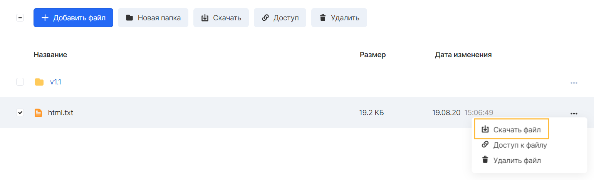

Information about objects
-------------------------

You can view information about an object when you select a bucket on the Buckets tab of the Object Storage service.

All objects of the selected bucket and possible operations with them are listed in the "Folders and files" window.

VK CS provides several ways to access objects:

*   Download
*   Access by public link

Download
--------

To download objects, select the desired object or mark several objects and click the "Download" button:

To download a single object, you can use the options menu of the selected object.

**Attention**

Downloading directories in a bucket is only possible through the S3 CLI, S3 API, or S3-compatible graphical file managers.

Public access
-------------

By default, objects uploaded to the bucket have private access settings that prevent users from accessing them from the Internet.

Enabling public access to the file will make it available to anyone with a direct link.

You can enable public access in the context menu of an object or a set of bucket objects.

The link contains the name of the bucket containing the object, the endpoint of the Object Storage service, and the object key. The object will be available for reading and copying from the Internet, but it will not be possible to delete it.

**Note**

The bucket object reference containing its key cannot be changed at will.