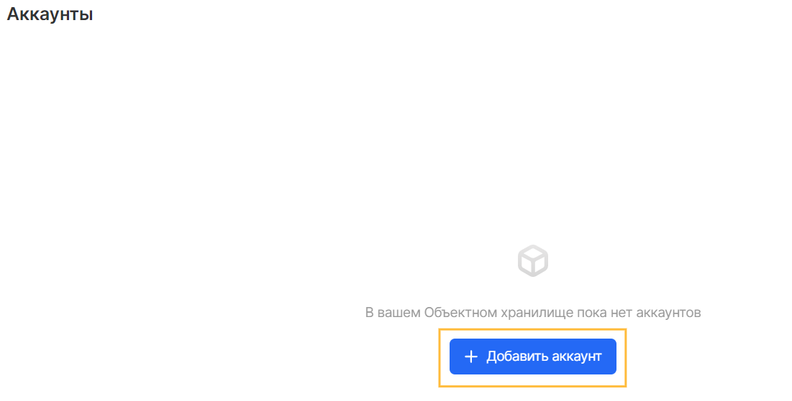
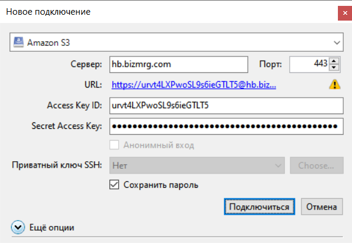
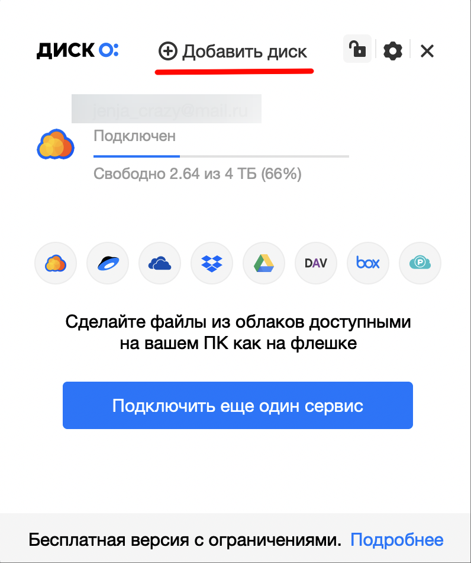
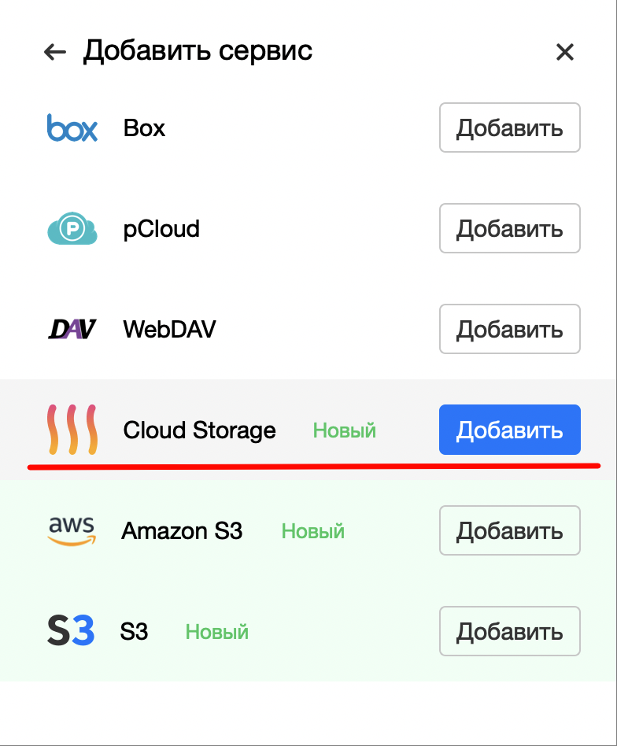

Graphical tools such as file managers allow you to view objects in a bucket by simulating a hierarchical directory structure.

## Before starting work

Before you start working with file managers, you need to create an authorized account or make sure it exists, as well as the availability of data on the key ID and secret key.

You can create an account in the "Accounts" menu of the "Object Storage" service using the "Add account" button:



When you create an account, you will be provided with data that you want to save. After closing the window, it will be impossible to restore the Secret Key, however, if you lose it, you can create a new account or add a new secret key to an existing account:


## CyberDuck

Cyberduck is a free cloud storage browser for Mac and Windows with support for Object Storage S3 as well as many other cloud platforms.

Installation is performed using [the product distribution kit](https://cyberduck.io/download) from the official website, as well as the classic user interface of the operating system.

**Connection**

To connect, specify:

- Connection type: `Amazon S3`
- Server and Port: `hb.bizmrg.com:443`
- Access Key ID: Key identifier obtained when creating an Object Storage account
- Secret access key: the secret key obtained when creating an Object Storage account



**Note**

CyberDuck works with VK Cloud Object Storage as a hierarchical file system. This means that the keys of objects uploaded via CyberDuck will look like a path to a file, for example: prefix / subprefix / image.png.

## WinSCP

WinSCP is an open source graphical SFTP (SSH File Transfer Protocol) client for Windows. It also supports SCP (Secure Copy Protocol). Designed for secure copying of files between a computer and servers that support these protocols.

To configure, enter the following data:

- Transfer protocol: `Amazon S3`
- Hostname: `hb.bizmrg.com`
- Port: `443`
- Access Key ID: Key ID obtained when creating an Object Storage account
- Secret Access Key: The secret key obtained when creating an Object Storage account


**Note**

CyberDuck works with VK Cloud Object Storage as a hierarchical file system. This means that the keys of objects uploaded via CyberDuck will look like a path to a file, for example: prefix / subprefix / image.png.

## S3FS

s3fs allows Linux and macOS to mount an S3 bucket via FUSE. s3fs maintains its own object format for files, allowing you to use other tools such as the AWS CLI.

**Installation**

Many systems provide ready-made packages:

Amazon Linux via EPEL:

```
 sudo amazon-linux-extras install epel
sudo yum install s3fs-fuse
```

Arch Linux:

```
 sudo pacman -S s3fs-fuse
```

Debian 9 and Ubuntu 16.04 or newer:

```
 sudo apt install s3fs
```

Fedora 27 or newer:

```
 sudo dnf install s3fs-fuse
```

Gentoo:

```
 sudo emerge net-fs / s3fs
```

RHEL and CentOS 7 or newer via EPEL:

```
 sudo yum install epel-release
sudo yum install s3fs-fuse
```

SUSE 12 and openSUSE 42.1 or newer:

```
 sudo zypper install s3fs
```

macOS via Homebrew:

```
 brew cask install osxfuse
brew install s3fs
```

**Connection**

To mount a bucket in an operating system, you should:

1.  Save the key ID and private key in the `~/.passwd-s3fs` file in the format `<key_identifier>: <secret_key>`, and also restrict access to the `~/.passwd-s3fs` file:
    ```
     echo <key_identifier>: <secret_key>> ~ / .passwd-s3fs
    chmod 600 ~ / .passwd-s3fs
    ```
2.  Select the directory where the bucket will be mounted and make sure you have permission for the mount operation.
3.  Run a command of the form:
    ```
     s3fs <package_name> / mount / <path_to_folder> -o passwd_file = ~ / .passwd-s3fs -o url = http: //hb.bizmrg.com -o use_path_request_style
    ```

## Disk-O:

Disk-O: - a program that allows you to work with clouds in one place - on your computer. At the same time, files do not take up space on the device, because they are stored only in the clouds. The program works with VK Cloud Object Storage, as well as platforms such as: Cloud Mail.ru, Yandex.Disk, Google Drive, Dropbox and other storages.

The program should be installed using the standard user interface of the operating system, as well as the installation file from the [official website](https://disk-o.cloud/ru/) .

**Connection**

To connect, add the Cloud Storage service, then enter the account and bucket data:



Where:

- Storage: predefined storage class of the Object Storage service - Cold data or Hot data
- Bucket: the name of the existing bucket
- Access Key: Key identifier obtained when creating an Object Storage account
- Secret Key: the secret key obtained when creating an Object Storage account

As a result, the bucket will be mounted as an additional disk in the operating system and will not use local space.

**Attention**

Only one service is available in the free version of Disk-O: When connecting additional drives, you need to purchase the paid version.
