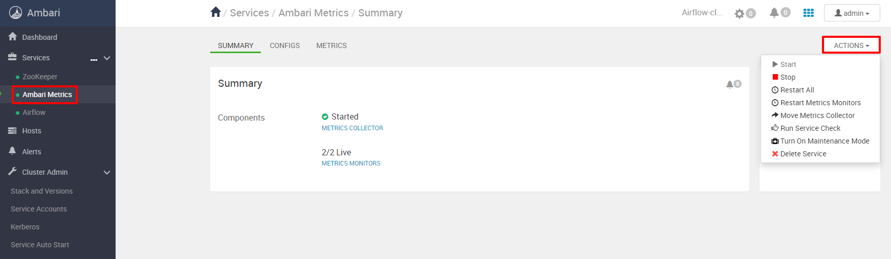

Apache Airflow is a platform for creating, planning and monitoring workflows.

Airflow allows you to create workflows in the form of directed acyclic graphs (DAGs) of tasks. A variety of command line utilities perform complex operations on the DAG. The user interface easily visualizes pipelines running in a production environment, monitors progress, and troubleshoots as needed.

## Apache Airflow Principles

Dynamic - pipelines have a code configuration (Python) that allows you to create dynamic pipelines.

Extension - Easily define your own operators and executors, and extend the library according to the level of abstraction appropriate for your environment.

Clarity - Script parameterization is built into the core of Airflow using the powerful Jinja templating tool.

Scalability - Airflow has a modular architecture and uses a message queue to organize any number of workflows. Airflow is ready for infinite scaling.

This platform is not a streaming solution.

## Assembly components

**ZooKeeper**

Apache Zookeeper is an open source project of the Apache Software Foundation, a coordinator service that provides distributed synchronization of small data (configuration information, namespace) for a group of applications. Zookeeper is a distributed key-value store that guarantees reliable storage of information through synchronous replication between nodes, version control, a queuing mechanism and locks. Due to the use of RAM and scalability, it has high speed.

Architecturally, Zookeeper is organized according to client-server technology, when client applications access one of the nodes combined into an ensemble. Among the ensemble of servers, the main node, the Leader, stands out, which performs all recording operations and starts automatic recovery in case of failure of any of the connected servers. The rest of the nodes - subscribers or followers, replicate data from the Leader and are used by client applications for reading.

ZooKeeper simulates a virtual tree-like file system of interconnected nodes, which represent a combined concept of file and directory. Each node of this hierarchy can simultaneously store data and have subordinate child nodes.

In the Ambari interface, to control the Zookeeper component, open the appropriate tab and open the "Actions" drop-down menu:

**Ambari Metrics**

Ambari Metrics System (AMS) - Collects, aggregates and maintains system metrics in clusters managed by Ambari and has 4 components:

- metrics monitors on each host in the cluster collect system-level metrics and publish them to the Metrics Collector
- Hadoop Sinks connects to Hadoop components to publish metrics to Metrics Collector
- Metrics Collector is a daemon that runs on a specific host in a cluster and receives data from registered users, monitors or listeners
- Grafana is a daemon that runs on a specific host in the cluster and serves up pre-built dashboards to visualize metrics.

In the Ambari interface, to control the Ambari Metrics component, open the appropriate tab and open the "Actions" drop-down menu:

<>
