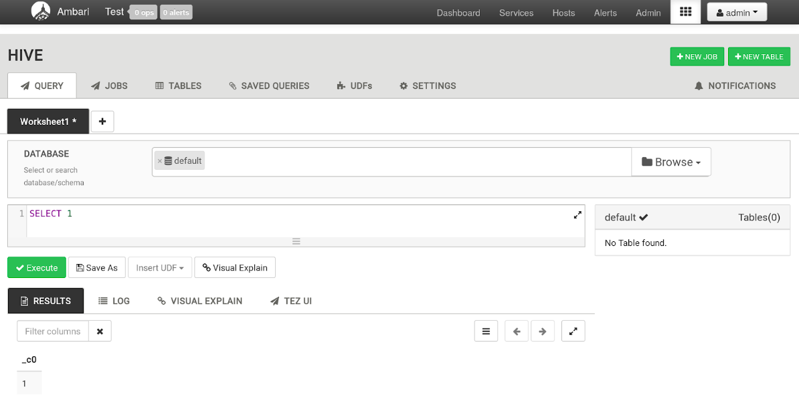
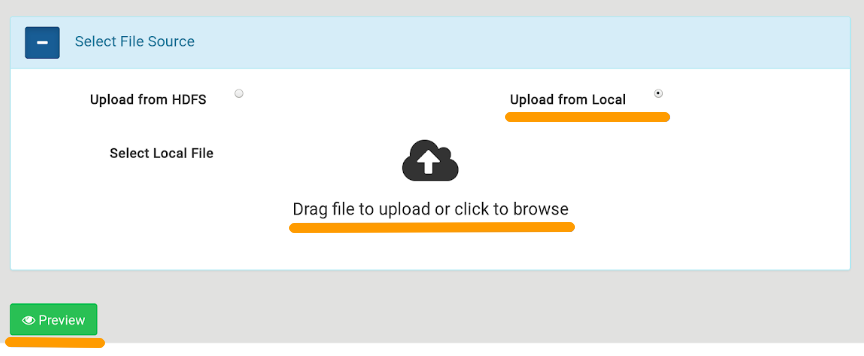
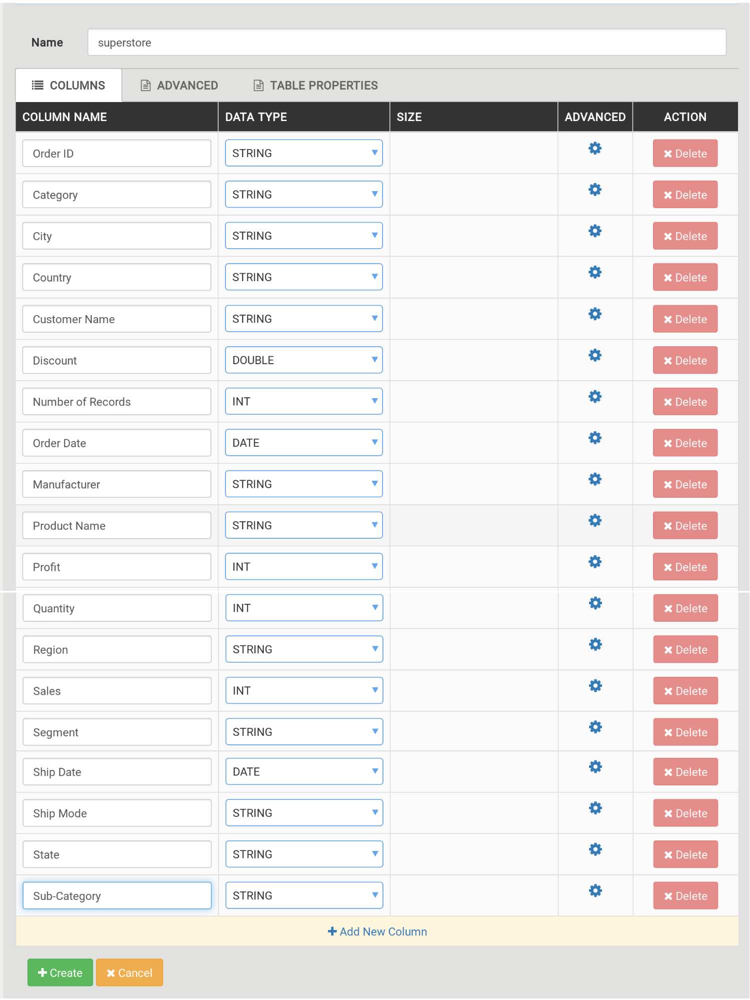

## Description

Data Mart is a slice of the database, which is designed to represent an array of highly specialized thematic information, focused on specific queries.

The idea for data marts was proposed in 1991 by Forrester Research. The information warehouse was presented as a certain set of specific databases that contain information related to specific vectors of the corporation's activities.

The advantages of such a slice are that the target part of the data warehouse is as close as possible to a specific user; the content of thematic subsets of data previously aggregated by specialists, which are easier to customize and design in the future; Also, for the implementation of a data mart, no high-power computing equipment is required.

## Apache hive

The VK Cloud Big Bata service uses the Hive data mart.

Apache Hive is a data warehouse system in the Hadoop ecosystem.

A convenient and affordable way to work with Hive is to use the Hive View interface in the Ambari interface. Hive View provides the following features:

- interactive execution of SQL queries;
- visualization of the query plan;
- creating and deleting tables;
- saving and viewing the history of requests;
- adding custom functions (UDF);
- debugging of Tez tasks;
- adjusting Hive parameters;

To open Hive View, click on the button in the upper right corner of the menu bar and select Hive View 2.0 from the drop-down list. To simplify migration from older Ambari versions, the service also uses the previous version of Hive View (1.0). It has fewer features, but has a familiar interface.

The QUERY tab allows you to run queries interactively.

## Loading data

For more complex queries, you must first create tables and load data.

In the Tables tab, pressing the "+" button and then "UPLOAD TABLE" opens the interface for creating a table by loading a .csv file.

Next, you need to select the following parameters:

- Field type - CSV
- Field Delimiter -, (comma)
- Escape Character - \\ (backslash)
- Quote Character - "(double quotes)
- Is first row header - enabled

If the downloaded data has a different format, then you should set the appropriate settings when downloading the file.

Below you need to select "Upload from Local", click on the text "Drag file to upload or click to browse" and upload the required file.

You can also check the correctness of the entered data and, if necessary, change them:

Then press the "Create" button. Hive View first loads the CSV file into a temporary table and, if successful, moves it to the backname table.
