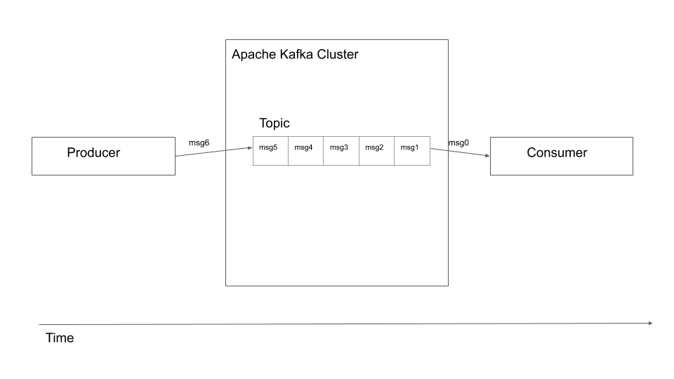

## Description

Apache Kafka is used as a data bus in VK Cloud Big Data.

Apache Kafka is a distributed streaming platform today. In this case, a bus with a colossal bandwidth is provided, on which absolutely all data passing through it can be processed in real time.

## Terminology

First, you need to understand the Kafka terminology.

**Producers / producer** - any input source. These can be servers that output logs, IOT devices, a script that transforms data.

**Topics / Topics** - When manufacturers upload data, it is referred to one of the available "topics", which is a way of grouping related data for processing. Themes themselves are logs of ever-growing data feeds where data is stored in a simple key-value format. The data coming from the producers delivers messages to the end of the log.

**Messages** are a key / value data pair.

Consumers - Consumers accept data provided by manufacturers. Consumers are the final destination where data is stored, such as a database.

**Partitions** - Topics can be split into sections. This way the topic can be split across multiple computers, making Kafka extremely scalable.

Let's say there is a cluster of connected machines that can:

- receive data from several producers.
- store the received data.
- allow consumers to read stored data. Typically, consumers read one message at a time.
- ordinal reading of data. Let's say message m1 is received by the cluster at time t1; and message m2 at time T1 + 5. The consumer will read message m1 before m2.
- provides one-time data delivery. This means that a message sent to the cluster will be guaranteed to the consumer at least once.

## Scaling

Like most components in the Hadoop ecosystem, a Kafka cluster can scale to an infinite number of nodes.

Scaling to multiple nodes works in Kafka by dividing topics into multiple sections. For example, when a topic is split into 2 sections, it means that the workload of one topic is split into 2 nodes in the cluster. Thus, it becomes possible not only to select a node for a topic; but also split the topic into multiple nodes.

