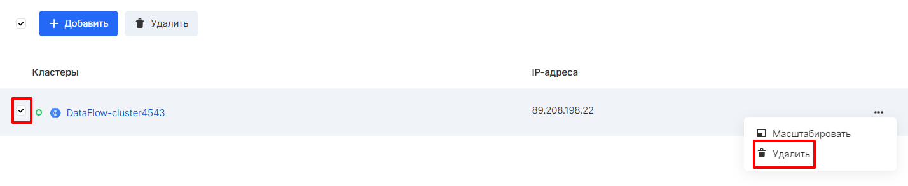
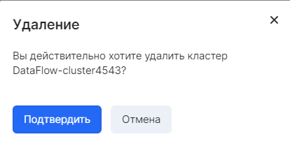

## Deleting a cluster

In the section "Big Data" - "Clusters" in the context menu of the selected cluster to be deleted, on hovering, a menu appears with the option to delete a cluster. You can also delete it by checking the box next to the required cluster and clicking the "Delete" button:

After clicking it in the window that opens, you must confirm the action:

After a while, the Big Data cluster will be successfully deleted.
