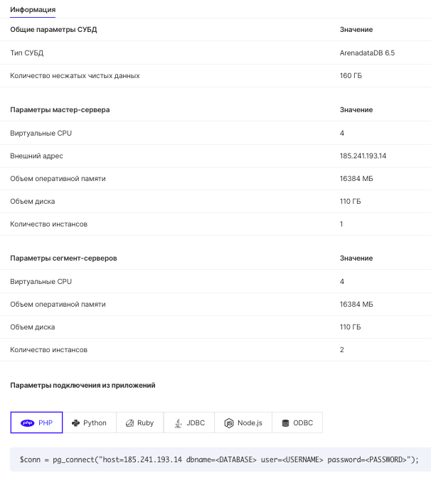

## Connecting to an instance

You can see how to connect to the database by clicking on the instance name in the list or by hovering over the information icon.

The "Connection parameters" section contains code examples from popular languages.

When using examples, replace macros <DATABASE>, <USERNAME>, <PASSWORD> with actual values:

- <DATABASE> is the name of the database specified during creation.
- <USERNAME> - username (specified during creation).
- <PASSWORD> - user password (specified during creation).
- <HOST> is the IP address of the virtual machine where the database is located. In the example above, this is 185.241.193.14, which is the external IP.

Additional information can be found in the documentation for the connector used (a connector is an entity used to connect to a database).
