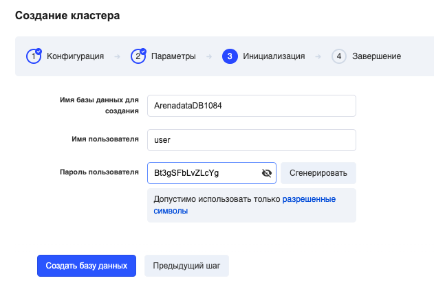

To create a database, go to the ["Analytical Databases" section of your personal](https://mcs.mail.ru/app/services/analytic-databases/) account, select "Arenadata DB" and "Create Database":

Cluster is a cluster with synchronous data replication. It is used when there are increased requirements for system reliability and fault tolerance.

In the next steps, select the required configuration options:

<table style="box-sizing: border-box; border-collapse: collapse; border-spacing: 0px; background-color: rgb(255, 255, 255); border: none; empty-cells: show; max-width: 100%; width: 690px; margin-bottom: 20px; color: rgb(56, 76, 96); font-family: &quot;Open Sans&quot;, Helvetica, &quot;Lucida Grande&quot;, sans-serif; font-size: 16px; font-style: normal; font-variant-ligatures: normal; font-variant-caps: normal; font-weight: 400; letter-spacing: normal; orphans: 2; text-align: start; text-indent: 0px; text-transform: none; white-space: normal; widows: 2; word-spacing: 0px; -webkit-text-stroke-width: 0px; text-decoration-style: initial; text-decoration-color: initial;"><tbody style="box-sizing: border-box;"><tr style="box-sizing: border-box; user-select: none; line-height: 32px;"><td style="box-sizing: border-box; padding: 5px 10px; min-width: 5px; border: 1px solid rgb(221, 221, 221); user-select: text; background-color: rgb(239, 239, 239);">Amount of uncompressed data</td><td style="box-sizing: border-box; padding: 5px 10px; min-width: 5px; border: 1px solid rgb(221, 221, 221); user-select: text;">Maximum database size</td></tr><tr style="box-sizing: border-box; user-select: none; line-height: 32px;"><td style="box-sizing: border-box; padding: 5px 10px; min-width: 5px; border: 1px solid rgb(221, 221, 221); user-select: text; background-color: rgb(239, 239, 239);">Cluster name</td><td style="box-sizing: border-box; padding: 5px 10px; min-width: 5px; border: 1px solid rgb(221, 221, 221); user-select: text;">Leave the default name or enter your name in Latin characters.</td></tr><tr style="box-sizing: border-box; user-select: none; line-height: 32px;"><td style="box-sizing: border-box; padding: 5px 10px; min-width: 5px; border: 1px solid rgb(221, 221, 221); user-select: text; background-color: rgb(239, 239, 239);">Node configuration</td><td style="box-sizing: border-box; padding: 5px 10px; min-width: 5px; border: 1px solid rgb(221, 221, 221); user-select: text;">CPU / RAM / HDD (SSD) master configuration. The replica / slave will be created with the same configuration automatically.</td></tr><tr style="box-sizing: border-box; user-select: none; line-height: 32px;"><td style="box-sizing: border-box; padding: 5px 10px; min-width: 5px; border: 1px solid rgb(221, 221, 221); user-select: text; background-color: rgb(239, 239, 239);">Accessibility zone</td><td style="box-sizing: border-box; padding: 5px 10px; min-width: 5px; border: 1px solid rgb(221, 221, 221); user-select: text;">specify the availability zone (we recommend DP1 or MS1).</td></tr><tr style="box-sizing: border-box; user-select: none; line-height: 32px;"><td style="box-sizing: border-box; padding: 5px 10px; min-width: 5px; border: 1px solid rgb(221, 221, 221); user-select: text; background-color: rgb(239, 239, 239);">Net</td><td style="box-sizing: border-box; padding: 5px 10px; min-width: 5px; border: 1px solid rgb(221, 221, 221); user-select: text;">Leave the default or choose your own private network.</td></tr><tr style="box-sizing: border-box; user-select: none; line-height: 32px;"><td style="box-sizing: border-box; padding: 5px 10px; min-width: 5px; border: 1px solid rgb(221, 221, 221); user-select: text; background-color: rgb(239, 239, 239);">Disc type</td><td style="box-sizing: border-box; padding: 5px 10px; min-width: 5px; border: 1px solid rgb(221, 221, 221); user-select: text;">For the best performance, we recommend choosing the drive type SSD or Hi-IOPS SSD.</td></tr></tbody></table>

The next step is to set the parameters for initializing the database.

<table style="box-sizing: border-box; border-collapse: collapse; border-spacing: 0px; background-color: rgb(255, 255, 255); border: none; empty-cells: show; max-width: 100%; width: 690px; margin-bottom: 20px; color: rgb(56, 76, 96); font-family: &quot;Open Sans&quot;, Helvetica, &quot;Lucida Grande&quot;, sans-serif; font-size: 16px; font-style: normal; font-variant-ligatures: normal; font-variant-caps: normal; font-weight: 400; letter-spacing: normal; orphans: 2; text-align: start; text-indent: 0px; text-transform: none; white-space: normal; widows: 2; word-spacing: 0px; -webkit-text-stroke-width: 0px; text-decoration-style: initial; text-decoration-color: initial;"><tbody style="box-sizing: border-box;"><tr style="box-sizing: border-box; user-select: none; line-height: 32px;"><td style="box-sizing: border-box; padding: 5px 10px; min-width: 5px; border: 1px solid rgb(221, 221, 221); user-select: text; background-color: rgb(239, 239, 239);">Database name to create</td><td style="box-sizing: border-box; padding: 5px 10px; min-width: 5px; border: 1px solid rgb(221, 221, 221); user-select: text;">You can leave the default or enter your own.</td></tr><tr style="box-sizing: border-box; user-select: none; line-height: 32px;"><td style="box-sizing: border-box; padding: 5px 10px; min-width: 5px; border: 1px solid rgb(221, 221, 221); user-select: text; background-color: rgb(239, 239, 239);">Username</td><td style="box-sizing: border-box; padding: 5px 10px; min-width: 5px; border: 1px solid rgb(221, 221, 221); user-select: text;">You need to provide an administrator name for remote access.</td></tr><tr style="box-sizing: border-box; user-select: none; line-height: 32px;"><td style="box-sizing: border-box; padding: 5px 10px; min-width: 5px; border: 1px solid rgb(221, 221, 221); user-select: text; background-color: rgb(239, 239, 239);">Administrator password</td><td style="box-sizing: border-box; padding: 5px 10px; min-width: 5px; border: 1px solid rgb(221, 221, 221); user-select: text;">You must set an administrator password for remote access.</td></tr></tbody></table>

The instance will be created in a few minutes.

After that, information about the instance and connection methods will appear.
