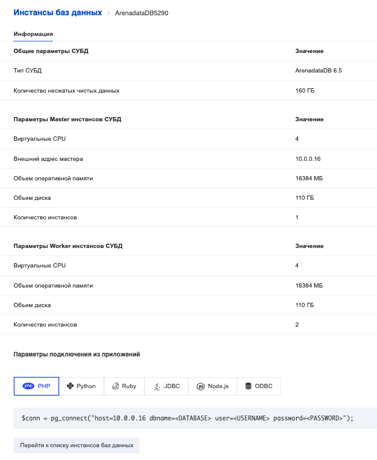

Connecting to an instance
=========================

To view the methods of connecting to an instance, you can click on the instance name in the list of virtual machines, or hover over the information icon ( **i** ).

The instance card displays all the information you need.

The "Connection parameters" section contains code examples from popular languages.

When using examples, replace macros <DATABASE>, <USERNAME>, <PASSWORD> with actual values:

*   <DATABASE> is the name of the database specified during creation.
*   <USERNAME> - username (specified during creation).
*   <PASSWORD> - user password (specified during creation).

Additional information can be found in the documentation for the connector used (a connector is an entity through which a connection to a database is made).

Loading data
============

Once you have selected a connector to connect to the database and established a connection, you can start downloading data.

The main tool for loading data into Greenplum and unloading data from Greenplum is the gpfdist utility. This is the http server that Greenplum speaks to all of its nodes at once, achieving high speed of both download and upload of data.

The official gpfdist documentation [is available at the official resource](https://gpdb.docs.pivotal.io/510/utility_guide/admin_utilities/gpfdist.html) .

What is gpfdist used for? Greenplum has the concept of external tables, the description of which looks almost the same as for ordinary tables, but at the end it adds a condition like LOCATION ('gpfdist: // hostname: 8080 / database_name / table_name.csv'), which specifies where exactly the file is stored, the structure of which is described in the external table. External table can be either read or write.

If the external table is created for reading, then, firstly, instead of the file name, you can use a mask (that is, you can read or download many files at once), and secondly, you can read from zipped files (.gz, .zip or. bz2), which significantly increases the speed of reading and loading files, since reading data from disks decreases many times compared to reading unarchived files.

External table can work with multiple gpfdist instances running even on different nodes. This further increases system performance - both for loading and unloading data.