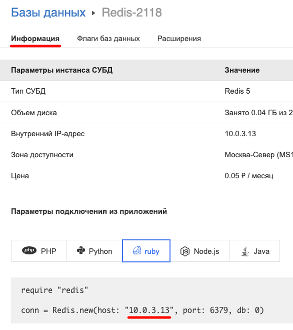
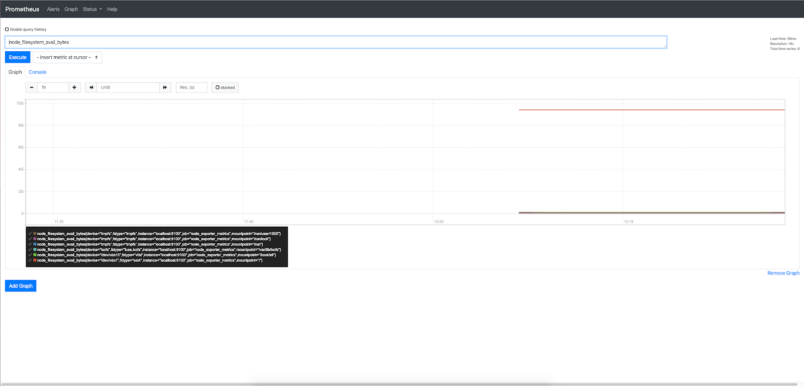
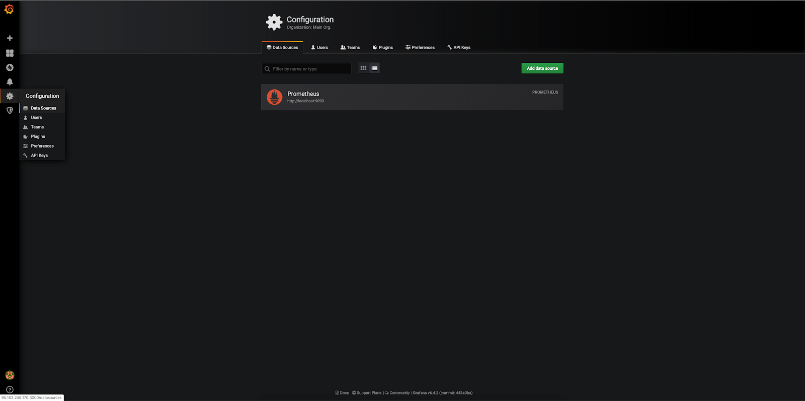
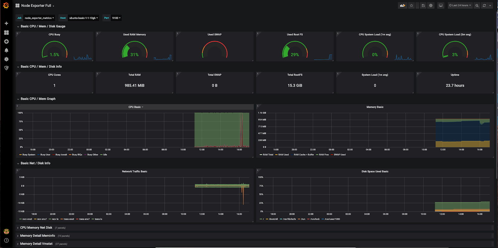
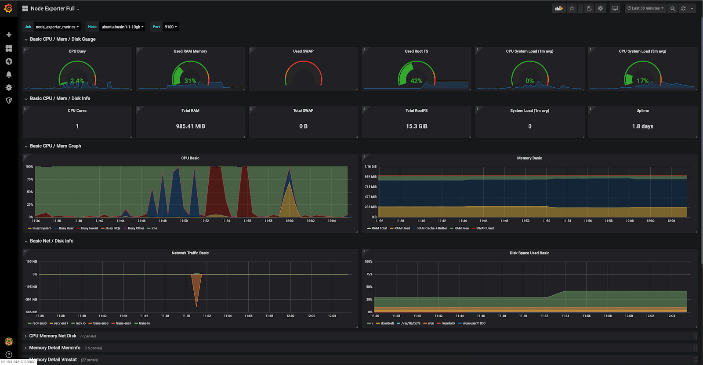

## Hardware configuration

Installed and configured Ubuntu 18.04 LTS x86_64 OS server.

<warn>

**Attention**

When using servers and hardware of other versions, some steps of the script may differ from those described below.

</warn>

## Scheme of work


## Description of components

**Prometheus** is a central server designed to collect and store data. Data is constantly changing over time (for example, disk usage, network interface traffic, site response time). The data items are called metrics. The Prometheus server reads metrics at a specified interval and places the received data in the Time Series DB. Time Series DB is a type of database designed to store time series (time-based values). In addition, Prometheus provides an interface for querying and visualizing the resulting data. The Prometheus query language is called PromQL. Prometheus works according to the Pull model, that is, it polls endpoints itself in order to obtain data.

**Exporters** are the processes that collect and transfer them to the Prometheus server. There are many different exporters, for example:

- Node_exporter - collection of system metrics (processor, memory, etc.).
- Mysqld_exporter - collecting MySQL server performance metrics.
- Postgres_exporter - collection of PostgreSQL server performance metrics.

Once launched, the exporter starts collecting the appropriate metrics and waits for requests from the Prometheus server on the specified port. The data is transmitted in http format.

**Grafana** is a convenient frontend for visualizing accumulated data, can be used to work with Prometheus server data, provides various pre-configured Dashboards for displaying data.

In addition to data collection, analysis, and visualization features, Prometheus and Grafana support custom alerts. In Grafana this mechanism is built-in, in Prometheus it is implemented by a separate component (Alert_manager). See [here](https://prometheus.io/docs/alerting/overview/) for details.

## Installing Prometheus

1. Log in to the Prometheus server with superuser rights.
2. Specify the current version of Prometheus:

```
root@ubuntu-basic-1-1-10gb:~# export VERSION="<version>"
```

<info>

**Note**

The current version of Prometheus can be [found and downloaded here](https://prometheus.io/download/).[](https://prometheus.io/download/#mysqld_exporter)

</info>

3. Create a prometheus user and a prometheus group under which you will run prometheus:

```
root@ubuntu-basic-1-1-10gb:~# groupadd --system prometheus
root@ubuntu-basic-1-1-10gb:~# useradd --system -g prometheus -s /bin/false prometheus
```

4. Install wget and tar:

```
root@ubuntu-basic-1-1-10gb:~# apt install -y wget tar
```

5. Download the prometheus archive and extract it to the /tmp folder:

```
root@ubuntu-basic-1-1-10gb:~# wget https://github.com/prometheus/prometheus/releases/download/v$VERSION/prometheus-$VERSION.linux-amd64.tar.gz -O - | tar -xzv -C /tmp
```

6. Create a directory for the configuration file:

```
root@ubuntu-basic-1-1-10gb:~# mkdir /etc/prometheus
```

7. Create a directory for data:

```
root@ubuntu-basic-1-1-10gb:~# mkdir /var/lib/prometheus
```

8. Copy the contents of the unpacked archive:

```
root@ubuntu-basic-1-1-10gb:~# cp /tmp/prometheus-$VERSION.linux-amd64/prometheus /usr/local/bin
root@ubuntu-basic-1-1-10gb:~# cp /tmp/prometheus-$VERSION.linux-amd64/promtool /usr/local/bin
root@ubuntu-basic-1-1-10gb:~# cp /tmp/prometheus-$VERSION.linux-amd64/tsdb /usr/local/bin
root@ubuntu-basic-1-1-10gb:~# cp -r /tmp/prometheus-$VERSION.linux-amd64/console\* /etc/prometheus
```

9. Delete the contents of the unpacked archive from the /tmp folder:

```
root@ubuntu-basic-1-1-10gb:~# rm -rf /tmp/prometheus-$VERSION.linux-amd64
```

10. Create a configuration file /etc/prometheus/prometheus.yml with the following content:

```
global:
scrape_interval: 10s
scrape_configs:
- job_name: 'prometheus'
static_configs:
- targets: ['localhost:9090']
```

In the global section, the data polling period is indicated, in the scrape_configs section, monitoring of Prometheus resources is connected.

11. Change the owner of the generated files:

```
root@ubuntu-basic-1-1-10gb:~# chown -R prometheus:prometheus /var/lib/prometheus /etc/prometheus
root@ubuntu-basic-1-1-10gb:~# chown prometheus:prometheus /usr/local/bin/prometheus /usr/local/bin/promtool /usr/local/bin/tsdb
```

12. Create a script to start the systemd service Prometheus. To do this, create the /etc/systemd/system/prometheus.service file with the following content:

```
[unit]
Description=Prometheus
Wants=network-online.target
After=network-online.target

[Service]
User=prometheus
Group=prometheus
ExecStart=/usr/local/bin/prometheus\
--config.file /etc/prometheus/prometheus.yml \
--storage.tsdb.path /var/lib/prometheus\
--web.console.templates=/etc/prometheus/consoles \
--web.console.libraries=/etc/prometheus/console_libraries
ExecReload=/bin/kill -HUP $MAINPID
[Install]
WantedBy=default.target
```

13. Launch Prometheus:

```
root@ubuntu-basic-1-1-10gb:~# systemctl daemon-reload
root@ubuntu-basic-1-1-10gb:~# systemctl start prometheus.service
root@ubuntu-basic-1-1-10gb:~# systemctl enable prometheus.service
Created symlink /etc/systemd/system/default.target.wants/prometheus.service → /etc/systemd/system/prometheus.service.
```

14. Make sure the service has started:

```
root@ubuntu-basic-1-1-10gb:~# systemctl status prometheus.service
● prometheus.service - Prometheus
Loaded: loaded (/etc/systemd/system/prometheus.service; enabled; vendor preset: enabled)
Active: active (running) since Wed 2019-10-16 07:26:45 UTC; 1s ago
Main PID: 3980 (prometheus)
Tasks: 6 (limit: 1151)
CGroup: /system.slice/prometheus.service
└─3980 /usr/local/bin/prometheus --config.file /etc/prometheus/prometheus.yml --storage.tsdb.path /var/lib/prometheus --web.console.templates=/etc/prometheus/ consoles --web.console.libraries=/etc/prometheus/console_libraries

Oct 16 07:26:46 ubuntu-basic-1-1-10gb prometheus[3980]: level=info ts=2019-10-16T07:26:46.082Z caller=main.go:336 vm_limits="(soft=unlimited ,hard=unlimited)"
Oct 16 07:26:46 ubuntu-basic-1-1-10gb prometheus[3980]: level=info ts=2019-10-16T07:26:46.089Z caller=main.go:657 msg="Starting TSDB .. ."
Oct 16 07:26:46 ubuntu-basic-1-1-10gb prometheus[3980]: level=info ts=2019-10-16T07:26:46.099Z caller=web.go:450 component=web msg="Start listening for connections" address=0.0.0.0:9090
Oct 16 07:26:46 ubuntu-basic-1-1-10gb prometheus[3980]: level=info ts=2019-10-16T07:26:46.104Z caller=head.go:512 component=tsdb msg="replaying WAL, this may take a while"
Oct 16 07:26:46 ubuntu-basic-1-1-10gb prometheus[3980]: level=info ts=2019-10-16T07:26:46.107Z caller=head.go:560 component=tsdb msg="WAL segment loaded" segment=0 maxSegment=0
Oct 16 07:26:46 ubuntu-basic-1-1-10gb prometheus[3980]: level=info ts=2019-10-16T07:26:46.110Z caller=main.go:672 fs_type=EXT4_SUPER_MAGIC
Oct 16 07:26:46 ubuntu-basic-1-1-10gb prometheus[3980]: level=info ts=2019-10-16T07:26:46.110Z caller=main.go:673 msg="TSDB started"
Oct 16 07:26:46 ubuntu-basic-1-1-10gb prometheus[3980]: level=info ts=2019-10-16T07:26:46.110Z caller=main.go:743 msg="Loading configuration file" filename=/opt/prometheus/prometheus.yml
Oct 16 07:26:46 ubuntu-basic-1-1-10gb prometheus[3980]: level=info ts=2019-10-16T07:26:46.150Z caller=main.go:771 msg="Completed loading of configuration file" filename=/etc/prometheus/prometheus.yml
Oct 16 07:26:46 ubuntu-basic-1-1-10gb prometheus[3980]: level=info ts=2019-10-16T07:26:46.150Z caller=main.go:626 msg="Server is ready to receive web requests."
```

15. Log in to the Prometheus web console on port 9090:


## Install Node_exporter

1. Specify the current version of Node_exporter:

```
root@ubuntu-basic-1-1-10gb:~# export VERSION="0.18.1"
```

<info>

**Note**

The current version of node_exporter can be [found and downloaded here](https://prometheus.io/download/) [](https://prometheus.io/download/#mysqld_exporter).

</info>

2. Download the mysqld_exporter archive and extract it to the /tmp folder:

```
root@ubuntu-basic-1-1-10gb:~# wget  https://github.com/prometheus/node_exporter/releases/download/v$VERSION/node_exporter-$VERSION.linux-amd64.tar.gz -O - | tar -xzv -C /tmp
```

3. Copy the contents of the unpacked archive to the /usr/local/bin folder:

```
root@ubuntu-basic-1-1-10gb:~# cp /tmp/node_exporter-$VERSION.linux-amd64/node_exporter /usr/local/bin
```

4. Change the owner of the generated files:

```
root@ubuntu-basic-1-1-10gb:~# chown -R prometheus:prometheus /usr/local/bin/node_exporter
```

4. Create a script to start the systemd service node_exporter. To do this, create a file /etc/systemd/system/node_exporter.service with the following content:

```
[unit]
Description=Prometheus Node Exporter
After=network.target

[Service]
Type=simple
Restart=always
User=prometheus
Group=prometheus
ExecStart=/usr/local/bin/node_exporter

[Install]
WantedBy=multi-user.target
```

5. Run node_exporter:

```
root@ubuntu-basic-1-1-10gb:~# systemctl daemon-reload
root@ubuntu-basic-1-1-10gb:~# systemctl start node_exporter.service
root@ubuntu-basic-1-1-10gb:~# systemctl enable node_exporter.service
Created symlink /etc/systemd/system/multi-user.target.wants/node_exporter.service → /etc/systemd/system/node_exporter.service.
```

6. Make sure the service has started:

```
root@ubuntu-basic-1-1-10gb:~# systemctl status node_exporter.service
● node_exporter.service - Prometheus Node Exporter
Loaded: loaded (/etc/systemd/system/node_exporter.service; enabled; vendor preset: enabled)
Active: active (running) since Wed 2019-10-16 07:45:29 UTC; 2min 50s ago
Main PID: 4166 (node_exporter)
Tasks: 3 (limit: 1151)
CGroup: /system.slice/node_exporter.service
└─4166 /usr/local/bin/node_exporter

Oct 16 07:45:29 ubuntu-basic-1-1-10gb node_exporter[4166]: time="2019-10-16T07:45:29Z" level=info msg=" - sockstat" source="node_exporter.go: 104"
Oct 16 07:45:29 ubuntu-basic-1-1-10gb node_exporter[4166]: time="2019-10-16T07:45:29Z" level=info msg=" - stat" source="node_exporter.go: 104"
Oct 16 07:45:29 ubuntu-basic-1-1-10gb node_exporter[4166]: time="2019-10-16T07:45:29Z" level=info msg=" - textfile" source="node_exporter.go: 104"
Oct 16 07:45:29 ubuntu-basic-1-1-10gb node_exporter[4166]: time="2019-10-16T07:45:29Z" level=info msg=" - time" source="node_exporter.go: 104"
Oct 16 07:45:29 ubuntu-basic-1-1-10gb node_exporter[4166]: time="2019-10-16T07:45:29Z" level=info msg=" - timex" source="node_exporter.go: 104"
Oct 16 07:45:29 ubuntu-basic-1-1-10gb node_exporter[4166]: time="2019-10-16T07:45:29Z" level=info msg=" - uname" source="node_exporter.go: 104"
Oct 16 07:45:29 ubuntu-basic-1-1-10gb node_exporter[4166]: time="2019-10-16T07:45:29Z" level=info msg=" - vmstat" source="node_exporter.go: 104"
Oct 16 07:45:29 ubuntu-basic-1-1-10gb node_exporter[4166]: time="2019-10-16T07:45:29Z" level=info msg=" - xfs" source="node_exporter.go: 104"
Oct 16 07:45:29 ubuntu-basic-1-1-10gb node_exporter[4166]: time="2019-10-16T07:45:29Z" level=info msg=" - zfs" source="node_exporter.go: 104"
Oct 16 07:45:29 ubuntu-basic-1-1-10gb node_exporter[4166]: time="2019-10-16T07:45:29Z" level=info msg="Listening on :9100" source="node_exporter. go:170"
```

## Setting up the Prometheus server to receive Node_exporter data

1. In the /opt/prometheus/prometheus.yml file, add the node_exporter section to the scrape_configs section:

```
scrape_configs:
- job_name: 'node'
scrape_interval: 10s
static_configs:
      - targets: ['localhost:9100']
```

<info>

**Note**
The scrape_configs section is intended to describe the purposes and means of monitoring. See the [documentation](https://prometheus.io/docs/prometheus/latest/configuration/configuration/#scrape_config) for details on settings.

</info>

In the example above, we configured data collection on **localhost** and port 9100, where node_exporter is running, gave the task the name node, and specified that data collection should be performed every 10 seconds.

If you created a database with Internet access, instead of **localhost** specify the IP address of the database, for example:



[](https://prometheus.io/docs/prometheus/latest/configuration/configuration/#scrape_config)

2. Restart the Prometheus service:

```
root@ubuntu-basic-1-1-10gb:~# systemctl reload prometheus.service
```

3. Wait a few minutes for the data to accumulate.

4. To view the graph of the average CPU load in the browser, go to:

```
http://<IP address of your PROMETHEUS server>:9090/graph?g0.range_input=1h&g0.expr=rate(node_cpu_seconds_total{mode="system"}[1m])&g0.tab=1
```


5. To view the disk space available to users in a browser, follow the link:

```
http://<IP address of your PROMETHEUS server>:9090/graph?g0.range_input=1h&g0.expr=node_filesystem_avail_bytes&g0.tab=1
```



6. To view the average incoming traffic through network interfaces (bytes/second) in a browser, follow the link:

```
http://<IP address of your PROMETHEUS server>:9090/graph?g0.range_input=1h&g0.expr=rate(node_network_receive_bytes_total[1m])&g0.tab=1
```

7. To view typical Prometheus consoles (sets of graphs) in a browser, follow the link:

```
http://<IP address of your PROMETHEUS server>:9090/consoles/index.html.example
```

You will see two links - Node and Prometheus. Node console chart example:


## Install Grafana

Install Grafana from the repository:

1. Install the required additional software:

```
root@ubuntu-basic-1-1-10gb:~# apt-get install -y software-properties-common wget apt-transport-https
```

2. Add the Grafana repository key:

```
root@ubuntu-basic-1-1-10gb:~# wget -q -O - https://packages.grafana.com/gpg.key | apt key add-
```

3. Add the Grafana repository:

```
root@ubuntu-basic-1-1-10gb:~# add-apt-repository "deb https://packages.grafana.com/oss/deb stable main"
```

4. Update the repositories and install Grafana:

```
root@ubuntu-basic-1-1-10gb:~# apt-get update && apt-get -y install grafana
```

5. Create a file /etc/grafana/provisioning/datasources/prometheus.yml with the following content:

```
apiVersion: 1
data sources:
-name: Prometheus
type: prometheus
access:proxy
url: http://localhost:9090
```

<info>

**Note**

Provisioning is a new Grafana feature for server preconfiguration. In this case, we're setting up the Prometheus data source during the installation process instead of having to do it later in the Grafana web interface.

</info>

6. Change the owner of the /etc/grafana/provisioning/datasources/prometheus.yml file:

```
root@ubuntu-basic-1-1-10gb:~# chown grafana:grafana /etc/grafana/provisioning/datasources/prometheus.yml
```

<info>

**Note**

We have connected Prometheus to Grafana. If Prometheus is physically located on a different server, change localhost to the IP address of the Prometheus server.

</info>

7. Launch Grafana:

```
root@ubuntu-basic-1-1-10gb:~# systemctl start grafana-server.service
root@ubuntu-basic-1-1-10gb:~# systemctl enable grafana-server.service
Synchronizing state of grafana-server.service with SysV service script with /lib/systemd/systemd-sysv-install.
Executing: /lib/systemd/systemd-sysv-install enable grafana-server
Created symlink /etc/systemd/system/multi-user.target.wants/grafana-server.service → /usr/lib/systemd/system/grafana-server.service.
```

8. Make sure Grafana is working:

```
root@ubuntu-basic-1-1-10gb:~# systemctl status grafana-server.service

● grafana-server.service - Grafana instance
Loaded: loaded (/usr/lib/systemd/system/grafana-server.service; enabled; vendor preset: enabled)
Active: active (running) since Wed 2019-10-16 13:26:25 UTC; 9 minutes ago
Docs: http://docs.grafana.org
Main PID: 6958 (grafana-server)
Tasks: 12 (limit: 1151)
CGroup: /system.slice/grafana-server.service
└─6958 /usr/sbin/grafana-server --config=/etc/grafana/grafana.ini --pidfile=/var/run/grafana/grafana-server.pid --packaging=deb cfg:default.paths. logs=/var/log/grafana cfg:default.paths.data=/var/lib/grafa

Oct 16 13:26:25 ubuntu-basic-1-1-10gb grafana-server[6958]: t=2019-10-16T13:26:25+0000 lvl=info msg="Initializing provisioningServiceImpl" logger=server
Oct 16 13:26:25 ubuntu-basic-1-1-10gb grafana-server[6958]: t=2019-10-16T13:26:25+0000 lvl=info msg="inserting datasource from configuration " logger=provisioning .datasources name=Prometheus
Oct 16 13:26:26 ubuntu-basic-1-1-10gb grafana-server[6958]: t=2019-10-16T13:26:26+0000 lvl=info msg="Backend rendering via phantomJS" logger=rendering
Oct 16 13:26:26 ubuntu-basic-1-1-10gb grafana-server[6958]: t=2019-10-16T13:26:26+0000 lvl=warn msg="phantomJS is deprecated and will be removed in a future release.
Oct 16 13:26:26 ubuntu-basic-1-1-10gb grafana-server[6958]: t=2019-10-16T13:26:26+0000 lvl=info msg="Initializing Stream Manager"
Oct 16 13:26:26 ubuntu-basic-1-1-10gb grafana-server[6958]: t=2019-10-16T13:26:26+0000 lvl=info msg="HTTP Server Listen" logger=http. server address=0.0.0.0:3000 protocol=http subUrl= socket=
Oct 16 13:27:31 ubuntu-basic-1-1-10gb grafana-server[6958]: t=2019-10-16T13:27:31+0000 lvl=info msg="Request Completed" logger=context userId= 0 orgId=0 uname= method=GET path=/ status=302 remote_addr=93.171.201.25 ti
Oct 16 13:27:46 ubuntu-basic-1-1-10gb grafana-server[6958]: t=2019-10-16T13:27:46+0000 lvl=info msg="Successful Login" logger=http.server user=admin@localhost
Oct 16 13:28:23 ubuntu-basic-1-1-10gb grafana-server[6958]:2019/10/16 13:28:23 http: proxy error: unsupported protocol scheme ""
Oct 16 13:28:23 ubuntu-basic-1-1-10gb grafana-server[6958]: t=2019-10-16T13:28:23+0000 lvl=info msg="Request Completed" logger=context userId= 1 orgId=1 uname=admin method=GET path=/api/datasources/proxy/2/api/v1/quer

```

After launch, Grafana will be available via the http protocol, port 3000. The login and password for the first login are admin/admin. The first time you log in, you will need to change your password.

9. Go to the Grafana web interface under the path Configuration/Data Sources and make sure Datasource Prometheus is active:

****

10. Click Datasource Prometheus, then Test:

****

11. Install Dashboard for Node Exporter visualization ([pre-built Dashboards](https://grafana.com/grafana/dashboards), [popular Dashboard for Node Exporter](https://grafana.com/grafana/dashboards/1860)) . To install in the web interface, go to Dashboards/Manage:


12. Click Import and in the Grafana.com Dashboard field enter [https://grafana.com/grafana/dashboards/1860:](https://grafana.com/grafana/dashboards/1860:)

****

Click Load, select Datasource Prometheus and click Import:

****

13. Dashboard will open:



## Create test load

To see how the graphs change when the server is under load, use the sysbench utility.

For this:

1. Install the sysbench utility:

```
root@ubuntu-basic-1-1-10gb:~# apt -y install sysbench
```

2. Run a series of tests:

```
root@ubuntu-basic-1-1-10gb:~# sysbench cpu --cpu-max-prime=2000000 --time=60 run

root@ubuntu-basic-1-1-10gb:~# sysbench memory --cpu-max-prime=2000000 --time=60 run

root@ubuntu-basic-1-1-10gb:~# sysbench fileio --file-test-mode=rndrw --time=60 prepare
root@ubuntu-basic-1-1-10gb:~# sysbench fileio --file-test-mode=rndrw --time=60 run

root@ubuntu-basic-1-1-10gb:~# sysbench threads --time=60 run

root@ubuntu-basic-1-1-10gb:~# sysbench mutex --time=60 run
```

As a result of the test load, graphics in Grafana change:

****

## Delete

To remove deployed tools:

1. Remove Grafana:

```
root@ubuntu-basic-1-1-10gb:~# systemctl stop grafana-server.service
root@ubuntu-basic-1-1-10gb:~# systemctl disable grafana-server.service
root@ubuntu-basic-1-1-10gb:~# apt -y remove grafana
```

2. Remove Node_exporter:

```
root@ubuntu-basic-1-1-10gb:~# systemctl stop node_exporter.service
root@ubuntu-basic-1-1-10gb:~# systemctl disable node_exporter.service
root@ubuntu-basic-1-1-10gb:~# rm /etc/systemd/system/node_exporter.service
root@ubuntu-basic-1-1-10gb:~# rm -rf /opt/node_exporter
```

3. Remove Prometheus:

```
root@ubuntu-basic-1-1-10gb:~# systemctl stop prometheus.service
root@ubuntu-basic-1-1-10gb:~# systemctl disable prometheus.service
root@ubuntu-basic-1-1-10gb:~# rm /etc/systemd/system/prometheus.service
root@ubuntu-basic-1-1-10gb:~# rm -rf /opt/prometheus
```

4. Remove user and group:

```
root@ubuntu-basic-1-1-10gb:~# userdel prometheus
root@ubuntu-basic-1-1-10gb:~# groupdel prometheus
```
