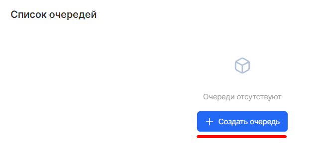
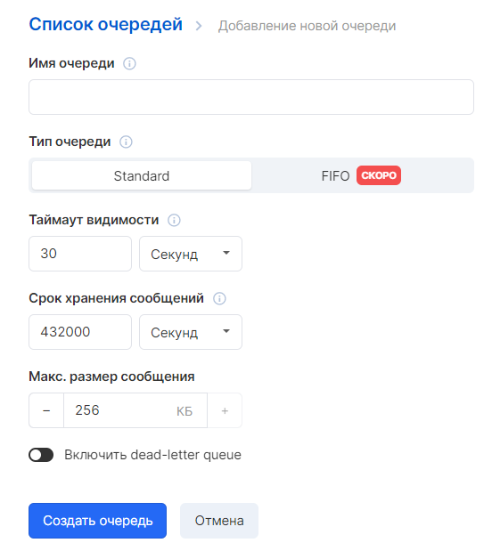
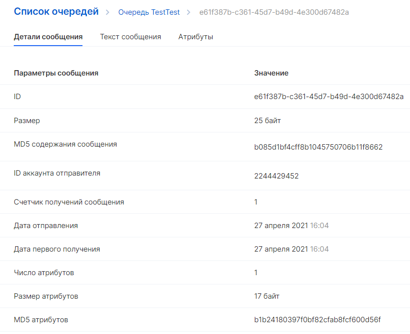
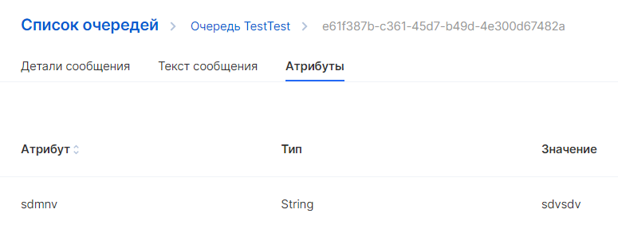

This section will help you get to know Cloud Queues better and show you how to manage queues and messages using the Cloud Queues Control Panel.

## Creating a queue

The first and most common task of Cloud Quques is to create queues. This procedure shows how to create and configure a queue.

Select "Create Queue":

Enter a name for your queue and its type (Standart or FIFO).

To create a queue with default parameters, scroll down and select "Create Queue".

VK Cloud SQS distributes information about the new queue through the system. Since Cloud Queries is a distributed system, there may be a slight delay before the queue is displayed on the Queue List page.

## Sending a message

After creating a queue, you can send a message to it.

In the left navigation bar, select the Queue List. In the queue list, select the queue you created:

Click Add Message, then enter the text in the message body and select other parameters you need.

Select "Send Message".

Your message has been sent, and the console will display a message about the successful addition to the queue.

## Viewing and deleting your message

After you send a message to the queue, you can view the message and its attributes from a specific queue.

On the "Queue List" page, select the desired queue and then click on a specific message to view it.

The "Messages in Queue" tab displays a list of received messages. For each message in the list, the message ID, size, date of dispatch, and number of receptions are displayed.

To delete messages, select the messages you want to delete, and then select Delete.
