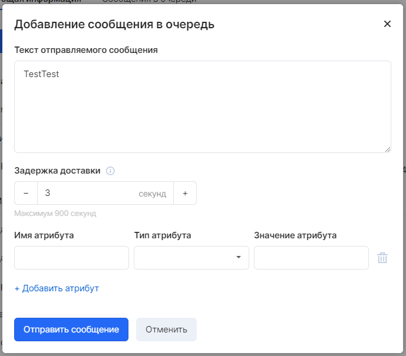

This section will help you get to know Cloud Queues better and show you how to manage queues and messages using the Cloud Queues Control Panel.

## Creating a queue

1. Go to VK Cloud [personal account](https://mcs.mail.ru/app/en).
1. Go to **Message queues** → **Queues**.
1. Click the **Submit your request**.
1. On the page that appears, fill out an application to create a new queue `qs-queue`.
1. Wait for the application to be processed.

## Sending a message

After creating a queue, you can send a message to it.

In the left navigation bar, select the **Queues**. In the queue list, select the queue you created:

Click **Add Message**, then enter the text in the message body and select other parameters you need.

Select **Send Message**.

Your message has been sent, and the console will display a message about the successful addition to the queue.

## Viewing and deleting your message

After you send a message to the queue, you can view the message and its attributes from a specific queue.

On the **Queues** page, select the desired queue and then click on a specific message to view it.

The **Messages in Queue** tab displays a list of received messages. For each message in the list, the message ID, size, date of dispatch, and number of receptions are displayed.
