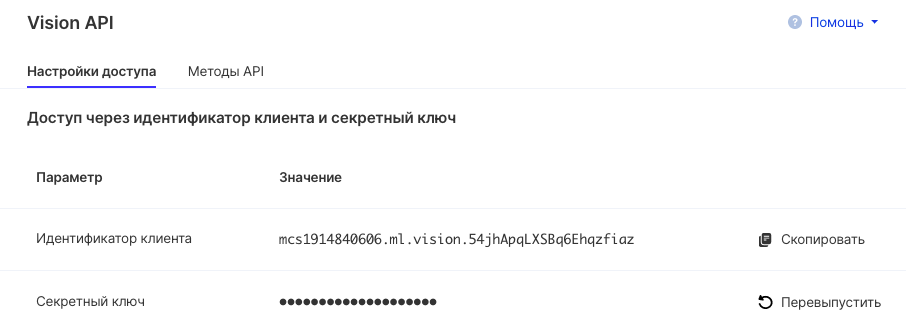
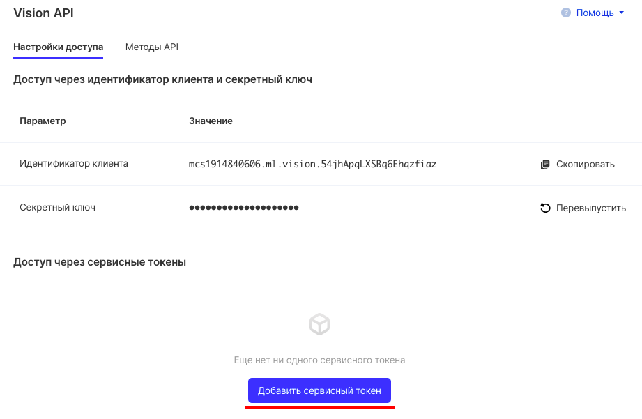
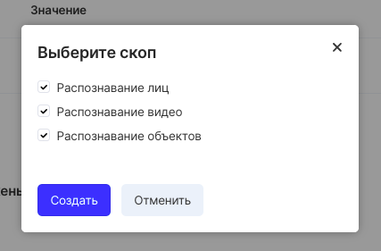
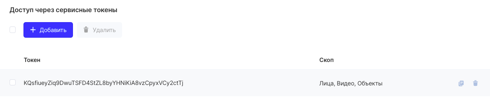

The machine learning service is enabled by default in all VK CS projects you create.

## Learning environments

To create and run a virtual machine with integrated machine learning tools, just click "Create environment" on the service page:

## Vision

You can connect to the service in two different ways, described below.

## API Endpoint

API Endpoint is a "entry point", a URL used to connect to a service for management. For machine learning, there are two of them:

- Vision for image recognition    https://smarty.mail.ru/
- Vision for video recognition    https://smarty.mail.ru/

## Access via client ID and secret key

To control access via client ID and private key, [the Vision API page](https://mcs.mail.ru/app/services/machinelearning/vision/access/) displays the necessary information. The client ID has already been generated and cannot be replaced, and the key can be reissued with the appropriate button:

## Access via service token

To generate a service token, click the button and select the desired scope:

The token will be created and displayed:

