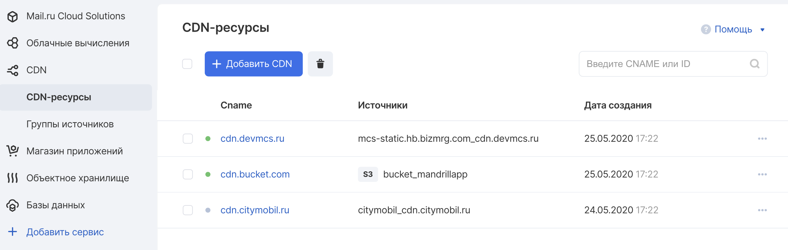
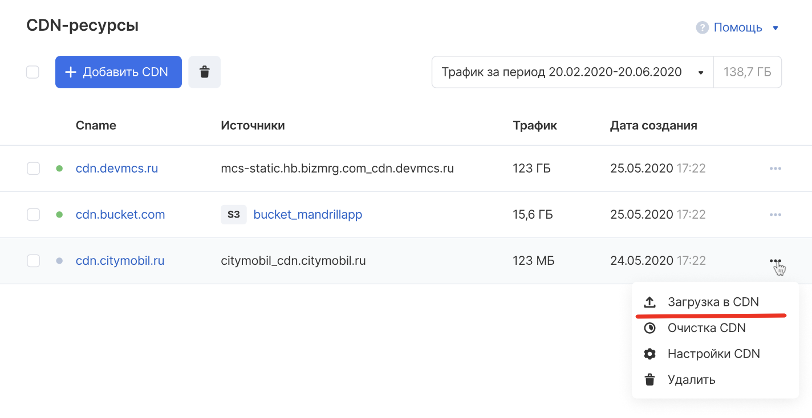
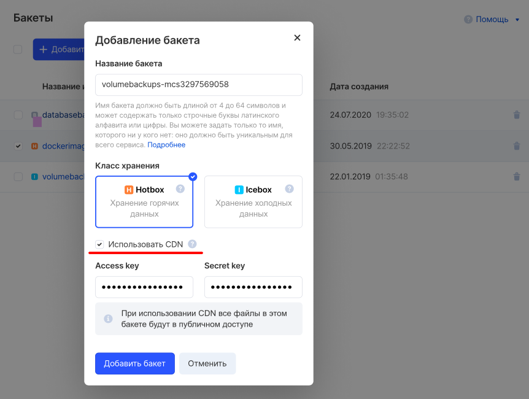
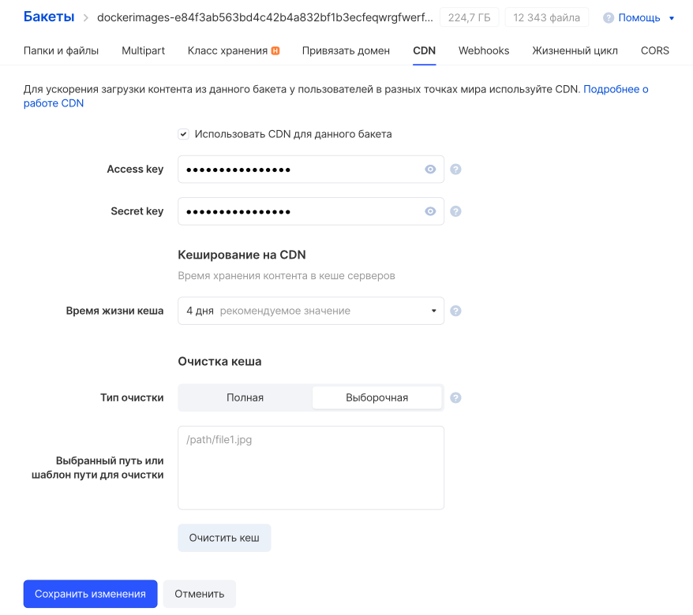
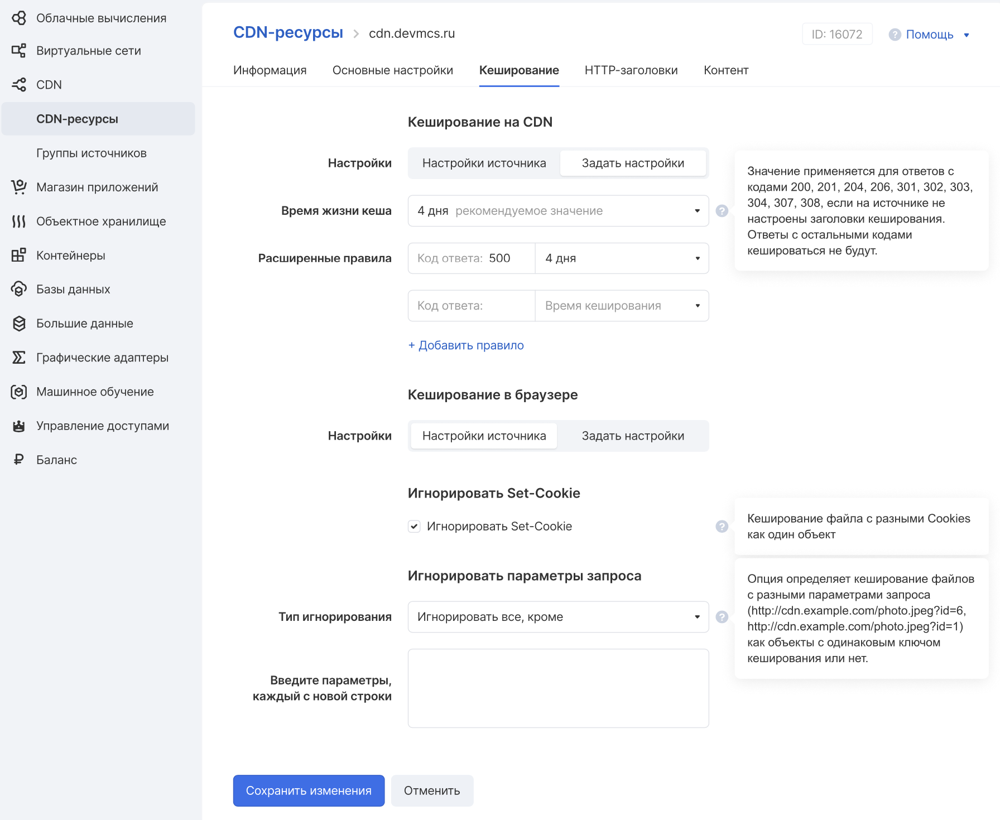
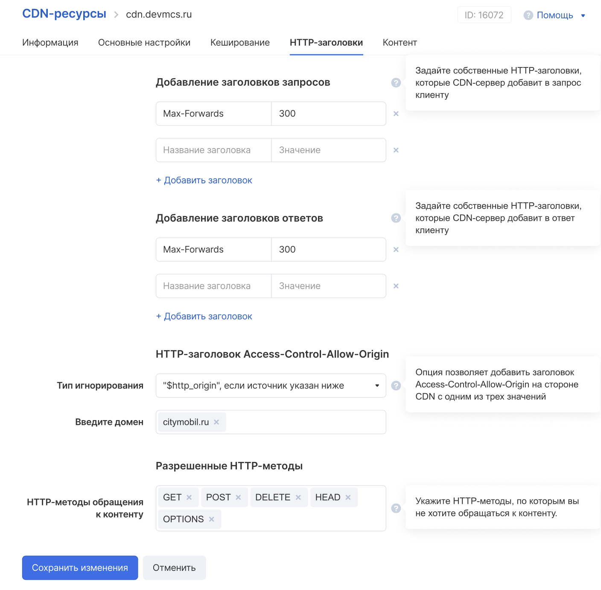
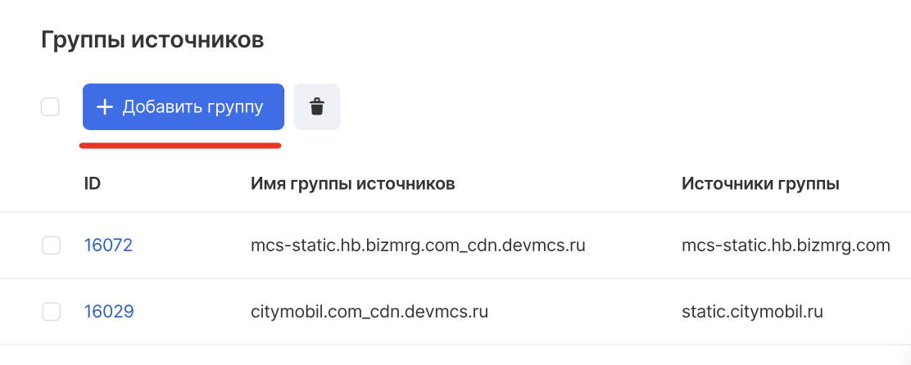

## Adding a resource

To add a resource, go to the "CDN resources" tab (on the left) and click on the "Add CDN" button:



Then fill in the fields as described:


Resource created:


## Uploading files to a resource

Via CDN panel:

Select the "Upload to CDN" option in the context menu of the CDN resource:



Via bucket:

When creating a bucket, select the "Use CDN" checkbox:



And on the "CDN" tab of the bucket, set the recommended value for the cache lifetime:



## Caching

Resource caching is necessary for fast content delivery - for example, if the content is used on a popular web resource with more than 100,000 user visits per month.

In the CDN resource settings, you can set the desired caching values:



## HTTP headers

When the browser requests a resource from the server, it uses HTTP. This request includes a set of key-value pairs containing information such as the version of the browser or the file formats it understands. These pairs are called request headers.

The server responds with the requested resource, but it also sends response headers containing information about the resource or the server itself.

In the settings of the CDN resource, you can configure the required headers with the required parameters:



## Content settings

In the settings of the CDN resource, you can set the necessary content settings, including the HTTP response code and URL for the redirect:


## Source groups

In case there is a need to distribute content from different sources, the VK Cloud interface has such an option.

To add a source group, click the corresponding button:

 And then fill in the fields with the required data:


## DNS setup

Create a CNAME cdn record for the devmcs.ru domain zone directed to [ ] (in this example, we are talking about the cl-0cc5e00c.gcdn.co domain).

An example in BIND format is below:

```
 ORIGIN devmcs.ru.
cdn CNAME cl-0cc5e00c.gcdn.co.
```

## CDN integration / content distribution

1.  You need to decide what content (what files) you need to distribute through the CDN.
2.  It is necessary to determine the source / group of sources through which the content will be distributed.
3.  You need to upload the content to the VK Cloud interface.
4.  You need to create a DNS record (see above).
5.  It is necessary to replace the original domain on the path to the static files with a personal one.
6.  The resulting path / URL will be the one that needs to be substituted in the layout of the web page (or other resource) as the URL of the required content.
