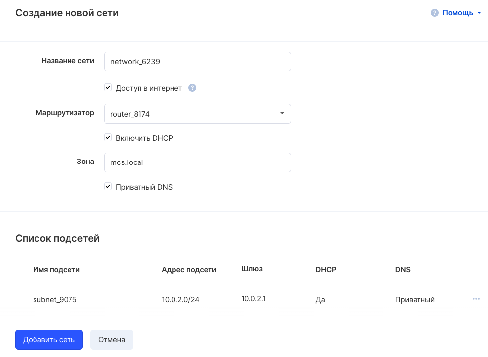
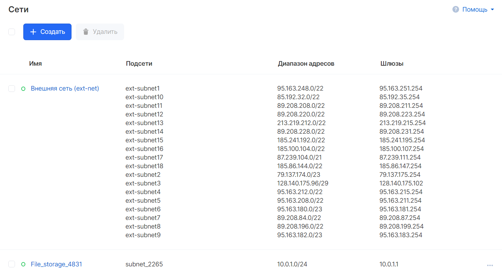
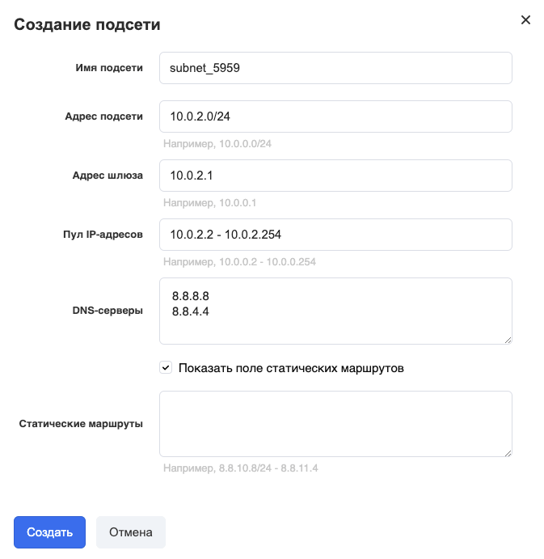

In your [personal account, the "Virtual networks" section](https://mcs.mail.ru/app/services/server/networks/) is responsible for creating networks and subnets. Once created, networks and subnets are immediately available to all virtual machines in the project. In order for other virtual machines to see each other within the same network or subnet, you must specify the appropriate network settings (belonging to this network or subnet) in each of the virtual machines.

By default, the project has already created one network with several subnets:

## Network creation

In the "Networks" section, you can create a network using the "Create" button. The New Network Wizard will open:

After creating a network, it will appear in the general list of networks:

## Subnetting

To create a subnet, you must first select a network from the list of created networks in the "Virtual networks" section of your VK CS Personal Account.

When you click on the "Add subnet" button, the subnet creation wizard will open, in which you should specify the desired subnet configuration and you can set static routes:

## Delete network

To delete a network or subnet, just select the appropriate menu item in the drop-down list on hover:

