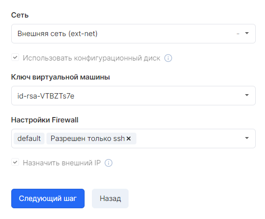
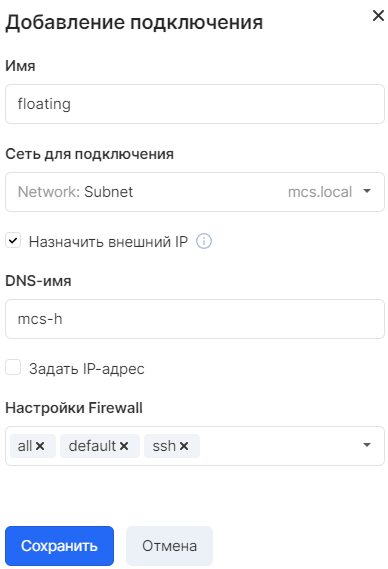

## Description

In VK CS, there are two ways to organize access to an instance from the Internet: using floating IPs or adding a port from the ext-net network. In both cases, the instance will be available via the routed Internet address.

Floating IP is a 1: 1 NAT virtual address assigned to a port on a private network. It requires a network with Internet access and a virtual machine network adapter configured for a private network.

The ext-net network is a common network for all projects with routed ("white") segment subnets, a random address from which can be assigned directly to the virtual machine port. There is no DHCP on this network, so a static address must be configured in the instance operating system. The mask and gateway can be found [on the network page](https://mcs.mail.ru/app/services/server/network/edit/298117ae-3fa4-4109-9e08-8be5602be5a2/subnets/) in your personal account.

## Application

In [the VK CS personal account,](https://mcs.mail.ru/app/services/infra/routers/) when creating a virtual machine at the "Network settings" step, you can select either an external network (ext-net) or a private network with the option "Assign external IP":

The operating system images provided by VK CS use a cloud-init component that configures the virtual machine's network adapter when the "Use configuration disk" option is selected. However, if you are using your own image, you may need to manually configure the network in the operating system.

You can add another network connection for an existing instance in the "Network Information" section on the virtual machine page by clicking the "Add Connection" button:

As well as when creating a VM, you can choose between private and external networks.
