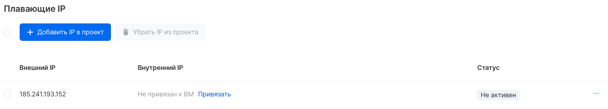

Instances in VK Cloud can be connected to private networks or directly to ext-net. To access a VM located in a private network from the Internet, it is recommended to use the floating IP address functionality.

Unlike ext-net, floating IP addresses can be bound to virtual machines and reassigned at any time. Also, this type of addresses is bound to the project and remains in it until released by the user.

Floating IP is associated to a "gray" address due to the 1: 1 NAT mechanism on the router, while a private network address must be configured on the VM.

Floating addresses in your [VK Cloud account are](https://mcs.mail.ru/app/services/infra/routers/) managed on the "Floating IPs" page of the "Virtual Networks" service. This page displays the addresses allocated to the project:

## Binding an address to an instance

To assign a floating address to a private network port, select the "Bind" option in the line with IP, then select the required address in the drop-down list:

**Note**

Floating IP binding can only be done if there is an instance with a connected port on the private network.

## Releasing Floating IP

To remove an address from a project, select "Remove IP from project" in the address context menu.


**Attention**

When a floating IP address is deleted, it is released from the project and can be automatically assigned to another project.

## OpenStack CLI

Floating addresses can be managed in the OpenStack client:

Viewing addresses in a project:

```
 openstack floating ip list
```

Floating address assignment per port:

```
 openstack floating ip set --port <port ID> <address>
```

Assigning an address to a port of a specified instance:

```
 openstack server add floating ip <server ID> <address>
```

Removing an address from a project:

```
 openstack floating ip delete <address>
```
