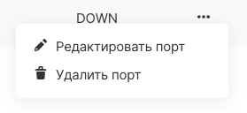

Port - the virtual network interface card of the instance containing the IP address, DNS name and security groups.

Port operations can be performed [in your VK Cloud account](https://mcs.mail.ru/app/services/infra/shares/) and in the Openstack CLI.

## Port View

In your personal account VK Cloud you can view the existing ports of private networks. To do this, go to the "Networks" page of the "Virtual networks" section, select the required network, then open the subnet.

The "Ports" tab shows the subnet connected to the Internet (the router ports are visible: SNAT, INTERFACE_DISTRIBUTED) and with DHCP enabled (the DHCP port address is also the address of the private DNS server).

## Adding ports

In the VK Cloud panel, a port (network connection) is added to the virtual machine by selecting the "Add connection" option on the "Network information" tab of the instance page:

In the parameters of the added connection, you must fill in the fields:

<table style="width: 100%;"><tbody><tr><td style="width: 28.8938%; background-color: rgb(239, 239, 239); text-align: center;">Parameter</td><td style="width: 71.0177%; background-color: rgb(239, 239, 239); text-align: center;">Description</td></tr><tr><td style="width: 28.8938%;">Network to connect</td><td style="width: 71.0177%;">Selecting an external (ext-net) or private network to connect to the instance. It is also possible to create a new network in the project.</td></tr><tr><td style="width: 28.8938%;">DNS name</td><td style="width: 71.0177%;">Entering the DNS name of the port, required when using private DNS. Appears when you select a private network.</td></tr><tr><td style="width: 28.8938%;">Set IP address</td><td style="width: 71.0177%;">Setting the item allows you to set the instance to a specific address in the private network.</td></tr><tr><td style="width: 28.8938%;">Firewall settings</td><td style="width: 71.0177%;">Select the security group rules to be assigned to the port.</td></tr></tbody></table>

After saving, the network interface will be added to the instance; you will additionally need to configure the network in the instance's operating system.

## Editing and Deleting Ports

Editing or deleting existing ports is available in the port context menu on the Ports tab:

## OpenStack CLI

Port operations can be performed in the OpenStack client:

Add network to instance:

```
 openstack server add network <server ID> <network ID>
```

View the list of virtual machine ports:

```
 openstack port list --server <server ID>
```

Get port data:

```
 openstack port show <port ID>
```

Change port parameters:

```
 openstack port set <argument> <port ID>
```

- \--dns-name - DNS port name
- \--description - arbitrary description
- \--enable / disable - enable / disable the port (disabled port does not allow traffic)
- \--name - port name
- \--fixed-ip - assign the specified address from the subnet
- \--security-group - assign a security group to a port
- \--disable-port-security - disable security groups and checks for compliance of the port IP address and traffic
- \--allowed-address - specifying a trusted list of outgoing traffic addresses

Remove port:

```
 openstack port delete <port ID>
```
