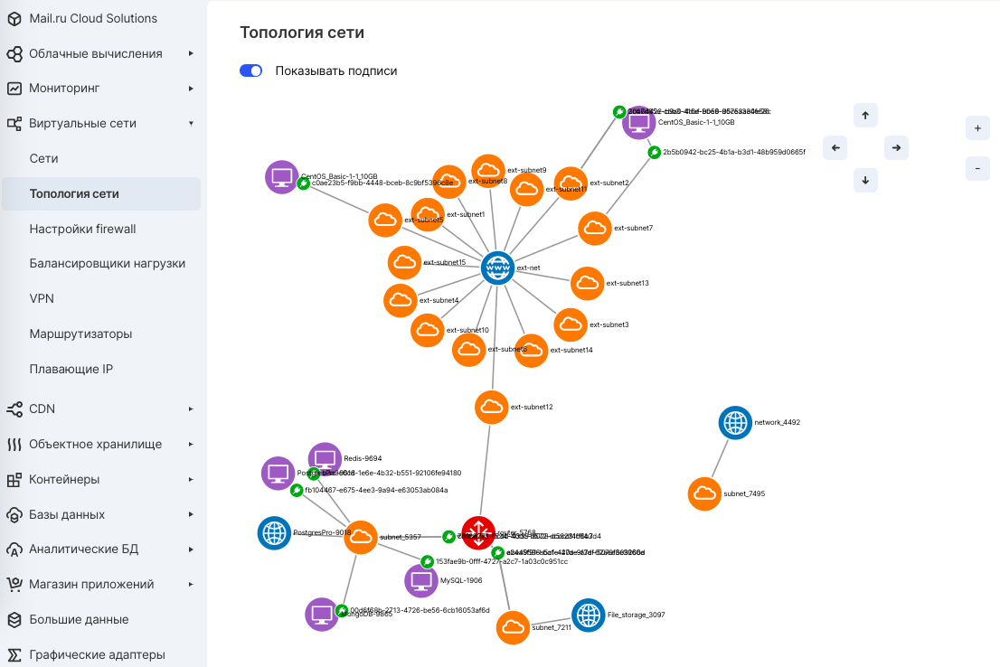
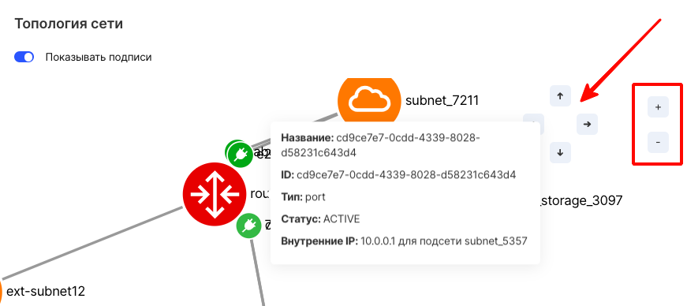

## Description

Network topology is a graphical representation of the network connectivity of virtual machines. This is a diagram on which you can see the following elements, as well as all the connections between them:

- Networks
- Subnets
- Routers
- Virtual machines

## Network information

The topology of virtual networks of a specific VK CS project can be seen in the " [Network Topology](https://mcs.mail.ru/app/services/cloud-networks/topology/) " section of your personal account.

If necessary, you can zoom in on individual fragments of the network using the navigation buttons, and view the details of a specific fragment of the network when you click:

