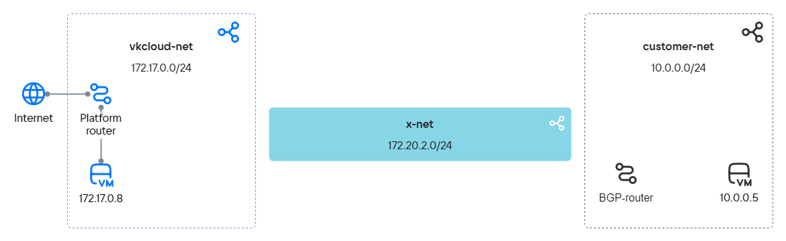
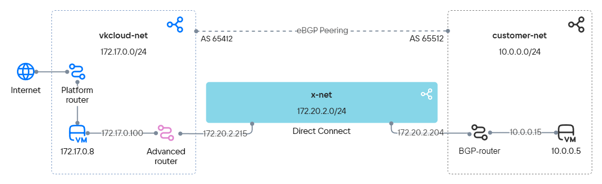

Advanced routers can link your local network with VK Cloud virtual networks, without using a dedicated virtual machine as a router. It makes data transferring easier bu using dynamic routing capabilities over the [BGP](https://datatracker.ietf.org/doc/html/rfc1163) protocol.

To show the configuration of an advanced router, two independent networks will be connected using the BGP protocol:

- Client network — the customer’s internal network, which may not have access to the Internet.
- Virtual network — located in VK Cloud and connected to the platform router.

## Preparation steps

1. Make sure the OpenStack client is [installed](../../../../manage/tools-for-using-services/openstack-cli#1_install_the_openstack_client), and [authenticate](../../../../manage/tools-for-using-services/openstack-cli#3_complete_authentication) in the project.

1. Select a client network in your local infrastructure:

   - The network must be connected to a router that:
       - supports connection via BGP protocol;
       - (optional) can support the BFD protocol: this will reduce the convergence time of routing protocols;
       - can be a device or virtual machine on the client network.
   - The network may not have access to the Internet.

   If there is no appropriate network, create one.

   Note the following:

    - the name and the IP address of the subnet;
    - the name of the network in which the subnet is located;
    - the IP address of the machine in the subnet that will be used to test connection between networks;
    - the name of the BGP router.

   <info>
   In this case, we will use a network with a virtual machine Router OS 7.10 (MikroTik), performing the functions of a BGP router.
   </info>

1. Select or [create](../../operations/manage-net#creating_a_network) a virtual network with Internet access in VK Cloud. Use an existing router with an external network connection or [create](../../operations/manage-router#adding_a_router) a new one.

   Note the following:

   - the name and the IP address of the subnet;
   - the name of the network in which the subnet is located;
   - the router name.

1. Create a [virtual machine](../../../../base/iaas/instructions/vm/vm-create) on the `vkcloud-net` network. Add SSH access and disable backup.

    Note the VM's IP address.

1. Contact the [technical support](/en/contacts) to add a network to your VK Cloud project to organize a direct connection.

    When the network is provided, note its name, subnet name, and IP address.

1. Make sure you have collect all the data you need.

The data are used in this case:

| Object | Client network | Virtual network| Direct connection network
| :---| :--- | :--- | :---
| Netwok                                  | `customer-net`                                    | `vkcloud-net` | `x-net` |
| Subnet and IP address                              | `customer-subnet`, `10.0.0.0/24`                            | `vkcloud-subnet`, `172.17.0.0/24`| `x-subnet`, `172.20.2.0/24`|
| Machine IP address    | `10.0.0.5`    | `172.17.0.8`|
| BGP router | `MikroTik` |

The scheme for preparation of networks looks like this:



## 1. Creating an advanced router

1. In personal account, go to **Virtual networks** → **Routers**.
1. Select **Add router**.
1. Select the **Advanced** router type. If there is no advanced type in your project, contact the [technical support](/en/contacts).
1. Enter the name. In this case — `advanced-router`.
1. Select **Create**.

## 2. Configure the network interfaces of the advanced router

To organize data transfer between independent networks, you need to add interfaces to the advanced router:

- To the network where the router is located — `vkcloud-net`. These interfaces are used to connect to VMs within the network. The number of such interfaces depends on the network structure.
- To the direct connection network `x-net`. This interface will help to organize connection between VK Cloud and the local network.

To add the interfaces:

1. Go to the router's tab **Interfaces**.
1. Add an interface directed to the virtual network:
   1. Select **Add interface**.
   1. Configure parameters:

      - **Name**: `vkcloud-net-iface`;
      - **Subnet**: `vkcloud-subnet`;
      - **Interface IP address**: `172.17.0.100`.

   1. Select **Create**.
1. Add an interface directed to the direct connection network:
   1. Select **Add interface**.
   1. Fill in parameters:

      - **Name**: `x-net-iface`;
      - **Subnet**: `x-subnet`;
      - **Interface IP address**: `172.20.2.215`.
   1. Select **Create**.

## 3. Configure the network interfaces of the client network's BGP router

1. Add network interfaces directed to:

   - To the direct connection network `x-net`. This interface will help to organize connection between VK Cloud and the local network.
   - To the network where the BGP router is located — `customer-net`. These interfaces are used to connect to machines within the network. The number of such interfaces depends on the network structure.

1. Configure interfaces using DHCP.

1. Configure system ID.

1. Add networks for BGP announcement.

1. (Optional) If the router supports BFD, configure the BFD protocol.

<details>
    <summary>Example setup for MikroTik</summary>

   1. To add network interfaces, connect to MikroTik via SSH and run the command:

      ```bash
       /ip address add address=172.20.2.204/24 interface ether1
       /ip address add address=10.0.0.15/24 interface ether2
      ```

   1. Configure interfaces using DHCP:

      ```bash
       /ip dhcp-client
       add add-default-route=no interface=ether1
       add add-default-route=no interface=ether2
      ```

   1. Configure system ID:

      ```bash
       /system identity
       set name=bgp-customer
      ```

   1. Add networks for BGP announcement:

      ```bash
       /ip firewall address-list
       add address=10.0.0.0/24 list=bgp_networks
      ```

   1. Configure the BFD protocol:

      ```bash
       /routing bfd configuration
       add disabled=no interfaces=ether1
      ```

</details>

## 4. Configure BGP neighbors for the advanced router

To configure the connection using the BGP protocol, you need to add dynamic routes and specify BGP neighbors. Dynamic routing requires Autonomous System Numbers (ASNs). If your network is assigned an ASN, use it. If an ASN is not assigned, use a number from the range `64512`–`65534` — these numbers can be assigned for private autonomous networks. In the case the following numbers will be used:

- `65512` for `customer-net`;
- `64512` for `vkcloud-net`.

To configure dynamic routes for `advanced-router`:

1. In personal account, go to **Virtual networks** → **Routers**.
1. Select the added advanced router and select the **Dynamic routing** tab.
1. Select **Create a BGP router**.
1. Fill in parameters:

   - **Name**: `to-MikroTik`;
   - **Router ID**: `172.20.2.215`;
   - **ASN**: `64512`.

1. Select **Create**.
1. Select the added BGP router and select the **BGP neighbors** tab.
1. Add a BGP neighbor. Fill in parameters:

   - **Name**: `MikroTik`;
   - **Remote neighbor**: `172.20.2.204`;
   - **Remote ASN**: `65512`.

1. Select **Create**.

Make sure the router has established a connection with its neighbor: the marker next to the name is green and BFD is enabled.

The advanced router will start broadcasting BGP announcements to its neighbor. Go to the **BGP Advertisements** tab and make sure that the router broadcasts advertisements for all networks to which its interfaces are directed:

- `172.17.0.0/24`;
- `172.20.2.0/24`.

Both announcements must have green markers.

## 5. Configure BGP neighbors for the client network router

1. Connect to a router on your local network.  
1. Specify parameters for connecting via BGP protocol:

   - The client network ASN: `65512`;
   - Router ID: `172.20.2.204`;
   - The virtual network ASN: `64512`;
   - BGP router ID: `172.20.2.215`;
   - Use BFD.
1. (Optional) Check that BFD connection is established.
1. Check that connection with the BGP neighbor is established. If the BGP connection is established, the response must have `keepalive-time` and `uptime` values more than zero.
1. View all available BGP routes. The list of routes should include the networks `172.17.0.0/24` and `172.20.2.0/24`.

<details>
 <summary>Example setup for MikroTik</summary>

1. Connect to MikroTik via SSH and run the command::

    ```bash
    /routing bgp connection
    add address-families=ip as=65512 local.address=172.20.2.204 .role=ebgp name=bgp-customer output.network=bgp_networks remote.address=172.20.2.215 .as=64512 router-id=172.20.2.204 use-bfd=yes
    ```
1. Check that connection is established using the BFD protocol. Run:

   ```bash
   /routing bfd session print
   ```

   Response example:

   ```bash
      Flags: U - up, I - inactive 
   0 U multihop=no vrf=main remote-address=172.20.2.215%ether1 local-address=172.20.2.204 state=up state-changes=1 uptime=3h27m12s desired-tx-interval=200ms actual-tx-interval=100ms 
     required-min-rx=200ms remote-min-rx=10ms multiplier=5 hold-time=1s packets-rx=75343 packets-tx=72203
   ```

1. Check that connection with the BGP neighbor is established in MikroTik. Run:

   ```bash
   /routing bgp session print
   ```

   Response example:

   ```bash
      Flags: E - established
   0 E name="tw-bgp-mikrotik-1"
        remote.address=172.20.2.215 .as=64512 .id=172.20.2.215 .capabilities=mp,rr,gr,as4,ap,err,llgr .hold-time=4m
       .messages=5 .bytes=131 .gr-time=120 .eor=ip
      local.address=172.20.2.204 .as=65512 .id=172.20.2.204 .capabilities=mp,rr,gr,as4 .messages=4 .bytes=105 .eor=""
        output.procid=20 .network=bgp_networks
       input.procid=20 ebgp
      hold-time=3m keepalive-time=1m uptime=2m51s380ms last-started=aug/28/2023 07:27:15
   ```
1. Run to check all MikroTik's routes:

   ```bash
   /ip route print where bgp
   ```

   Response example:

   ```bash
   Flags: D - DYNAMIC; A - ACTIVE; b, y - BGP-MPLS-VPN
   Columns: DST-ADDRESS, GATEWAY, DISTANCE
       DST-ADDRESS    GATEWAY       DISTANCE
   DAb 172.17.0.0/24  172.20.2.215        20
   D b 172.20.2.0/24  172.20.2.215        20   
   ```

</details>

## 6. Configure static routes between networks

1. Configure a static route from the virtual network `vkcloud-net` to the client network `customer-net` via an advanced router:

   1. In personal account, go to **Virtual networks** → **Networks**..
   1. Select the `vkcloud-net` network and open its subnets's settings.
   1. Select **Show static route field**.
   1. Enter the route: `10.0.0.0/24 - 172.17.0.100`.
   1. Select **Save**.

1. Configure a static route from the client network `customer-net` to the virtual network `vkcloud-net` via the BGP router of the client network. The route must be to `172.17.0.0/24` via `10.0.0.15`.

1. Reboot machines `172.17.0.8` and `10.0.0.5` so that the routes are included in their route network.

1. Check that static routes are registered on the VM `172.17.0.8`, which is located in the virtual network `vkcloud-net`. Connect to `vkcloud-vm` via SSH and run the command:

   ```bash
    ip route
   ```

   The list of routes should include the networks `10.0.0.0/24` and `172.20.2.0/24`.
1. Check the list of routes for machine `10.0.0.5`, which is located on the client network `customer-net`. The list of routes should include the networks `172.17.0.0/24` and `172.20.2.0/24`.

## 7. Check the direct connection

Ping or traceout a machine on the opposite network. If a response comes from another network, then the network connection has been configured correctly.

For instance, ping `10.0.0.5` machine on the client network from `172.17.0.8` on the virtual network:

1. Connect to `vkcloud-vm` via SSH and run.
1. Ping the internal IP address of a machine on the client network:

      ```bash
      ping 10.0.0.5
      ```

The IP address must respond to ping.

The structured interaction between networks and machines within networks looks like this:



## Monitor resource usage

If you no longer need the created resources, delete them:

1. [Delete](../../../../base/iaas/instructions/vm/vm-manage#deleting_a_vm) the virtual machine.
1. [Delete](../../operations/manage-router#removing_the_router) routers.
1. Delete the[subnet](../../operations/manage-net#deleting_a_network) and the [network](../../operations/manage-net#deleting_a_subnet).
