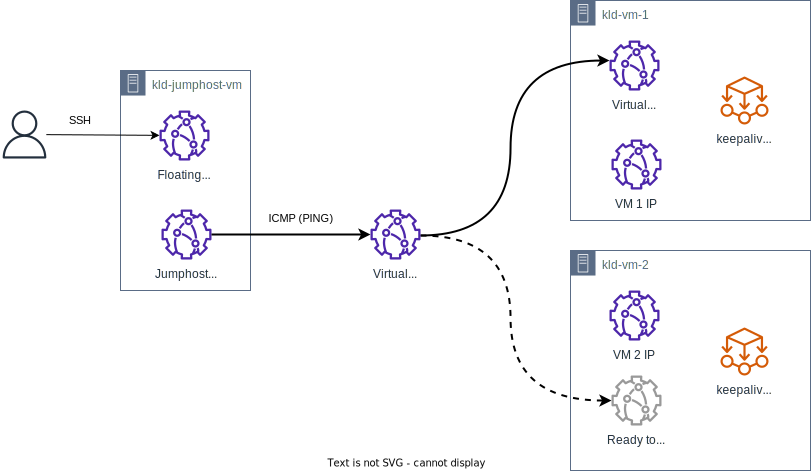

If incoming traffic is processed by a cluster of several similar virtual machines, then you can create a virtual IP address (Virtual IP, VIP) for them. This address is used to organize fault-tolerant processing of incoming traffic by these virtual machines. The technology works like this: a VIP is assigned to one of the cluster virtual machines that processes traffic from this VIP. Clients accessing this address will be directed to this virtual machine. If the virtual machine fails, then the VIP will be transferred to another virtual machine from the cluster, and traffic processing will continue. Virtual machines monitor their state and manage VIP assignment using the [VRRP] protocol (https://www.rfc-editor.org/rfc/rfc3768).

To show the virtual IP address setting:

- two virtual machines will be created for which:
  - a virtual IP address will be created;
  - VRRP will be configured in the [keepalived](https://keepalived.readthedocs.io/en/latest/introduction.html) implementation to serve this IP address.
- a third virtual machine with a floating IP address will be created, from which all the necessary settings and health check will be performed.



## 1. Preparation steps

1. Make sure OpenStack CLI is [installed](/en/base/account/project/cli/setup/) and you can [authorize](/en/base/account/project/cli/authorization/) in it.

1. Select the subnet where the virtual machines and virtual IP address will be placed. They must be on the same subnet.

    If the required subnet does not exist, [create it](../../operations/manage-net#creating_a_subnet).

    Write down the following information:
    - subnet name;
    - the name of the network in which the subnet is located.

    The `mysubnet` subnet in the `mynetwork` network will be used as an example.

1. Determine which IP address will be used as the virtual IP address. This IP address must not be used by any entities (such as a virtual machine or load balancer).

    The address `192.168.0.254/24` will be used as an example.

1. Make sure that this IP address will not be used by other objects (for example, assigned to a virtual machine or load balancer port). One of the easiest ways to achieve this is to create an OpenStack port with a chosen address and then never use that port anywhere.

    To create such a port, run the command in the OpenStack CLI:

    ```bash
    openstack port create <port name> --network mynetwork --fixed-ip subnet=mysubnet,ip-address=192.168.0.254
    ```

1. Create the `kld-vm1`, `kld-vm-2` and `kld-jumphost-vm` virtual machines.

    These VMs must be in a security group that allows all inbound and outbound traffic within the group itself.
    For example, such a group is `default`.

    If non-standard security groups are used, they must allow:
    - SSH traffic to `kld-vm1` and `kld-vm-2`;
    - VRRP traffic between `kld-vm1` and `kld-vm-2`;
    - ICMP traffic to the selected virtual IP address (for health check).

   <tabs>
   <tablist>
   <tab>kld-vm-1</tab>
   <tab>kld-vm-2</tab>
   <tab>kld-jumphost-vm</tab>
   </tablist>
   <tabpanel>

   Set the following options:

   - **Virtual machine name:** `kld-vm-1`.
   - **Number of machines in configuration:** `1`.
   - **Operating system:** `Ubuntu 22.04`.
   - **Network:** network and subnet selected earlier.
   - **DNS-name:** `kld-vm-1`.
   - **Firewall settings:** `default`.
   - **Assign external IP:** make sure the option is not selected.

   Select other parameters of the virtual machine at your discretion.

   </tabpanel>
   <tabpanel>

   Set the following options:

   - **Virtual machine name:** `kld-vm-2`.
   - **Number of machines in configuration:** `1`.
   - **Operating system:** `Ubuntu 22.04`.
   - **Network:** network and subnet selected earlier.
   - **DNS-name:** `kld-vm-2`.
   - **Firewall settings:** `default`.
   - **Assign external IP:** make sure the option is not selected.

   Select other parameters of the virtual machine at your discretion.

   </tabpanel>
   <tabpanel>

   Set the following options:

    - **Virtual machine name:** `kld-jumphost-vm`.
    - **Number of machines in configuration:** `1`.
    - **Operating system:** `Ubuntu 22.04`.
    - **Network:** network and subnet selected earlier.
    - **DNS-name:** `kld-jumphost-vm`.
    - **Firewall settings:** `default`, `ssh`.
    - **Assign external IP:** make sure the option is selected. A floating IP address (Floating IP, FIP) is required to connect to a virtual machine via SSH from the Internet.

    Select other parameters of the virtual machine at your discretion.

   </tabpanel>
   </tabs>

1. Define the OpenStack port through which the `kld-vm-1` and `kld-vm-2` virtual machines will work with the virtual IP address:

    1. For the virtual machine `kld-vm-1`:

       1. [Connect](/en/base/iaas/vm-start/vm-connect/vm-connect-nix) to the `kld-jumphost-vm` virtual machine via SSH.
       1. Connect to the virtual machine `kld-vm-1` via SSH.
       1. Run the command:

          ```bash
          ip route | grep default
          ```

          Sample output:

          ```text
          default via 192.168.0.1 dev ens3 proto dhcp src 192.168.0.11 metric 100
          ```

          Record the following information from the output:

          - Network interface name (followed by `dev`): in this example `ens3`.
          - IP address of the network interface (followed by `src`): in this example `192.168.0.11`.

       1. Run the OpenStack CLI command:

         ```bash
         openstack port list -c ID --server kld-vm-1 --fixed-ip ip-address=<Network interface IP address from previous step>
         ```

         Sample output:

         ```text
         +--------------------------------------+
         | ID                                   |
         +--------------------------------------+
         | e1bd636a-aaaa-bbbb-cccc-a673e7cbef83 |
         +--------------------------------------+
         ```

         Record the OpenStack port ID from the output.

    1. Follow the same steps on the `kld-vm-2` virtual machine.

Write down all received data. Result for the given example:

<!-- prettier-ignore -->
| Object                                                    | Value                                     |
| --------------------------------------------------------- | ----------------------------------------- |
| **For kld-vm-1 virtual machine**                                                                      |
| Network interface name                                    | `ens3`                                    |
| Network interface IP address                              | `192.168.0.11`                            |
| OpenStack port ID for the network interface               | `e1bd636a-aaaa-bbbb-cccc-a673e7cbef83`    |
| **For kld-vm-2 virtual machine**                                                                      |
| Network interface name                                    | `ens3`                                    |
| Network interface IP address                              | `192.168.0.22`                            |
| OpenStack port ID for the network interface               | `74268d00-xxxx-yyyy-zzzz-cf9f93536d5c`    |
| **Other**                                                                                             |
| Subnet for virtual machines and virtual IP address        | `192.168.0.0/24`                          |
| Subnet name                                               | `mysubnet`                                |
| The name of the network where the subnet is located       | `mynetwork`                               |
| Virtual IP address                                        | `192.168.0.254/24`                        |
<!-- prettier-ignore -->

## 2. Install and configure keepalived

1. Install `keepalived`:

    1. For the virtual machine `kld-vm-1`:

       1. [Connect](/en/base/iaas/vm-start/vm-connect/vm-connect-nix) to the `kld-jumphost-vm` virtual machine via SSH.
       1. Connect to the virtual machine `kld-vm-1` via SSH.
       1. Run the commands:

          ```bash
          sudo apt update
          sudo apt install keepalived

          ```

    1. Follow the same steps on the `kld-vm-2` virtual machine.

1. Configure `keepalived`:

   <tabs>
   <tablist>
   <tab>kld-vm-1</tab>
   <tab>kld-vm-2</tab>
   </tablist>
   <tabpanel>

   1. Connect to the `kld-jumphost-vm` virtual machine via SSH.
   1. Connect to the virtual machine `kld-vm-1` via SSH.
   1. Edit the `/etc/keepalived/keepalived.conf` file, replacing its contents with the following:

      ```conf
      global_defs
      {
        router_id KLD-VM-1
      }
      
      vrrp_instance VI_254
      {
        state MASTER
        interface ens3
        virtual_router_id 254
        priority 120
        advert_int 1

        authentication
        {
          auth_type PASS
          auth_pass <authentication password>
        }
      
        virtual_ipaddress
        {
          192.168.0.254/24
        }
      }
      ```

   </tabpanel>
   <tabpanel>

   1. Connect to the `kld-jumphost-vm` virtual machine via SSH.
   1. Connect to the virtual machine `kld-vm-2` via SSH.
   1. Edit the `/etc/keepalived/keepalived.conf` file, replacing its contents with the following:

      ```conf
      global_defs
      {
        router_id KLD-VM-2
      }
      
      vrrp_instance VI_254
      {
        state BACKUP
        interface ens3
        virtual_router_id 254
        priority 90
        advert_int 1

        authentication
        {
          auth_type PASS
          auth_pass <authentication password>
        }
      
        virtual_ipaddress
        {
          192.168.0.254/24
        }
      }
      ```

   </tabpanel>
   </tabs>

   In the config file:

    - `router_id` — identifier of the `keepalived` router, the value is different for each of the configurations.
    - `vrrp_instance` - VRRP instance settings. The VRRP instance name is only locally significant, so it can be the same for configurations on different virtual machines.

      - `state` is the role that `keepalived` starts with: `MASTER` or `SLAVE`. Then, depending on the result of the selection of the master, the role can be changed.
      - `interface` is the name of the interface on which VRRP is running. The interface name is only locally significant, so it can be the same for configurations on different virtual machines.
      - `virtual_router_id` — VRRP router ID from 0 to 255. Must match in both configurations.
      - `priority` - the priority according to which the VRRP master is selected. In this case, `kld-vm-1` will be the master because it has the highest priority.
      - `advert_int` — VRRP message sending interval (in seconds).
      - `authentication` — authentication parameters. In this case, authentication is performed using a password (`PASS`). Passwords (value `auth_pass`) must match in all configurations.
      - `virtual_ipaddress` - virtual IP address. The values must match in all configurations.

      Read more about the parameters in the [keepalived documentation](https://keepalived.readthedocs.io/en/latest/configuration_synopsis.html#vrrp-instance-definitions-synopsis).

1. Run `keepalived`:

    1. For the virtual machine `kld-vm-1`:

       1. Connect to the `kld-jumphost-vm` virtual machine via SSH.
       1. Connect to the virtual machine `kld-vm-1` via SSH.
       1. Run the command:

         ```bash
         sudo systemctl start keepalived

         ```

       1. Run the command to check the status of `keepalived`:

         ```bash
         sudo systemctl status keepalived
         ```

         Example output:

         ```text
         ● keepalived.service - Keepalive Daemon (LVS and VRRP)
              Loaded: loaded (/lib/systemd/system/keepalived.service; enabled; vendor preset: enabled)
              Active: active (running) since Mon 2023-01-09 10:55:35 UTC; 21h ago
              ...
         ```

         `keepalived` must be in the `running` state.

    1. Follow the same steps on the `kld-vm-2` virtual machine.

## 3. Configure IP Source Guard

The `keepalived` installed on virtual machines should be able to send traffic not only from the IP addresses `192.168.0.11` and `192.168.0.22`, but also from the virtual IP address `192.168.0.254`. Since OpenStack ports in VK Cloud use the [IP Source Guard mechanism](../../concepts/traffic-limiting#using_ip_source_guard), allow traffic from the virtual IP address for virtual machine ports:

1. For `kld-vm-1`:

   ```bash
   openstack port set e1bd636a-aaaa-bbbb-cccc-a673e7cbef83 --allowed-address ip-address=192.168.0.254/24
   ```

1. For `kld-vm-2`:

   ```bash
   openstack port set 74268d00-xxxx-yyyy-zzzz-cf9f93536d5c --allowed-address ip-address=192.168.0.254/24
   ```

## 4. Check if the virtual IP address is working

Open two terminal sessions:

1. During the first session:
   1. [Connect](/ru/base/iaas/vm-start/vm-connect/vm-connect-nix) to the virtual machine `kld-jumphost-vm` via SSH.
   1. Start a continuous ping of the virtual IP address:

      ```bash
      ping 192.168.0.254
      ```

      The IP address should successfully ping.

1. In the second session:

    1. Connect to the `kld-jumphost-vm` virtual machine via SSH.
    1. Connect to the virtual machine `kld-vm-1` via SSH.
    1. Stop the `keepalived` process:

      ```bash
      sudo systemctl stop keepalived
      ```

      Since this virtual machine was in the role of master and stopped processing traffic, now the processing of traffic arriving at the virtual IP address will be transferred to the virtual machine `kld-vm-2`.
      The ping process started in the first terminal session should not be interrupted.

   1. Restart the `keepalived` process:

       ```bash
       sudo systemctl start keepalived
       ```

       The virtual machine will again assume the role of master and begin processing traffic that arrives at the virtual IP address.

   1. Run the command:

      ```bash
      ip address show dev ens3
      ```

      Check that the virtual IP address is present in the output:

      ```text
      ens3: <BROADCAST,MULTICAST,UP,LOWER_UP> mtu 1500 qdisc fq_codel state UP group default qlen 1000
          link/ether fa:16:3e:a3:82:f2 brd ff:ff:ff:ff:ff:ff
          altname enp0s3
          inet 192.168.0.4/24 metric 100 brd 192.168.0.255 scope global dynamic ens3
             valid_lft 523420sec preferred_lft 523420sec
          inet 192.168.0.254/24 scope global secondary ens3
             valid_lft forever preferred_lft forever
      ```

## Monitor resource usage

If you no longer need the created resources, delete them:

1. [Delete](/ru/base/iaas/vm-start/manage-vm/vm-delete) virtual machines.
1. [Remove](../../operations/manage-floating-ip#removing_floating_ip_address_from_the_project) the floating IP address assigned to the `kld-jumphost-vm` virtual machine.
1. [Delete](../../operations/manage-ports#deleting_a_port) the port that has been assigned a virtual IP address.
1. Delete the [subnet](../../operations/manage-net#deleting_a_subnet) and [network](../../operations/manage-net#deleting_a_network) where the virtual cars.
