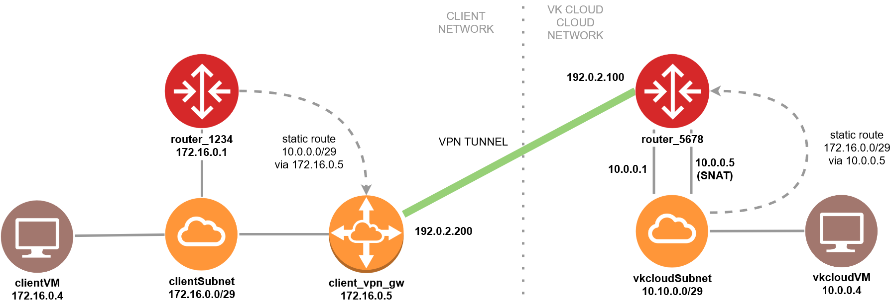

Next, you will learn how to organize the interaction of the VK Cloud virtual network with an external (client) network through a VPN tunnel. Several virtual machines will also be created to test the functionality of the tunnel.

<info>

Next, a VPN tunnel will be built to another network of the VK Cloud platform, and a virtual machine will be used as a VPN endpoint. The information provided on setting up a VPN tunnel can be adapted to work with any other VPN endpoint, such as a corporate firewall or other network equipment.

</info>

## 1. Preparatory Steps

1. Make sure that OpenStack CLI [is installed](../../../../base/account/project/cli/setup) and you can [authorize](../../../../base/account/project/cli/authorization) in it.

1. Create networks.

   <info>

   You can create a network with any parameters you choose. Adjust the next steps in this scenario as needed.

   </info>

   <tabs>
   <tablist>
   <tab>Client network</tab>
   <tab>Virtual network</tab>
   </tablist>
   <tabpanel>

   This network will act as the client network.

   When creating a network, set the following parameters:

    - **Network name**: `clientNet`.
    - **Internet Access**: Make sure this option is selected. It will allow you to assign public floating IP addresses to virtual machines on this network.
    - **Router**: `Create new`.
    - **Subnet List**: edit the only subnet in the list. Set the following parameters for the subnet:

      - **Name**: `clientSubnet`.
      - **Address**: `172.16.0.0/29`.
      - **Gateway**: `172.16.0.1`.
      - **Enable DHCP**: Make sure this option is selected.
      - **DHCP IP address pool**: `172.16.0.2 - 172.16.0.6`.
      - **Private DNS**: Make sure this option is selected.

   </tabpanel>
   <tabpanel>

    This network will act as a virtual network.

    When creating a network, set the following parameters:

    - **Network name**: `vkcloudNet`.
    - **Internet Access**: Make sure this option is selected. It will allow you to ensure the operation of the VPN tunnel and assign public floating IP addresses to virtual machines in this network.
    - **Router**: `Create new`.
    - **Subnet List**: edit the only subnet in the list. Set the following parameters for the subnet:

      - **Name**: `vkcloudSubnet`.
      - **Address**: `10.0.0.0/29`.
      - **Gateway**: `10.0.0.1`.
      - **Enable DHCP**: Make sure this option is selected.
      - **DHCP IP address pool**: `10.0.0.2 - 10.0.0.6`.
      - **Private DNS**: Make sure this option is selected.
   </tabpanel>
   </tabs>

1. Determine which routers have been created for these networks. This information will be needed when you configure the VPN further.

    It is further assumed that:

    - router `router_1234` was created for the `clientNet` network;
    - router `router_5678` was created for the `vkcloudNet` network.

1. Determine the IP address of the `SNAT` interface for the `router_5678` router:

    1. Open the page with the list of subnets for the `vkcloudNet` network.
    1. Click on the subnet name `vkcloudSubnet`.
    1. Click the **Ports** tab.
    1. Find the `SNAT` device port in the list of ports and copy its IP address.

1. Create a virtual machine that will act as a VPN gateway on the `clientNet` client network, with the following settings:

    - **Virtual machine name**: `client_vpn_gw`.
    - **Virtual machine type**: `Basic-1-2`.
    - **Number of machines in the configuration**: one.
    - **Operating system**: `Ubuntu 22.04`.
    - **Network**: client network and corresponding `clientNet: clientSubnet` subnet.
    - **Virtual Machine Key**: The key that will be used to connect via SSH.
    - **Firewall settings**: everything is allowed (`all`).
    - **Assign External IP**: Make sure this option is selected.

   Select other parameters of the virtual machine at your discretion.

1. Collect information necessary for further work. Further, it is assumed that:

   | Object                                                               | Value           |
   | -------------------------------------------------------------------- | --------------- |
   | The public IP address of the router `router_5678`                    | `192.0.2.100`   |
   | IP address of the `client_vpn_gw` virtual machine on the `clientSubnet` subnet | `172.16.0.5` |
   | Floating public IP address of the virtual machine `client_vpn_gw`    | `192.0.2.200`   |
   | Client subnet from client VPN gateway `client_vpn_gw`                | `172.16.0.0/29` |
   | Cloud VPN Gateway Virtual Subnet                                     | `10.0.0.0/29`   |
   | IP address of the `SNAT` port in the cloud subnet                    | `10.0.0.5`      |



## 2. Set up a VPN tunnel on the cloud side

Create a VPN with the following settings:

<tabs>
<tablist>
<tab>1. Setting up IKE</tab>
<tab>2. Configuring IPsec</tab>
<tab>3. Creating Endpoint Groups</tab>
<tab>4. Tunnel setup</tab>
</tablist>
<tabpanel>

Select **IKE Policy** - `New IKE Policy`, and set:

- **Policy name**: `vkcloud-client-ike`.
- **Key lifetime**: 3600 seconds.
- **Authorization Algorithm**: `sha256`.
- **Encryption algorithm**: `aes-256`.
- **IKE version**: `v2`.
- **Diffie-Hellman group**: `group14`.

</tabpanel>
<tabpanel>

Select **IPsec Policy** - `New IPsec Policy`, and set:

- **Policy name**: `vkcloud-client-ipsec`.
- **Key lifetime**: 3600 seconds.
- **Authorization Algorithm**: `sha256`.
- **Encryption algorithm**: `aes-256`.
- **Diffie-Hellman group**: `group14`.

</tabpanel>
<tabpanel>

Choose:

- **Router**: `router_5678`.

- **Local Endpoint**: `New endpoint group`.
  - **Name**: `vkcloud-endpoint-group`.
  - **Subnets**: `vkcloudSubnet`.

- **Remote Endpoint**: `New endpoint group`.
  - **Group name**: `client-endpoint-group`.
  - **Subnet address**: `172.16.0.0/29`.

</tabpanel>
<tabpanel>

Select **Settings** - `Basic`, and set:

- **Tunnel name**: `vkcloud-client-vpn`.
- **Public IPv4 Peer IP address**: `192.0.2.200`.
- **Shared Key (PSK)**: Any pre-shared key of your choice that satisfies the key requirements.

  The key must:

  - be at least 16 characters long;
  - contain at least one letter or number;
  - consist only of the following valid characters:
    - uppercase and lowercase letters of the Latin alphabet;
    - numbers;
    - symbols `-+&!@#$%^*(),.:;_=<>{}/`.

</tabpanel>
</tabs>

## 3. Set up a VPN tunnel on the side of the client network

1. Disable IP Source Guard on the VPN gateway port so that it can forward any traffic:

    1. Find the port with the private IP address `172.16.0.5` of the virtual machine `client_vpn_gw`. Get the ID of this port.

    1. Allow traffic from any address through this port:

       ```bash
       openstack port set <port id> --allowed-address ip-address=0.0.0.0/0
       ```

1. Connect to the `client_vpn_gw` virtual machine via SSH. All further actions must be performed on this virtual machine.

1. Enable IP Forwarding so that the virtual machine can route traffic from the private network to the VPN tunnel:

    ```bash
    echo 'net.ipv4.ip_forward = 1' | sudo tee -a /etc/sysctl.conf
    sudo sysctl -p

    ```

1. Install StrongSwan - An IPsec VPN Implementation for Linux:

   ```bash
   sudo apt update
   sudo apt install -y strongswan libcharon-extra-plugins libcharon-extauth-plugins libstrongswan-extra-plugins

   ```

1. Add VPN connection settings from the client network side to the `/etc/ipsec.conf` file. These settings are a mirror image of the tunnel settings made in the [previous step](#2-set-up-a-vpn-tunnel-on-the-cloud-side).

   ```ini
   conn client-vkcloud-vpn
      authby=secret
      left=%defaultroute
      leftid=192.0.2.200
      leftsubnet=172.16.0.0/29
      right=192.0.2.100
      rightsubnet=10.0.0.0/29
      ike=aes256-sha2_256-modp2048!
      esp=aes256-sha2_256!
      keyingtries=0
      ikelifetime=3600
      lifetime=8h
      dpddelay=30
      dpdtimeout=120
      dpdaction=hold
      auto=start
   ```

   <info>

   For the Diffie-Hellman group `group14`, the equivalent notation is `modp_2048`. The mapping of `modp` to group names is given in [RFC 3526](https://www.rfc-editor.org/rfc/rfc3526).

   </info>

1. Specify the shared key (PSK) in the `/etc/ipsec.secret` file. The key must match the key specified [previously](#2-set-up-a-vpn-tunnel-on-the-cloud-side):

   ```ini
   192.0.2.200 192.0.2.100 : PSK "<pre-shared key, specified previously>"
   ```

1. Restart the StrongSwan service:

   ```bash
   sudo systemctl restart strongswan-starter
   ```

## 4. Add static routes

In order for traffic to pass through the VPN tunnel, you need to add static routes:

<tabs>
<tablist>
<tab>On the side of the cloud network</tab>
<tab>On the side of the client network</tab>
</tablist>
<tabpanel>

1. Open the page with the list of subnets for the `vkcloudNet` network in your personal account.
1. Expand the `vkcloudSubnet` subnet menu and select `Edit Subnet`.
1. Make sure the **Show static routes field** option is selected.
1. Enter a static route to the client network `172.16.0.0/29` in the field. As the next hop, you need to specify the IP address of the `SNAT` interface of the router `router_5678` in the cloud subnet `vkcloudSubnet`.

   ```text
   172.16.0.0/29 - 10.0.0.5
   ```

</tabpanel>
<tabpanel>

1. Open the page with information about the router `router_1234` in your personal account, to which the client subnet `clientSubnet` and the VPN gateway `client_vpn_gw` are connected.
1. On the **Static Routes** tab, click the **Add Static Route** button.
1. Write a static route to the cloud network `10.0.0.0/29`:

    - **Destination network**: `10.0.0.0/29`.
    - **Intermediate host (Next HOP)**: `172.16.0.5` (IP address of the VPN gateway on the client subnet).

1. Click the **Add Interface** button.

</tabpanel>
</tabs>

## 5. Check if the VPN tunnel is working

1. View the status of the VPN tunnel from the VK Cloud platform.

    To do this, open the VPN page `vkcloud-client-vpn` in your personal account and go to the **Tunnel Settings** tab. The VPN must be in `ACTIVE` status.

1. Create a firewall rule group `icmp` to allow ICMP traffic.

    In this group, create an inbound rule:

    - **Type**: `ICMP`.
    - **Remote address**: `All IP addresses`.

    This is necessary so that the test virtual machines can ping each other.

1. Create two virtual machines:

    - `clientVM`:

      - in the network `clientNet`, subnet `clientSubnet`;
      - with a floating IP address to connect to it via SSH;
      - with firewall rule groups `default`, `ssh`, `icmp`.

    - `vkcloudVM`:
      - in the network `vkcloudNet`, subnet `vkcloudSubnet`;
      - with a floating IP address to connect to it via SSH;
      - with firewall rule groups `default`, `ssh`, `icmp`.

1. Determine the private IP addresses of the virtual machines on the respective subnets. Let be:

    - `clientVM` has IP address `172.16.0.4`;
    - `vkcloudVM` has IP address `10.0.0.4`.

1. Connect to the `vkcloudVM` virtual machine via SSH.

1. Ping the `clientVM` virtual machine from the `vkcloudVM` virtual machine:

    ```bash
    ping 172.16.0.4
    ```

    The `clientVM` host must respond to the ping.

## Monitor resource usage

If you no longer need the created resources, delete them:

1. [Delete](/ru/base/iaas/vm-start/manage-vm/vm-delete) virtual machines.
1. [Delete](../../operations/manage-vpn#udalenie-vpn-tunnelya) VPN tunnel.
1. [Delete](../../operations/manage-router#upravlenie-staticheskimi-marshrutami) static routes defined on the side of the client network.

   <info>

   Static routes on the side of the cloud network will be deleted along with the subnet for which they were registered.

   </info>

1. [Delete](../../operations/manage-router#udalenie-marshrutizatora) client and cloud network routers.
1. Delete the client and cloud [subnets](../../operations/manage-net#udalenie-podseti) and [networks](../../operations/manage-net#udalenie-seti).
1. [Delete](../../operations/manage-floating-ip#udalenie-plavayushchego-ip-adresa-iz-proekta) floating IP addresses.
