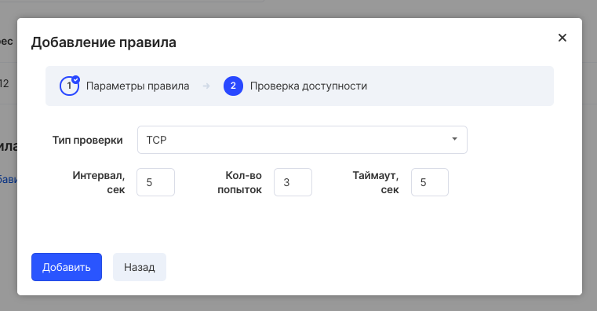

To add a rule to a created balancer, select it in the list of created balancers in the "Load balancers" section of the Virtual networks service:

When you select balancing, a window will open for viewing, adding and editing rules:

To add a rule, specify the required field values:

- Balancing protocol
- Destination protocol
- Balancing method
- Port

In the next step, you will be prompted to configure the availability check:

