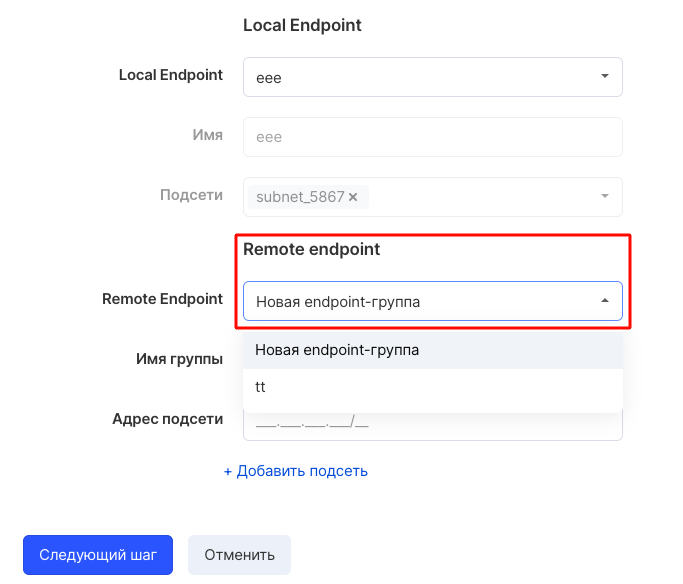
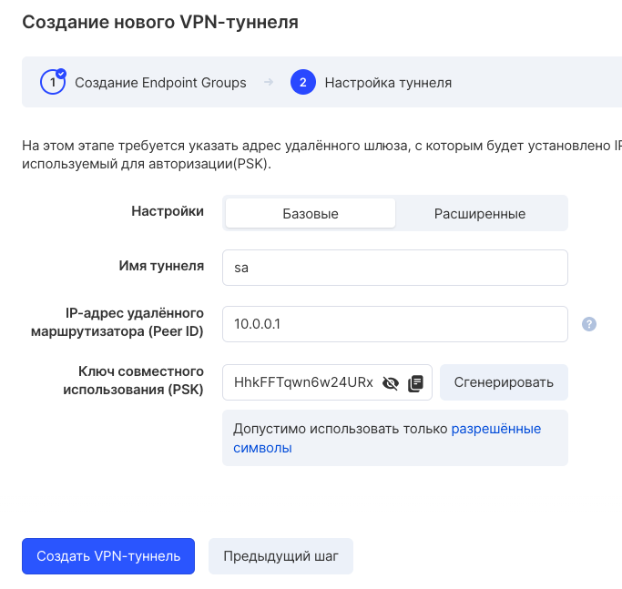

To add a subnet to a VPN connection, use the "Edit VPN" option in the drop-down list of options:

At step 1, select "New endpoint group":

Enter the IP address of the new subnet and proceed to the next step by clicking the "Next step" button:

Before completing the changes, you need to make sure that the entered data are correct and confirm them by clicking the "Create VPN Tunnel" button.
